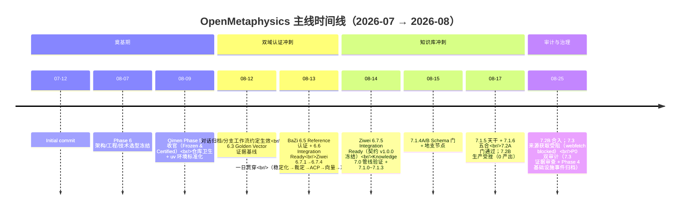

# 项目进展梳理（Git 历史可视化）

> 生成: 2026-08-25 · 分支 `work/docs/project-history-review`
> 数据来源: git 全量提交历史 + `context/` 权威状态文档交叉核对
> 快照基线: `main = 38ee24e`（与 `origin/main` 同步, 快照时点不含本分支）

---

## 1. 仓库快照

| 指标 | 值 |
|------|-----|
| 提交总数 | 73（含 merge） |
| 时间跨度 | 2026-07-12 → 2026-08-25（约 6.5 周，实际有提交的活跃日仅 9 天） |
| 当前 HEAD | `main = 38ee24e`，与 `origin/main` 同步 |
| 本地分支 | 31 条（不含 main）；30 条已合入 main，仅 `work/ci/proto-lint-fix` 未合并 |
| 测试基线 | 全仓库 green（权威口径 599/599） |
| 冻结契约 | Qimen / BaZi / Ziwei 契约均 v1.0.0 Frozen；Behavior Contracts 100 条 Frozen |

## 2. 主线时间线



### 提交活动分布（按日）

```
07-12  █                1   Initial commit
08-07  █                1   Phase 6 架构文档
08-09  ███████          7   Qimen 收官 + 环境标准化
08-12  ████             4   工作流约定 + BaZi 6.3
08-13  ████████████████ 16  ← BaZi/Ziwei 生命周期冲刺（单日峰值）
08-14  ████████████     12  ← Ziwei 收尾 + Knowledge 语料开跑
08-15  ████             4   Schema 门 + 地支节点
08-17  ████████████     12  ← 天干/五合 + 7.2A 门 + 7.2B 受挫
08-25  ████████████████ 16  ← 审计与治理日（7.2B 合入、7.3、双审计、卫生修复）
                            合计 73 commits
```

## 3. 各阶段进展总览

图例: ✅ 完成/认证　🟡 部分完成（诚实偏差已记录）　🔴 受阻/事件未关闭

```
✅ Phase 5        Qimen 排盘        ██████████  Frozen & Certified（契约 v1.0.0, 24 向量, 双实现 30/30）
✅ Phase 6        架构/工程冻结      ██████████  Architecture Freeze（docs/design/phase6 不可变）
✅ Phase 6.3~6.6  BaZi 生命周期     ██████████  Integration Ready / Certified（24 向量等价）
✅ Phase 6.7.x    Ziwei 生命周期    ██████████  Integration Ready / Certified（Engine v0.3.0, 24 向量）
🟡 Phase 7.0~7.1  Knowledge 语料    ███████░░░  63 节点 + 37 关系 + 10 引用（sha256 9c222617）
🔴 Phase 7.2~7.3  扩展生产          ███░░░░░░░  7.2B 与 7.3 均 0 生产 —— Tier 1 来源不可达 + webfetch 受阻
🟡 Reference      Runtime           █████████░  6 层全部完成, Freeze Candidate（待最终冻结）
🔴 Phase 4        基础设施事件      ███░░░░░░░  Incident OPEN（R/R2/R3 失败率异常, 根因未确立; 协议设计稿已就绪待评审）
```

### 关键里程碑对照表

| 日期 | 里程碑 | 状态 |
|------|--------|------|
| 07-12 | 仓库初始化 | ✅ |
| 08-09 | Qimen Phase 5 冻结认证（首个 Certified 域） | ✅ |
| 08-12 | 对话归档 + 分支工作流约定建立 | ✅ |
| 08-13 | BaZi Integration Ready（第 2 个 Certified 域） | ✅ |
| 08-13~14 | Ziwei 完整生命周期 6.7.1→6.7.5（第 3 个 Certified 域，含 4 项 ACP 实施） | ✅ |
| 08-14~17 | Knowledge 语料 41 词汇 → 63 节点/37 关系/10 引用 | 🟡 |
| 08-17 | 7.2B 生产尝试：Tier 1 来源不可达，0 产出（诚实记录） | 🔴 受阻 |
| 08-25 | 7.3 来源获取：webfetch 受阻，0 生产；P0 审计裁定 METADATA_ONLY 可合并 | 🔴 受阻 |
| 08-25 | Phase 4 基础设施事件归档（R/R2/R3），Incident OPEN；表征协议设计稿就绪 | 🔴 OPEN |

**当前卡点一句话**: 三大计算域（Qimen/BaZi/Ziwei）全部 Integration Ready，主线停在 **Knowledge 扩展生产** —— 外部来源不可达是唯一硬阻塞；次级未决项为 Reference Runtime 最终冻结与 Phase 4 事件闭环。

## 4. 分支拓扑现状

```
main ●──●──●── … ──● 38ee24e（= origin/main）
     │
     ├── 30 条本地 work/feature 分支已全部合入（bazi×2, ziwei×7,
     │   knowledge×13, docs×5, phase4×1, convention×1, feature×1）
     │
     ├── 远端残留（已在 main 历史中）:
     │     origin/codex/fix-ci-workflows
     │     origin/work/ziwei/phase6.7.1.6-acp-implementation
     │
     └──● c1c476a work/ci/proto-lint-fix ◀── 唯一未合并本地分支
            （buf STANDARD lint 修复: calendar.proto RPC 类型重命名 + 文档同步）

工作区悬空产出（不在任何提交内）:
  ? docs/governance/phase4/INFRASTRUCTURE_CHARACTERIZATION_PROTOCOL.md
      （上轮 Prompt 3 设计稿, DESIGN READY 待评审; 头部声明所属分支不存在）
  stash@{0} ci-fix-wip（基于已合并旧分支 7.1.4a）/ stash@{1} autostash
```

## 5. 过程观察（历史健康度）

- ✅ **主线上线性清晰**: first-parent 每 Sprint 一 merge，merge 信息自带阶段名，可读性好。
- ✅ **文档与 git 记录一致**: `context/项目状态.md`、`context/归档.md` 与提交史逐项对得上，无虚报状态。
- ✅ **诚实偏差文化**: 7.1.2（18/24）、7.1.3（7/8）、7.2B/7.3（0 产出）均如实记录，未粉饰。
- ⚠️ **约定前瑕疵**（不建议重写）: `5b`/`5c` 无意义提交信息（08-09，工作流约定建立之前）；`270b6f8` 提交信息为分支名文本（疑为误操作标记提交）。远端已推送 + 冻结工件在库，重写历史风险大于收益，保留原样。
- ⚠️ **直连 main 提交**: 7.2B/7.3 会话存在直接提交 main 的情况（`193779d` 等，已由 `6add9be` 追认）。属流程偏差但已有处置记录，此后恢复分支流。

## 6. 是否需要整理？——需要，共 7 项（均为轻量操作，不涉及历史重写）

| # | 整理项 | 现状 | 建议动作 | 优先级 |
|---|--------|------|----------|--------|
| 1 | 已合并本地分支 ×30 | 全部已合入 main，继续堆积只会干扰视图 | 用户批准后批量 `git branch -d` 清理 | 高 |
| 2 | 远端残留分支 ×2 | `origin/codex/fix-ci-workflows`、`origin/work/ziwei/phase6.7.1.6-acp-implementation` 已在 main 历史 | `git push origin --delete <name>` | 中 |
| 3 | `work/ci/proto-lint-fix` 未合并 | buf lint 修复（calendar.proto RPC 重命名 + 文档，1 commit） | 走审查后合入，或明确搁置并注明原因 | 高 |
| 4 | stash ×2 | `ci-fix-wip` 基于已合并旧分支；另有 autostash | 核查内容后 drop 或恢复 | 中 |
| 5 | 未跟踪设计稿 | `INFRASTRUCTURE_CHARACTERIZATION_PROTOCOL.md`（Prompt 3, DESIGN READY）声明所属分支不存在 | 单独开 `work/phase4/*` 分支提交归位，或由用户裁定搁置 | 高 |
| 6 | DEF-01 文档错标 | `SOURCE_STATUS.md` GAP 编号列交叉错标（P0 审计发现） | 待授权的文档修正 Sprint | 中 |
| 7 | 历史提交信息瑕疵 | `5b`/`5c`/`270b6f8` | 不处理（重写风险 > 收益），仅备案 | 低 |

## 7. 结论

1. **进展脉络**: 立项 → Phase 6 架构冻结 → 三域逐个"稳定化→向量→冻结审查→Reference 认证→Integration Ready"（Qimen/BaZi/Ziwei）→ Knowledge 语料建设 → 卡在外部来源获取。节奏健康，治理纪律逐步收紧。
2. **当前主线**: 解除 Knowledge 来源阻塞（Phase 7.2B/7.3 复产），其后按 `docs/ROADMAP.md` 推进 Reference Runtime 最终冻结。
3. **整理判定**: 需要轻度整理 —— 主要是分支堆积（#1/#2）与两处悬空产出（#3/#5），外加一处审计发现的文档错标（#6）。仓库历史本身无需也不应重写。
