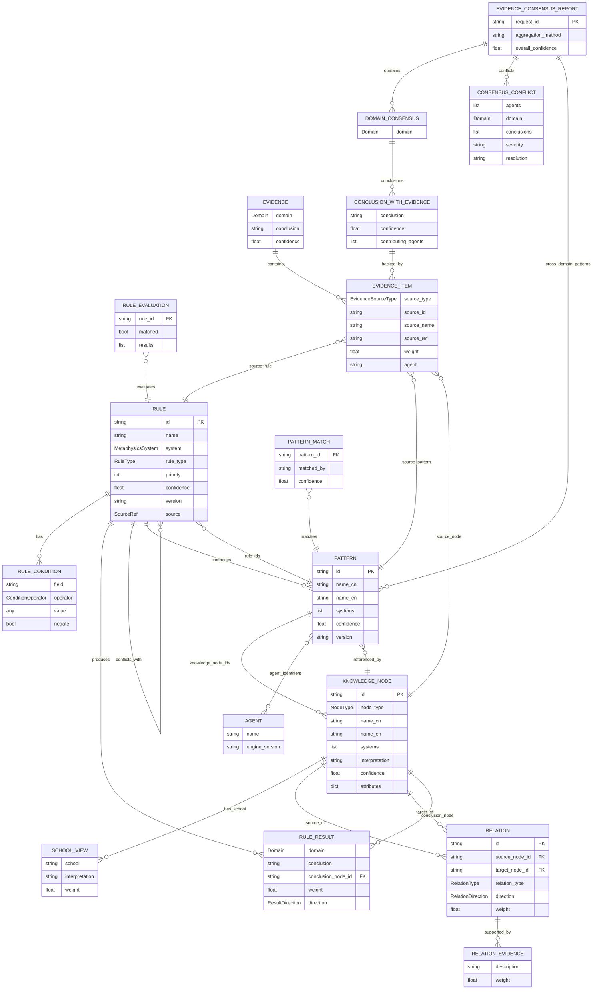

# Mermaid ER Diagram（实体关系图）

> 状态：设计 v1 (2026-07-11)

## 知识层 + 规则层 + 共识层 实体关系

## 核心实体说明

- **RULE** 是规则层的核心实体，包含条件（RULE_CONDITION）和结果（RULE_RESULT），可声明冲突关系。
- **KNOWLEDGE_NODE** 是知识层的核心实体，支持多流派（SCHOOL_VIEW），通过 RELATION 构成知识图谱。
- **PATTERN** 是连接层：组合多个 RULE，引用多个 KNOWLEDGE_NODE，被多个 AGENT 识别。
- **EVIDENCE_ITEM** 是多态引用：可指向 RULE、PATTERN 或 KNOWLEDGE_NODE，是共识层的最小证据单元。
- **EVIDENCE_CONSENSUS_REPORT** 取代旧 ConsensusReport：按 DOMAIN 分组，每个 DOMAIN 内多个 CONCLUSION_WITH_EVIDENCE 并存。
