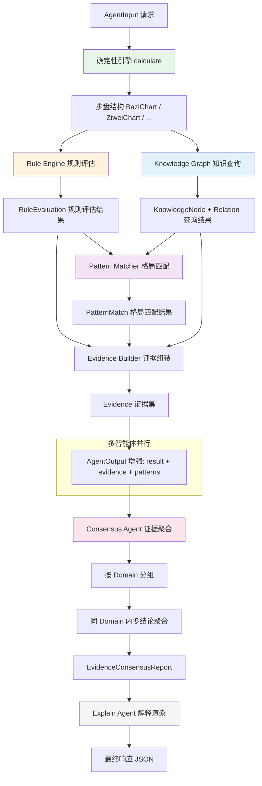
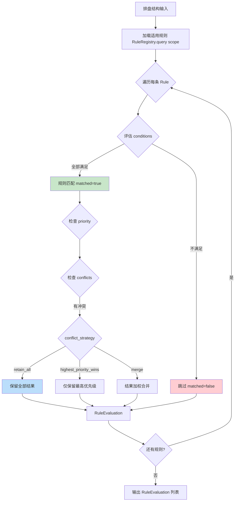
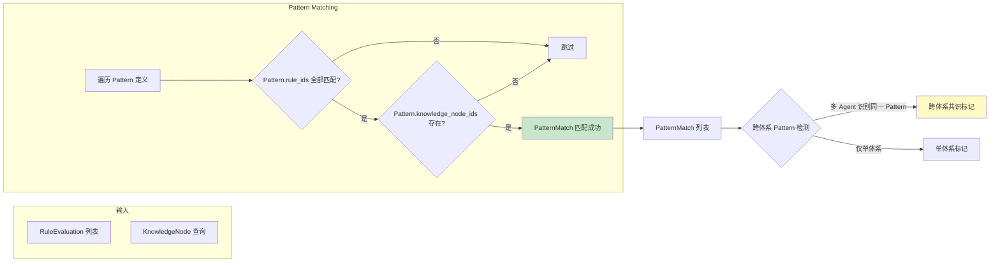
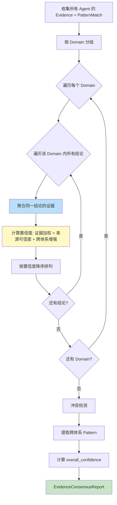
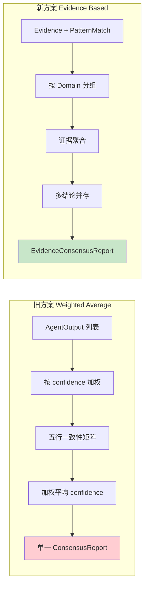

# Mermaid Flow Diagram（流程图）

> 状态：设计 v1 (2026-07-11)

## 1. 整体数据流：从排盘到证据聚合共识



## 2. 规则评估流程（Rule Engine 内部）



## 3. 格局匹配流程（Pattern Matcher）



## 4. Evidence-Based Consensus 聚合流程



## 5. 置信度计算公式（设计说明）

单条结论的 `confidence` 计算方式（非代码，仅设计公式）：

```
conclusion_confidence = normalize(
    Σ(evidence_item.weight × source.credibility × agent_confidence_factor)
    / count(evidence_items)
    × cross_system_bonus
)

其中：
  - source.credibility: 引用来源的可信度（SourceRef.credibility）
  - agent_confidence_factor: 识别此证据的智能体的原始置信度
  - cross_system_bonus: 若多体系识别同一 Pattern，置信度增强（1.0 ~ 1.2）
  - normalize: 截断到 [0, 1]
```

## 6. 与现有 Consensus Agent 的对比



| 维度       | 旧方案（Weighted Average）         | 新方案（Evidence Based）              |
|-----------|-----------------------------------|---------------------------------------|
| 聚合对象   | AgentOutput.confidence            | Evidence + PatternMatch               |
| 结论数量   | 单一结论                          | 多结论并存                            |
| 可追溯性   | 仅 confidence 数值                | 每结论附带全部证据                    |
| 跨体系比较 | 比较五行一致性                    | 比较共同 Pattern                      |
| 冲突处理   | 降低 overall_confidence           | retain_all，保留全部证据              |
