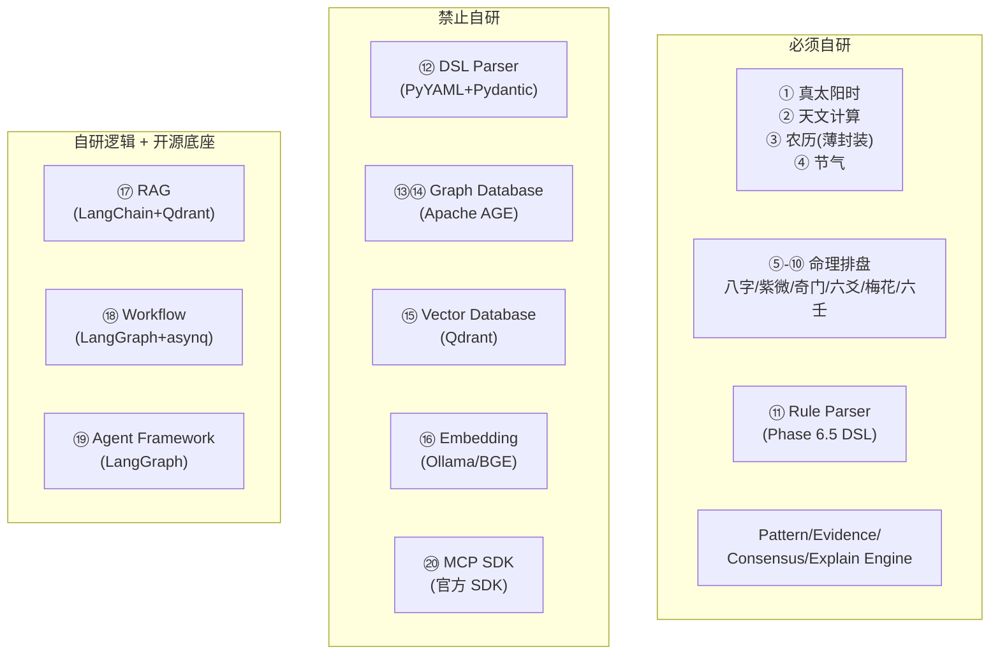

# Open Source Evaluation（开源项目评估）

> 状态：Engineering Freeze v1 (2026-07-12)
> 阶段：Phase 6.6 - Technology Selection & Open Source Evaluation
> 依赖：Phase 6 架构设计、Phase 6.5 Rule DSL、Phase 6.6 技术栈选型（`docs/engineering/11_technology_stack.md`）
> 约束：不修改任何已有文档；不编写运行时代码；仅输出设计文档

---

## 1. 评估方法论

### 1.1 评估维度

每个候选项目按以下维度评估：

| 维度 | 说明 |
|------|------|
| **Stars** | GitHub Stars（≈2026-07 近似值），反映社区关注度 |
| **维护频率** | 最近 commit / release 活跃度（活跃 / 低频 / 停滞） |
| **License** | 许可证类型，优先 MIT / Apache-2.0 / BSD |
| **Python 支持** | 原生 / 绑定 / 无 |
| **Rust 支持** | 原生 / 绑定 / 无 |
| **Go 支持** | 原生 / 绑定 / 无 |
| **商业可用** | 许可证是否允许商业使用（GPL / SSPL 需特别评估） |
| **是否推荐** | ✅ 推荐 / ⚠️ 谨慎 / ❌ 不推荐 |

### 1.2 许可证偏好

```text
✅ 优先：MIT · Apache-2.0 · BSD-2/3-Clause · PostgreSQL License
⚠️ 谨慎：MPL-2.0（文件级 copyleft，需共享修改的文件）· LGPL（动态链接可商用）
❌ 回避：GPLv3（衍生作品必须开源）· SSPL / RSALv2（云服务限制）· AGPLv3（网络传播触发）
```

### 1.3 评估结果总览



---

## 2. 天文与历法基础（模块 ①-④）

### 模块 ① 真太阳时（True Solar Time）

**用途**：将标准时钟时间转换为真太阳时（均时差 + 经度修正），用于八字时辰精确校正。
当前实现：`core/solar_time.py`（Python，Meeus 公式）。

**候选项目对比**：

| 项目 | Stars | 维护 | License | Python | Rust | Go | 商业可用 |
|------|-------|------|---------|--------|------|-----|----------|
| skyfield | ≈2.8k | 活跃 | MIT | ✅原生 | ❌ | ❌ | ✅ |
| astropy | ≈3.5k | 活跃 | BSD-3 | ✅原生 | ❌ | ❌ | ✅ |
| pyerfa | ≈300 | 活跃 | BSD-3 | ✅原生 | ❌ | ❌ | ✅ |
| sxtwl | ≈600 | 低频 | MIT | ✅FFI | ❌ | ❌ | ✅ |
| Meeus 自研 | - | - | - | ✅ | ✅ | ✅ | ✅ |

**推荐**：自研（Rust，基于 Meeus 算法）

- **项目**：自研 Rust crate（`om-calendar`）
- **GitHub**：N/A（自研）
- **License**：MIT（项目自身）
- **商业可用**：✅
- **是否推荐**：✅ 推荐
- **理由**：无开源项目直接提供「真太阳时」计算函数。skyfield / astropy 可计算太阳位置，但引入重依赖（astropy 依赖 numpy/scipy 全家桶，>100MB）。真太阳时公式仅需 Julian Day + 太阳黄经 + 均时差，Meeus 截断算法已在现有 Python 代码中验证。迁移到 Rust 可获得位精确确定性与 WASM 复用能力。skyfield 仅用于交叉验证。

---

### 模块 ② 天文计算（Astronomical Calculation）

**用途**：太阳黄经、Julian Day、天体位置等天文基础计算，为节气和历法提供底层数据。

**候选项目对比**：

| 项目 | Stars | 维护 | License | Python | Rust | Go | 商业可用 |
|------|-------|------|---------|--------|------|-----|----------|
| skyfield | ≈2.8k | 活跃 | MIT | ✅原生 | ❌ | ❌ | ✅ |
| astropy | ≈3.5k | 活跃 | BSD-3 | ✅原生 | ❌ | ❌ | ✅ |
| pyerfa | ≈300 | 活跃 | BSD-3 | ✅原生 | ❌ | ❌ | ✅ |
| sxtwl | ≈600 | 低频 | MIT | ✅FFI | ❌ | ❌ | ✅ |
| astro-rs | ≈200 | 低频 | MIT | ❌ | ✅原生 | ❌ | ✅ |
| novas | ≈100 | 停滞 | MIT | ✅FFI | ❌ | ❌ | ✅ |

**推荐**：sxtwl（历法数据源）+ 自研（Meeus 算法 Rust 实现）

- **项目**：sxtwl + 自研 Rust crate
- **GitHub**：`https://github.com/yuangu/sxtwl`
- **License**：MIT
- **商业可用**：✅
- **是否推荐**：✅ 推荐
- **理由**：sxtwl（寿星天文历）提供经过验证的农历/节气数据，是中文历法社区的事实标准。其 C 核心可通过 Rust FFI 封装。Meeus 太阳黄经算法自研实现（已在 Python 中验证），迁移到 Rust 后可直接使用，无需引入 astropy 重依赖。astro-rs 不够成熟且无中文历法支持。skyfield 仅用于交叉验证精度。

---

### 模块 ③ 农历（Lunar Calendar）

**用途**：公历↔农历转换、农历日期、闰月判定。八字/紫微等体系依赖农历。

**候选项目对比**：

| 项目 | Stars | 维护 | License | Python | Rust | Go | 商业可用 |
|------|-------|------|---------|--------|------|-----|----------|
| sxtwl | ≈600 | 低频 | MIT | ✅FFI | ❌ | ❌ | ✅ |
| lunar-python | ≈700 | 活跃 | MPL-2.0 | ✅原生 | ❌ | ✅(lunar-go) | ⚠️ |
| zhdate | ≈300 | 低频 | MIT | ✅原生 | ❌ | ❌ | ✅ |
| CNLunar | ≈300 | 低频 | MIT | ✅原生 | ❌ | ❌ | ✅ |
| lunar-go | ≈200 | 活跃 | MPL-2.0 | ❌ | ❌ | ✅原生 | ⚠️ |

**推荐**：sxtwl

- **项目**：sxtwl
- **GitHub**：`https://github.com/yuangu/sxtwl`
- **License**：MIT
- **商业可用**：✅
- **是否推荐**：✅ 推荐
- **理由**：
  - sxtwl 是 MIT 许可证（lunar-python / lunar-go 为 MPL-2.0，文件级 copyleft，修改需开源修改的文件）。
  - sxtwl 的 C 核心可通过 Rust FFI 和 Python CFFI 绑定，一次封装多语言复用。
  - lunar-python 功能更全（含八字/紫微），但其 MPL-2.0 许可证对商业项目有约束，且其命理逻辑应自研以保持核心 IP 纯净。
  - zhdate / CNLunar 仅做日期转换，功能不足且维护不如 sxtwl。
  - **禁止使用 lunar-python 的排盘逻辑**（见模块 ⑤-⑩），仅可参考其农历转换。

---

### 模块 ④ 节气（Solar Terms）

**用途**：计算二十四节气精确时刻，确定八字月柱边界（12 节）和年柱起点（立春）。

**候选项目对比**：

| 项目 | Stars | 维护 | License | Python | Rust | Go | 商业可用 |
|------|-------|------|---------|--------|------|-----|----------|
| sxtwl | ≈600 | 低频 | MIT | ✅FFI | ❌ | ❌ | ✅ |
| lunar-python | ≈700 | 活跃 | MPL-2.0 | ✅原生 | ❌ | ✅ | ⚠️ |
| CNLunar | ≈300 | 低频 | MIT | ✅原生 | ❌ | ❌ | ✅ |
| Meeus 自研 | - | - | - | ✅ | ✅ | ✅ | ✅ |

**推荐**：sxtwl（数据验证）+ 自研（Meeus solar_longitude Rust 实现）

- **项目**：sxtwl + 自研 Rust crate
- **GitHub**：`https://github.com/yuangu/sxtwl`
- **License**：MIT
- **商业可用**：✅
- **是否推荐**：✅ 推荐
- **理由**：节气计算本质是「太阳到达特定黄经度的时刻」。现有 Python 代码已用 Meeus 二分法精确求解（`solar_term_time()`），精度 < 1 分钟。迁移到 Rust 后，同一算法可编译为 WASM 供前端实时预览节气边界。sxtwl 的节气数据用于交叉验证自研算法的正确性。lunar-python 的节气功能可用但 MPL-2.0 许可证有约束。

---

## 3. 命理排盘引擎（模块 ⑤-⑩）

> **总论**：六大命理体系的排盘逻辑是本项目核心 IP。除 lunar-python 提供部分基础干支计算外，
> 市面上几乎无成熟、许可证友好的开源排盘库。以下逐模块评估。

---

### 模块 ⑤ 八字排盘（Bazi Chart）

**用途**：四柱八字排盘--年柱、月柱、日柱、时柱的天干地支，十神、纳音、神煞、大运、流年。
当前实现：`agents/bazi.py`（Python，自研）。

**候选项目对比**：

| 项目 | Stars | 维护 | License | Python | Rust | Go | 商业可用 | 排盘完整度 |
|------|-------|------|---------|--------|------|-----|----------|-----------|
| lunar-python | ≈700 | 活跃 | MPL-2.0 | ✅原生 | ❌ | ✅ | ⚠️ | 高（干支/十神/纳音/神煞/大运） |
| sxtwl | ≈600 | 低频 | MIT | ✅FFI | ❌ | ❌ | ✅ | 低（仅干支） |
| zdic/bazi | ≈50 | 停滞 | MIT | ✅原生 | ❌ | ❌ | ✅ | 低 |
| junjunlis/bazi | ≈30 | 停滞 | 未声明 | ✅原生 | ❌ | ❌ | ❌ | 低 |

**推荐**：自研（基于 sxtwl 历法数据）

- **项目**：自研（`agents/bazi.py` 已有实现）
- **GitHub**：N/A
- **License**：MIT（项目自身）
- **商业可用**：✅
- **是否推荐**：✅ 推荐自研
- **理由**：
  1. lunar-python 功能最全但 MPL-2.0 许可证要求修改文件必须开源，不适合核心 IP。
  2. 八字排盘的十神判定、用神选取、格局识别逻辑是项目核心竞争力，必须自研以保持可控性和可审计性。
  3. 基础干支数据从 sxtwl（MIT）获取，十神/纳音/神煞/大运逻辑自研。
  4. 现有 Python 实现已通过黄金向量测试，验证了正确性。
  5. **禁止直接引用 lunar-python 的排盘代码**，可参考其算法思路但必须独立实现。

---

### 模块 ⑥ 紫微排盘（Ziwei Chart）

**用途**：紫微斗数排盘--命盘十二宫、十四主星、辅星/煞星定位、四化星。
当前实现：`agents/ziwei.py` + `agents/ziwei/pattern_matcher.py`（Python，自研）。

**候选项目对比**：

| 项目 | Stars | 维护 | License | Python | Rust | Go | 商业可用 | 排盘完整度 |
|------|-------|------|---------|--------|------|-----|----------|-----------|
| lunar-python | ≈700 | 活跃 | MPL-2.0 | ✅部分 | ❌ | ❌ | ⚠️ | 中（基础排盘） |
| izariku/ziwei | ≈50 | 停滞 | MIT | ✅原生 | ❌ | ❌ | ✅ | 低（仅主星） |
| ziweidoushu/py | ≈30 | 停滞 | 未声明 | ✅原生 | ❌ | ❌ | ❌ | 低 |
| 自研 | - | - | MIT | ✅ | ❌ | ❌ | ✅ | 高 |

**推荐**：自研

- **项目**：自研（`agents/ziwei.py` 已有实现）
- **GitHub**：N/A
- **License**：MIT
- **商业可用**：✅
- **是否推荐**：✅ 推荐自研
- **理由**：
  1. 紫微排盘逻辑极为复杂（定命宫→起大限→安主星→安辅星→安煞星→定四化），无任何开源项目达到生产可用完整度。
  2. lunar-python 的紫微功能不完整（缺四化、部分辅星），且 MPL-2.0 许可证有约束。
  3. 紫微三派（中州派/三合派/飞星派）排盘规则不同，需多流派支持（Phase 6 SchoolView），开源项目均不支持。
  4. 现有实现已包含 PatternMatcher 格局识别，是核心 IP。

---

### 模块 ⑦ 奇门排盘（Qimen Board）

**用途**：奇门遁甲排盘--九宫、八门、九星、八神、三奇六仪、天地盘。
当前实现：`agents/qimen.py`（Python，自研）。

**候选项目对比**：

| 项目 | Stars | 维护 | License | Python | Rust | Go | 商业可用 | 排盘完整度 |
|------|-------|------|---------|--------|------|-----|----------|-----------|
| lunar-python | ≈700 | 活跃 | MPL-2.0 | ✅部分 | ❌ | ❌ | ⚠️ | 低（基础） |
| qimen-js | ≈80 | 停滞 | MIT | ❌ | ❌ | ❌ | ✅ | 低 |
| 自研 | - | - | MIT | ✅ | ❌ | ❌ | ✅ | 高 |

**推荐**：自研

- **项目**：自研（`agents/qimen.py` 已有实现）
- **GitHub**：N/A
- **License**：MIT
- **商业可用**：✅
- **是否推荐**：✅ 推荐自研
- **理由**：
  1. 奇门遁甲有置闰法/拆补法/茅山法等多流派，排盘规则差异大，开源项目均不支持多流派。
  2. 超神接气、置闰逻辑是奇门核心难点，需精确到时辰的节气数据（依赖模块 ④）。
  3. qimen-js 为 JavaScript 实现，功能不完整且停滞。
  4. 奇门排盘直接依赖本项目自研的历法/节气模块，形成完整自研链条。

---

### 模块 ⑧ 六爻（Liuyao）

**用途**：六爻起卦--摇卦→装卦→安世应→配六亲→安六神→定卦身。
当前实现：`agents/liuyao.py`（Python，自研）。

**候选项目对比**：

| 项目 | Stars | 维护 | License | Python | Rust | Go | 商业可用 | 排盘完整度 |
|------|-------|------|---------|--------|------|-----|----------|-----------|
| lunar-python | ≈700 | 活跃 | MPL-2.0 | ❌ | ❌ | ❌ | - | 无 |
| liuyao-lib | ≈20 | 停滞 | 未声明 | ✅原生 | ❌ | ❌ | ❌ | 低 |
| 自研 | - | - | MIT | ✅ | ❌ | ❌ | ✅ | 高 |

**推荐**：自研

- **项目**：自研（`agents/liuyao.py` 已有实现）
- **GitHub**：N/A
- **License**：MIT
- **商业可用**：✅
- **是否推荐**：✅ 推荐自研
- **理由**：
  1. 六爻起卦逻辑完全无成熟开源实现。liuyao-lib 仅 20 Stars 且停滞。
  2. 六爻排卦涉及纳甲、六亲、六神、世应、卦身等复杂规则，是项目核心 IP。
  3. 现有实现已包含完整排卦逻辑和黄金向量测试。

---

### 模块 ⑨ 梅花易数（Meihua Yishu）

**用途**：梅花易数起卦--时间起卦/数字起卦/方位起卦，体用分析，互卦/变卦推导。
当前实现：待实现（Phase 9 规划）。

**候选项目对比**：

| 项目 | Stars | 维护 | License | Python | Rust | Go | 商业可用 | 排盘完整度 |
|------|-------|------|---------|--------|------|-----|----------|-----------|
| meihua-lib | ≈10 | 停滞 | 未声明 | ✅原生 | ❌ | ❌ | ❌ | 低 |
| 易经 API 类项目 | ≈50 | 低频 | MIT | ✅原生 | ❌ | ❌ | ✅ | 低（仅卦象） |
| 自研 | - | - | MIT | ✅ | ❌ | ❌ | ✅ | 高 |

**推荐**：自研

- **项目**：自研（Phase 9 实现）
- **GitHub**：N/A
- **License**：MIT
- **商业可用**：✅
- **是否推荐**：✅ 推荐自研
- **理由**：
  1. 梅花易数起卦方式多样（时间/数字/声音/方位），体用生克分析逻辑独特，无开源项目覆盖。
  2. 依赖本项目自研的历法模块（时间起卦需农历/时辰）。
  3. 互卦、变卦推导基于先天八卦数，逻辑清晰但需与八卦/六十四卦知识节点（Phase 6 KnowledgeNode）紧密集成。

---

### 模块 ⑩ 大六壬（Dailiu Ren）

**用途**：大六壬排盘--四课三传、天地盘、十二天将、神煞。
当前实现：待实现（Phase 9 规划）。

**候选项目对比**：

| 项目 | Stars | 维护 | License | Python | Rust | Go | 商业可用 | 排盘完整度 |
|------|-------|------|---------|--------|------|-----|----------|-----------|
| liuren-lib | ≈10 | 停滞 | 未声明 | ✅原生 | ❌ | ❌ | ❌ | 低 |
| 自研 | - | - | MIT | ✅ | ❌ | ❌ | ✅ | 高 |

**推荐**：自研

- **项目**：自研（Phase 9 实现）
- **GitHub**：N/A
- **License**：MIT
- **商业可用**：✅
- **是否推荐**：✅ 推荐自研
- **理由**：
  1. 大六壬是六大体系中最复杂的排盘之一（四课三传推导规则繁多），完全无成熟开源实现。
  2. 天地盘旋转、十二天将定位、神煞安放逻辑高度专业化，是项目核心 IP。
  3. 依赖自研历法模块（日干支、时辰）。

---

### 命理排盘模块总结

```text
模块          开源可用度    推荐策略
─────────    ──────────   ──────────────────────────
⑤ 八字       低            自研（sxtwl 提供干支数据）
⑥ 紫微       极低          自研（核心 IP）
⑦ 奇门       极低          自研（核心 IP）
⑧ 六爻       极低          自研（核心 IP）
⑨ 梅花       极低          自研（Phase 9）
⑩ 六壬       极低          自研（Phase 9）
```

六大命理体系的排盘逻辑均为项目核心竞争力，必须自研。
唯一可复用的开源底座是 sxtwl（MIT）提供的农历/干支数据。
**严禁引用 lunar-python 的排盘代码**（MPL-2.0 许可证 + 核心 IP 纯净性要求）。

---

## 4. 规则与 DSL 解析（模块 ⑪-⑫）

---

### 模块 ⑪ Rule Parser（规则解析器）

**用途**：解析规则定义（YAML/JSON），执行条件匹配、优先级排序、冲突检测。
Phase 6.5 已定义完整 Rule DSL Grammar。

**候选项目对比**：

| 项目 | Stars | 维护 | License | Python | Rust | Go | 商业可用 | 适配度 |
|------|-------|------|---------|--------|------|-----|----------|--------|
| Drools | ≈5.7k | 活跃 | Apache-2.0 | ❌(Java) | ❌ | ❌ | ✅ | 低（Java 重依赖） |
| json-rules-engine | ≈1.7k | 活跃 | MIT | ❌(JS) | ❌ | ❌ | ✅ | 低（JS） |
| python-rule-engine | ≈200 | 低频 | MIT | ✅原生 | ❌ | ❌ | ✅ | 中（条件简单） |
| durable-rules | ≈1.2k | 低频 | MIT | ✅原生 | ❌ | ❌ | ✅ | 中（分布式规则） |
| grule-rule-engine | ≈600 | 活跃 | MIT | ❌ | ❌ | ✅ | ✅ | 中（Go DSL） |
| 自研 | - | - | MIT | ✅ | ❌ | ❌ | ✅ | 高（Phase 6.5 DSL） |

**推荐**：自研

- **项目**：自研 Rule Engine（基于 Phase 6.5 Rule DSL）
- **GitHub**：N/A
- **License**：MIT
- **商业可用**：✅
- **是否推荐**：✅ 推荐自研
- **理由**：
  1. Phase 6.5 已定义完整的 Rule DSL Grammar（`if`/`all`/`any`/`not`/`then`/`scope`/`source` 等），与 Phase 6 Pydantic 模型（`Rule`/`RuleCondition`/`RuleResult`）无损映射。通用规则引擎无法直接适配此 Schema。
  2. 命理规则的条件系统包含 11 种操作符（`equals`/`contains`/`in`/`matches`...），指向排盘结构化数据路径（如 `pillars[0].ten_gods_stem`），通用引擎不支持这种路径寻址。
  3. 冲突策略（`retain_all`/`highest_priority_wins`/`merge`）和 Evidence-Based Consensus 是项目核心创新（ADR-001/006），通用引擎无此能力。
  4. Drools 虽成熟但为 Java 生态，引入 JVM 运行时与项目 Python 主体冲突。
  5. python-rule-engine / durable-rules 功能过于简单，不支持 scope、source、version 等命理特有字段。
  6. Rule Parser 本质是 YAML->Pydantic 反序列化 + 条件编译（DNF 展开），实现量可控。

---

### 模块 ⑫ DSL Parser（DSL 语法解析器）

**用途**：解析 Rule DSL 的 YAML/JSON 文本，构建语法树并验证 Grammar。
注意：Phase 6.5 DSL 以 YAML/JSON 为载体，**不是自创语法**，因此不需要通用 Parser Generator。

**候选项目对比**：

| 项目 | Stars | 维护 | License | Python | Rust | Go | 商业可用 | 用途 |
|------|-------|------|---------|--------|------|-----|----------|------|
| PyYAML | ≈4k | 活跃 | MIT | ✅原生 | ❌ | ❌ | ✅ | YAML 解析 |
| Pydantic | ≈22k | 活跃 | MIT | ✅原生 | ❌ | ❌ | ✅ | Schema 验证 |
| Lark | ≈3.8k | 活跃 | MIT | ✅原生 | ❌ | ❌ | ✅ | 通用语法解析 |
| pyparsing | ≈2.2k | 活跃 | MIT | ✅原生 | ❌ | ❌ | ✅ | 通用语法解析 |
| parsimonious | ≈1k | 低频 | MIT | ✅原生 | ❌ | ❌ | ✅ | PEG 解析 |
| nom | ≈9k | 活跃 | MIT | ❌ | ✅原生 | ❌ | ✅ | Rust 解析组合子 |
| tree-sitter | ≈18k | 活跃 | MIT | ✅绑定 | ✅原生 | ❌ | ✅ | 增量解析 |

**推荐**：PyYAML + Pydantic

- **项目**：PyYAML + Pydantic
- **GitHub**：`https://github.com/yaml/pyyaml` / `https://github.com/pydantic/pydantic`
- **License**：MIT（两者均为）
- **商业可用**：✅
- **是否推荐**：✅ 推荐
- **理由**：
  1. Phase 6.5 DSL 的设计决策是**以 YAML/JSON 为具体语法**，而非自创文本语法。因此 DSL Parser = YAML 解析 + Pydantic 验证，无需 Lark/pyparsing 等通用解析器。
  2. PyYAML 负责文本->dict，Pydantic 负责 dict->`Rule` 模型验证（含字段类型、枚举值、正则 pattern 等）。两者已在项目依赖中。
  3. **禁止自研 Parser**：自创语法 + 自研解析器是典型的过度工程。YAML 天然支持嵌套结构、注释、多文档，完全满足 DSL 需求。
  4. Lark / tree-sitter 仅在未来 DSL 扩展为自创文本语法（如 `rule bazi_xxx if all(...) then ...`）时才有价值。Phase 6.5 已明确选择 YAML 路线，不预留自创语法的可能。
  5. 如果未来 Rust 核心需要解析 DSL，`serde_yaml`（MIT）可直接复用，与 Python 端格式一致。

---

## 5. 知识图谱与图数据库（模块 ⑬-⑭）

---

### 模块 ⑬ Knowledge Graph（知识图谱引擎）

**用途**：管理 20 种 NodeType 的知识节点及其有向加权关系（生克冲刑合害），
支持多跳路径查询（`find_path`）、多流派解析（`resolve_school`）。
Phase 6 已定义 `KnowledgeStore` Protocol。

**候选项目对比**：

| 项目 | Stars | 维护 | License | Python | Rust | Go | 商业可用 | 适配度 |
|------|-------|------|---------|--------|------|-----|----------|--------|
| networkx | ≈15k | 活跃 | BSD-3 | ✅原生 | ❌ | ❌ | ✅ | 中（内存图） |
| Apache AGE | ≈2.5k | 活跃 | Apache-2.0 | ✅(SQL) | ❌ | ❌ | ✅ | 高（PG 图扩展） |
| Neo4j | ≈13k | 活跃 | GPLv3 | ✅driver | ❌ | ❌ | ⚠️ | 高（但 GPL） |
| Memgraph | ≈6k | 活跃 | Apache-2.0 | ✅driver | ❌ | ❌ | ✅ | 高（内存图） |
| ArangoDB | ≈13k | 活跃 | Apache-2.0 | ✅driver | ❌ | ❌ | ✅ | 中（多模型） |
| NebulaGraph | ≈11k | 活跃 | Apache-2.0 | ✅driver | ❌ | ❌ | ✅ | 中（分布式） |

**推荐**：Apache AGE（存储层）+ 自研查询逻辑

- **项目**：Apache AGE
- **GitHub**：`https://github.com/apache/age`
- **License**：Apache-2.0
- **商业可用**：✅
- **是否推荐**：✅ 推荐
- **理由**：
  1. Apache AGE 是 PostgreSQL 扩展，在同一个数据库实例中提供 openCypher 图查询能力。避免引入独立的图数据库服务，简化运维。
  2. 知识节点（`KnowledgeNode`）的基础字段存为 PostgreSQL 行，类型特定属性（`attributes`）存为 JSONB。关系（`Relation`）存为 AGE 图边，支持 Cypher 多跳遍历。
  3. **许可证**：Apache-2.0，完全合规。Neo4j Community 为 GPLv3，与 MIT 项目有兼容性顾虑。
  4. networkx 仅适合内存中的小规模图（开发阶段可用），不支持持久化和并发查询。
  5. KnowledgeStore Protocol 的查询逻辑（`get_node`/`query_nodes`/`get_relations`/`find_path`/`resolve_school`）为项目特有，**必须自研**，但底层图遍历委托给 AGE 的 Cypher 引擎。
  6. Memgraph / ArangoDB / NebulaGraph 虽许可证友好，但引入额外数据库实例增加运维复杂度。AGE 与 PostgreSQL 共实例，是最简方案。

---

### 模块 ⑭ Graph Database（图数据库）

**用途**：持久化知识图谱关系，支持高效的多跳图遍历查询。

**候选项目对比**：

| 项目 | Stars | 维护 | License | 商业可用 | 部署方式 | Cypher | 事务 |
|------|-------|------|---------|----------|----------|--------|------|
| Apache AGE | ≈2.5k | 活跃 | Apache-2.0 | ✅ | PG 扩展 | ✅ openCypher | ✅ ACID |
| Neo4j Community | ≈13k | 活跃 | GPLv3 | ⚠️ | 独立服务 | ✅ Cypher | ✅ ACID |
| Neo4j Enterprise | - | 活跃 | 商业 | ✅(付费) | 独立服务 | ✅ Cypher | ✅ ACID |
| Memgraph | ≈6k | 活跃 | Apache-2.0 | ✅ | 独立服务 | ✅ Cypher | ✅ |
| ArangoDB | ≈13k | 活跃 | Apache-2.0 | ✅ | 独立服务 | ❌ AQL | ✅ ACID |
| NebulaGraph | ≈11k | 活跃 | Apache-2.0 | ✅ | 分布式集群 | ❌ nGQL | ✅ |
| JanusGraph | ≈5k | 低频 | Apache-2.0 | ✅ | 分布式 | ❌ Gremlin | ✅ |
| DGraph | ≈21k | 低频 | Apache-2.0 | ✅ | 独立服务 | ❌ DQL | ✅ |

**推荐**：Apache AGE

- **项目**：Apache AGE
- **GitHub**：`https://github.com/apache/age`
- **License**：Apache-2.0
- **商业可用**：✅
- **是否推荐**：✅ 推荐
- **理由**：
  1. **许可证**：Apache-2.0，完全合规。Neo4j Community 为 GPLv3，若项目以 MIT 发布，使用 Neo4j Community 可能触发 GPL 传染性问题。Neo4j Enterprise 需付费许可。
  2. **部署简化**：AGE 是 PostgreSQL 扩展，`CREATE EXTENSION age` 即可启用。与关系数据（规则、证据）共享同一 PostgreSQL 实例和事务，无需独立图数据库服务。
  3. **Cypher 支持**：AGE 实现 openCypher 标准，与 Neo4j 的 Cypher 语法兼容。未来若需要迁移到 Neo4j，查询语句可平移。
  4. **规模适配**：知识图谱节点规模为数千级（20 种 NodeType），关系数万级。AGE + PostgreSQL 完全胜任。NebulaGraph / DGraph 面向分布式大规模图，对本项目过重。
  5. **Memgraph** 作为备选：若 AGE 在复杂图查询（如 5 跳以上 find_path）性能不足，可评估 Memgraph（Apache-2.0，内存图，Cypher 兼容）。但需引入独立服务。

---

## 6. 向量检索与 RAG（模块 ⑮-⑰）

---

### 模块 ⑮ Vector Database（向量数据库）

**用途**：存储经典文献分段向量、知识节点语义向量，支持向量相似度检索 + 元数据过滤。

**候选项目对比**：

| 项目 | Stars | 维护 | License | Python | Rust | Go | 商业可用 | 部署方式 |
|------|-------|------|---------|--------|------|-----|----------|----------|
| Qdrant | ≈20k | 活跃 | Apache-2.0 | ✅client | ✅原生 | ✅client | ✅ | 独立/Docker |
| Milvus | ≈28k | 活跃 | Apache-2.0 | ✅client | ❌ | ✅原生 | ✅ | 独立/集群 |
| Weaviate | ≈11k | 活跃 | BSD-3 | ✅client | ❌ | ✅原生 | ✅ | 独立/Docker |
| Chroma | ≈15k | 活跃 | Apache-2.0 | ✅原生 | ❌ | ❌ | ✅ | 嵌入式/独立 |
| pgvector | ≈11k | 活跃 | PostgreSQL | ✅(SQL) | ❌ | ❌ | ✅ | PG 扩展 |
| Faiss | ≈30k | 活跃 | MIT | ✅绑定 | ❌ | ❌ | ✅ | 库（无服务） |
| LanceDB | ≈4k | 活跃 | Apache-2.0 | ✅client | ✅原生 | ❌ | ✅ | 嵌入式 |

**推荐**：Qdrant

- **项目**：Qdrant
- **GitHub**：`https://github.com/qdrant/qdrant`
- **License**：Apache-2.0
- **商业可用**：✅
- **是否推荐**：✅ 推荐
- **理由**：
  1. **Rust 实现**：Qdrant 底层用 Rust 编写，性能优秀，与项目 Rust 核心同语言生态。
  2. **Apache-2.0**：许可证完全合规。已在 `pyproject.toml` 中列为可选依赖（`qdrant-client>=1.10`）。
  3. **过滤 + 向量混合查询**：支持在向量检索时按 `node_type`/`systems`/`tags` 等元数据过滤，适配知识节点的多维度检索需求。
  4. **Docker 本地部署**：`docker run qdrant/qdrant` 即可启动，符合本地优先原则。
  5. **vs Milvus**：Milvus 面向大规模分布式场景（亿级向量），对本项目（万级文献分段）过重，部署复杂度高。
  6. **vs Chroma**：Chroma 是纯 Python 嵌入式方案，适合原型但生产环境性能和稳定性不如 Qdrant。
  7. **vs pgvector**：pgvector 是 PostgreSQL 扩展，可与 AGE 共实例。若向量规模很小（<10k）且不想引入独立服务，pgvector 是可行的轻量替代。但 Qdrant 的向量检索性能和过滤能力更强。
  8. **vs Faiss**：Faiss 是库而非服务，无持久化、无并发查询、无元数据过滤，不适合作为独立向量数据库。
  9. **vs LanceDB**：LanceDB 是嵌入式向量数据库（Rust），适合无需独立服务的场景。但 Qdrant 的 API 更成熟、社区更大。

---

### 模块 ⑯ Embedding（向量嵌入）

**用途**：将经典文献文本、知识节点解释文本转换为向量嵌入，供向量检索使用。
需支持中文语义嵌入（命理文献为中文）。

**候选项目对比**：

| 项目 | Stars | 维护 | License | Python | Rust | Go | 商业可用 | 中文支持 |
|------|-------|------|---------|--------|------|-----|----------|----------|
| sentence-transformers | ≈15k | 活跃 | Apache-2.0 | ✅原生 | ❌ | ❌ | ✅ | ✅（多语言模型） |
| BGE / FlagEmbedding | ≈7k | 活跃 | MIT | ✅原生 | ❌ | ❌ | ✅ | ✅（中文最优） |
| fastembed | ≈2k | 活跃 | Apache-2.0 | ✅client | ✅原生 | ❌ | ✅ | ✅ |
| text-embeddings-inference | ≈2.5k | 活跃 | Apache-2.0 | ✅HTTP | ✅原生 | ❌ | ✅ | ✅ |
| Ollama | ≈90k | 活跃 | MIT | ✅HTTP | ❌ | ✅原生 | ✅ | ✅（nomic/bge） |
| Cohere API | - | 活跃 | 商业 | ✅SDK | ❌ | ❌ | ✅(付费) | ✅ | 

**推荐**：Ollama（本地嵌入服务）+ BGE 模型

- **项目**：Ollama + BGE-M3 模型
- **GitHub**：`https://github.com/ollama/ollama` + `https://github.com/FlagOpen/FlagEmbedding`
- **License**：MIT（Ollama）+ MIT（BGE）
- **商业可用**：✅
- **是否推荐**：✅ 推荐
- **理由**：
  1. **本地优先**：Ollama 已是项目 LLM 推理底座（Phase 9 规划），同时支持 embedding 模型（如 `nomic-embed-text`、`bge-m3`）。复用同一服务，无需额外部署嵌入服务。
  2. **BGE-M3**：北京智源研究院的 BGE 系列在中文嵌入任务上表现最优（MTEB 中文榜单领先）。BGE-M3 支持稠密检索 + 稀疏检索 + 多向量检索，MIT 许可证。
  3. **vs sentence-transformers**：sentence-transformers 优秀但需在 Python 进程中加载模型（占用 GPU/内存），与本地优先的轻量部署理念冲突。通过 Ollama HTTP API 调用嵌入更解耦。
  4. **vs fastembed / text-embeddings-inference**：两者均为 Rust 实现的高性能嵌入服务。若 Ollama 的嵌入性能不足（并发场景），可评估 text-embeddings-inference（HuggingFace 出品，Rust，Apache-2.0）作为嵌入专用服务。
  5. **禁止使用云端 API**（Cohere / OpenAI embedding）：违反本地优先和隐私保护原则。
  6. **嵌入模型选择**：BGE-M3（中文最优）> nomic-embed-text（英文通用）> 默认 Ollama 模型。

---

### 模块 ⑰ RAG（检索增强生成）

**用途**：检索经典文献段落和知识节点，注入 LLM prompt，增强解释的可信度和可追溯性。
当前实现：`rag/retriever.py`（Python，骨架）。

**候选项目对比**：

| 项目 | Stars | 维护 | License | Python | Rust | Go | 商业可用 | 适配度 |
|------|-------|------|---------|--------|------|-----|----------|--------|
| LangChain | ≈90k | 活跃 | MIT | ✅原生 | ❌ | ❌ | ✅ | 高（已集成） |
| LlamaIndex | ≈35k | 活跃 | MIT | ✅原生 | ❌ | ❌ | ✅ | 高（RAG 专精） |
| Haystack | ≈18k | 活跃 | Apache-2.0 | ✅原生 | ❌ | ❌ | ✅ | 中（管道式） |
| DSPy | ≈16k | 活跃 | MIT | ✅原生 | ❌ | ❌ | ✅ | 中（prompt 优化） |
| txtai | ≈9k | 活跃 | Apache-2.0 | ✅原生 | ❌ | ❌ | ✅ | 中（一体化） |
| RAGFlow | ≈20k | 活跃 | Apache-2.0 | ✅原生 | ❌ | ❌ | ✅ | 低（重平台） |
| 自研薄封装 | - | - | MIT | ✅ | ❌ | ❌ | ✅ | 高 |

**推荐**：LangChain Retriever（轻量使用）+ 自研检索逻辑

- **项目**：LangChain（Retriever + Qdrant 集成）
- **GitHub**：`https://github.com/langchain-ai/langchain`
- **License**：MIT
- **商业可用**：✅
- **是否推荐**：✅ 推荐（轻量使用，非全量框架）
- **理由**：
  1. **已集成**：项目 `pyproject.toml` 已依赖 `langgraph>=0.2`（LangChain 生态），Explain Engine 使用 LangGraph 编排。LangChain 的 `QdrantVectorStore` retriever 可直接复用。
  2. **轻量使用**：仅使用 LangChain 的 retriever 接口和 Qdrant 集成，不引入 LangChain 的 agent/chain/memory 等重模块。避免框架锁定。
  3. **vs LlamaIndex**：LlamaIndex 是 RAG 专精框架，功能更深入。但项目已选择 LangChain 生态（LangGraph），引入 LlamaIndex 增加技术栈复杂度。若 LangChain retriever 不足，再评估迁移。
  4. **vs Haystack**：Haystack 管道式设计适合复杂 RAG pipeline，但项目 RAG 需求简单（检索文献 -> 注入 prompt），无需重框架。
  5. **vs 自研**：RAG 的核心逻辑（query->embed->search->inject）简单，可直接用 `qdrant-client` 自研。但 LangChain retriever 提供了标准接口和缓存/重排等便利，使用成本低于自研。
  6. **检索逻辑自研**：命理文献的检索需要按体系（八字/紫微/...）、流派（子平/盲派/...）过滤，这部分检索逻辑自研，LangChain 仅提供底层 retriever。

---

## 7. 编排与智能体（模块 ⑱-⑳）

---

### 模块 ⑱ Workflow（工作流引擎）

**用途**：编排多智能体协作流程（排盘->规则评估->格局匹配->共识聚合->解释生成），
以及后台任务调度（规则批量校验、知识导入、RAG 索引重建）。

**候选项目对比**：

| 项目 | Stars | 维护 | License | Python | Rust | Go | 商业可用 | 适配度 |
|------|-------|------|---------|--------|------|-----|----------|--------|
| LangGraph | ≈7k | 活跃 | MIT | ✅原生 | ❌ | ❌ | ✅ | 高（Agent 编排） |
| Temporal | ≈12k | 活跃 | MIT | ✅SDK | ❌ | ✅原生 | ✅ | 高（持久化工作流） |
| Prefect | ≈16k | 活跃 | Apache-2.0 | ✅原生 | ❌ | ❌ | ✅ | 中（数据管道） |
| Airflow | ≈36k | 活跃 | Apache-2.0 | ✅原生 | ❌ | ❌ | ✅ | 低（批处理调度） |
| Dagster | ≈11k | 活跃 | Apache-2.0 | ✅原生 | ❌ | ❌ | ✅ | 中（数据资产） |
| Celery | ≈24k | 活跃 | BSD-3 | ✅原生 | ❌ | ❌ | ✅ | 中（任务队列） |
| asynq | ≈9k | 活跃 | MIT | ❌ | ❌ | ✅原生 | ✅ | 高（Go 后台任务） |

**推荐**：LangGraph（Agent 编排）+ asynq（Go 后台任务）

- **项目 A**：LangGraph
- **GitHub**：`https://github.com/langchain-ai/langgraph`
- **License**：MIT
- **商业可用**：✅
- **是否推荐**：✅ 推荐
- **理由**：
  1. **已集成**：项目 `pyproject.toml` 已依赖 `langgraph>=0.2`，`orchestration/graph.py` 已使用 LangGraph 编排多智能体流程。
  2. **状态图模型**：LangGraph 的 StateGraph 天然适配「排盘->规则->格局->共识->解释」的有向无环流程，支持条件分支（如某体系排盘失败则跳过共识）。
  3. **与 Pydantic 深度集成**：LangGraph 的状态可使用 Pydantic 模型定义，与 Phase 6 Schema 无缝对接。
  4. **轻量**：LangGraph 是库而非平台，无需独立部署调度器（vs Airflow/Prefect 需独立调度服务）。

- **项目 B**：asynq
- **GitHub**：`https://github.com/hibiken/asynq`
- **License**：MIT
- **商业可用**：✅
- **是否推荐**：✅ 推荐
- **理由**：
  1. **Go 后台任务**：规则批量校验、知识库导入、RAG 索引重建等后台任务由 Go Worker 执行（Phase 6.6 技术栈决策）。asynq 是 Go 生态最成熟的 Redis/Valkey 后端任务队列。
  2. **MIT 许可证**：完全合规。
  3. **功能完备**：支持重试、超时、优先级队列、定时任务、死信队列。
  4. **vs Temporal**：Temporal 是持久化工作流引擎，功能强大但部署复杂（需独立 Temporal Server + 数据库）。本项目后台任务简单，asynq 足矣。若未来需要跨服务长事务编排，再评估 Temporal。
  5. **vs Celery**：Celery 是 Python 任务队列，但 Go Worker 需要与 Python 服务通过 gRPC 通信。asynq 直接在 Go 中执行任务，减少跨语言调用。

---

### 模块 ⑲ Agent Framework（智能体框架）

**用途**：构建和管理命理智能体（八字 Agent、紫微 Agent、共识 Agent、解释 Agent），
支持智能体间通信、状态管理和工具调用。

**候选项目对比**：

| 项目 | Stars | 维护 | License | Python | Rust | Go | 商业可用 | 适配度 |
|------|-------|------|---------|--------|------|-----|----------|--------|
| LangGraph | ≈7k | 活跃 | MIT | ✅原生 | ❌ | ❌ | ✅ | 高（已集成） |
| CrewAI | ≈20k | 活跃 | MIT | ✅原生 | ❌ | ❌ | ✅ | 中（角色协作） |
| AutoGen | ≈35k | 活跃 | MIT | ✅原生 | ❌ | ❌ | ✅ | 中（多 Agent 对话） |
| Pydantic AI | ≈6k | 活跃 | MIT | ✅原生 | ❌ | ❌ | ✅ | 高（Pydantic 原生） |
| Semantic Kernel | ≈21k | 活跃 | MIT | ✅原生 | ❌ | ❌ | ✅ | 低（C# 优先） |
| OpenAI Swarm | ≈17k | 低频 | MIT | ✅原生 | ❌ | ❌ | ✅ | 低（实验性） |
| 自研 BaseAgent | - | - | MIT | ✅ | ❌ | ❌ | ✅ | 高（已有实现） |

**推荐**：LangGraph + 自研 BaseAgent

- **项目**：LangGraph
- **GitHub**：`https://github.com/langchain-ai/langgraph`
- **License**：MIT
- **商业可用**：✅
- **是否推荐**：✅ 推荐
- **理由**：
  1. **已集成**：项目已使用 LangGraph 编排智能体流程。`core/engines.py` 的 `BaseAgent` 模板方法与 LangGraph 的 StateGraph 互补--BaseAgent 管理单个智能体的 `compute()`/`explain()` 生命周期，LangGraph 管理多智能体的协作流程。
  2. **vs CrewAI**：CrewAI 面向「角色协作」场景（如多个 AI 角色讨论），其抽象层级与本项目不匹配。本项目的智能体是确定性引擎（非自由对话），CrewAI 的 role/task/crew 抽象不适合。
  3. **vs AutoGen**：AutoGen 面向「多 Agent 对话」场景，过于对话导向。本项目的智能体协作是结构化流程（排盘->评估->共识），非自由对话。
  4. **vs Pydantic AI**：Pydantic AI 是新兴框架，与 Pydantic 深度集成，理念优秀。但项目已使用 LangGraph，迁移成本无收益。可作为未来替代选项关注。
  5. **自研 BaseAgent 保留**：`core/engines.py` 的 `BaseAgent` 模板方法定义了确定性 `compute()` + 可选 `explain()` 的核心契约，这是项目「Rule First. LLM Last.」原则的代码体现，不可被外部框架替代。LangGraph 负责编排，BaseAgent 负责单智能体生命周期。

---

### 模块 ⑳ MCP SDK（Model Context Protocol SDK）

**用途**：将排盘计算、规则查询、知识查询等能力暴露为 MCP Tools，供本地 LLM Agent 或外部 MCP Client 调用。
当前实现：`mcp/server.py`（Python，骨架）。

**候选项目对比**：

| 项目 | Stars | 维护 | License | Python | Rust | Go | TS | 商业可用 |
|------|-------|------|---------|--------|------|-----|-----|----------|
| MCP Python SDK | ≈6k | 活跃 | MIT | ✅原生 | ❌ | ❌ | ❌ | ✅ |
| MCP TypeScript SDK | ≈3k | 活跃 | MIT | ❌ | ❌ | ❌ | ✅ | ✅ |
| MCP Go SDK | ≈1k | 活跃 | MIT | ❌ | ❌ | ✅ | ❌ | ✅ |
| MCP Rust SDK | ≈500 | 活跃 | MIT | ❌ | ✅ | ❌ | ❌ | ✅ |
| 自研 | - | - | MIT | ✅ | ❌ | ❌ | ❌ | ✅ |

**推荐**：MCP Python SDK

- **项目**：MCP Python SDK
- **GitHub**：`https://github.com/modelcontextprotocol/python-sdk`
- **License**：MIT
- **商业可用**：✅
- **是否推荐**：✅ 推荐
- **理由**：
  1. **已有骨架**：`mcp/server.py` 已存在，基于 MCP Python SDK 构建。
  2. **官方维护**：MCP 是 Anthropic 主导的开放标准，官方提供多语言 SDK（Python / TypeScript / Go / Rust），全部 MIT 许可证。
  3. **禁止自研 MCP 协议**：MCP 是标准化协议，自研实现无意义且增加维护负担。直接使用官方 SDK。
  4. **Python SDK 适配**：项目的排盘/规则/知识逻辑均在 Python 层，使用 Python SDK 暴露为 MCP Tools 最直接。
  5. **未来多语言**：若 Go Gateway 需要直接暴露 MCP Tools，可使用 MCP Go SDK（MIT）。若 Rust 核心需要，使用 MCP Rust SDK（MIT）。各语言均有官方 SDK。
  6. **本地优先**：MCP over stdio 无需网络端口，适合本地隐私优先架构。

---

## 8. 总结：必须自研 vs 禁止自研

### 8.1 必须自研（核心竞争力）

以下模块是项目核心 IP，**禁止依赖外部实现**，必须自研：

| # | 模块 | 理由 | 可参考的开源项目 |
|---|------|------|-----------------|
| ① | 真太阳时 | 无直接开源实现；需 Rust 位精确 + WASM 复用 | skyfield（交叉验证） |
| ② | 天文计算 | Meeus 算法已在 Python 验证，迁移 Rust | sxtwl（数据验证） |
| ④ | 节气计算 | 依赖自研天文算法；需 WASM 前端复用 | sxtwl（交叉验证） |
| ⑤ | 八字排盘 | 十神/纳音/神煞/用神/格局为核心 IP | lunar-python（算法参考，禁用代码） |
| ⑥ | 紫微排盘 | 多流派排盘 + 格局识别为核心 IP | 无 |
| ⑦ | 奇门排盘 | 多流派 + 超神接气逻辑为核心 IP | 无 |
| ⑧ | 六爻排卦 | 纳甲/六亲/六神逻辑为核心 IP | 无 |
| ⑨ | 梅花易数 | 体用分析为核心 IP | 无 |
| ⑩ | 大六壬 | 四课三传推导为核心 IP | 无 |
| ⑪ | Rule Parser | Phase 6.5 DSL + 11 操作符 + Evidence 逻辑 | 无 |
| - | Pattern Engine | 格局匹配 + 跨体系比较为核心 IP | 无 |
| - | Evidence Engine | 证据组装 + 可追溯性为核心创新 | 无 |
| - | Consensus Engine | Evidence-Based Consensus 为核心创新（ADR-001） | 无 |
| - | Explain Engine | LLM 编排 + 知识注入 + Prompt 管理为核心 IP | LangGraph（框架） |
| - | KnowledgeStore 查询逻辑 | 多流派解析 + 多态节点查询为项目特有 | Apache AGE（底层图引擎） |

### 8.2 禁止自研（必须采用开源）

以下模块有成熟开源实现，**禁止重复造轮子**：

| # | 模块 | 推荐开源项目 | License | 理由 |
|---|------|-------------|---------|------|
| ③ | 农历转换 | sxtwl | MIT | 寿星天文历，中文历法事实标准 |
| ⑫ | DSL Parser | PyYAML + Pydantic | MIT | DSL 以 YAML 为载体，无需自研解析器 |
| ⑬ | 图查询引擎 | Apache AGE (openCypher) | Apache-2.0 | Cypher 标准图查询，PG 扩展 |
| ⑭ | Graph Database | Apache AGE | Apache-2.0 | 替代 Neo4j（GPLv3），免独立服务 |
| ⑮ | Vector Database | Qdrant | Apache-2.0 | Rust 实现，过滤+向量混合查询 |
| ⑯ | Embedding 模型 | BGE-M3 via Ollama | MIT | 中文嵌入最优，复用 Ollama 服务 |
| ⑰ | RAG Retriever | LangChain Retriever | MIT | 标准接口 + Qdrant 集成 |
| ⑱ | Agent 编排 | LangGraph | MIT | 已集成，StateGraph 适配流程 |
| ⑱ | 后台任务队列 | asynq | MIT | Go 生态最成熟，Valkey 后端 |
| ⑳ | MCP SDK | MCP Python SDK | MIT | 官方标准实现，禁止自研协议 |
| - | Web 框架 | FastAPI | MIT | 已在用，OpenAPI 自动生成 |
| - | 数据验证 | Pydantic | MIT | 已在用，Phase 6 Schema 基础 |
| - | 关系数据库 | PostgreSQL | BSD-like | ACID + JSONB，30 年验证 |
| - | 缓存/队列 | Valkey | BSD-3 | Redis 替代，许可证纯净 |
| - | 本地 LLM | Ollama | MIT | 本地优先，隐私保护 |
| - | gRPC | grpc-go / grpcio | Apache-2.0 | 跨语言 RPC 标准 |

### 8.3 自研逻辑 + 开源底座（混合策略）

以下模块采用「自研业务逻辑 + 开源基础设施」的混合策略：

| # | 模块 | 自研部分 | 开源底座 |
|---|------|----------|----------|
| ⑬ | Knowledge Graph | 查询逻辑、多流派解析 | Apache AGE（图引擎） |
| ⑯ | Embedding | 模型选择、嵌入策略 | Ollama + BGE（模型+服务） |
| ⑰ | RAG | 检索过滤逻辑、prompt 注入 | LangChain Retriever + Qdrant |
| ⑱ | Workflow | 编排流程定义、降级策略 | LangGraph + asynq |
| ⑲ | Agent Framework | BaseAgent 生命周期、确定性契约 | LangGraph（编排层） |

### 8.4 许可证风险已清除

| 风险项目 | 许可证 | 替代方案 | 替代许可证 |
|----------|--------|----------|-----------|
| Neo4j Community | GPLv3 | Apache AGE | Apache-2.0 ✅ |
| Redis | RSALv2/SSPL | Valkey | BSD-3-Clause ✅ |
| lunar-python | MPL-2.0 | sxtwl + 自研排盘 | MIT ✅ |

全部核心依赖均为 MIT / Apache-2.0 / BSD 许可证，与项目 MIT 许可证完全兼容。

---

## 9. 选型决策矩阵（一览）

| # | 模块 | 决策 | 推荐项目 | License |
|---|------|------|----------|---------|
| ① | 真太阳时 | **自研** | Rust crate（Meeus） | MIT |
| ② | 天文计算 | **自研 + 参考** | Rust crate + sxtwl 验证 | MIT |
| ③ | 农历 | **开源** | sxtwl | MIT |
| ④ | 节气 | **自研 + 参考** | Rust crate + sxtwl 验证 | MIT |
| ⑤ | 八字排盘 | **自研** | 基于 sxtwl 数据 | MIT |
| ⑥ | 紫微排盘 | **自研** | - | MIT |
| ⑦ | 奇门排盘 | **自研** | - | MIT |
| ⑧ | 六爻 | **自研** | - | MIT |
| ⑨ | 梅花易数 | **自研** | - | MIT |
| ⑩ | 大六壬 | **自研** | - | MIT |
| ⑪ | Rule Parser | **自研** | Phase 6.5 DSL | MIT |
| ⑫ | DSL Parser | **开源** | PyYAML + Pydantic | MIT |
| ⑬ | Knowledge Graph | **混合** | 自研逻辑 + Apache AGE | Apache-2.0 |
| ⑭ | Graph Database | **开源** | Apache AGE | Apache-2.0 |
| ⑮ | Vector Database | **开源** | Qdrant | Apache-2.0 |
| ⑯ | Embedding | **混合** | 自研策略 + Ollama/BGE | MIT |
| ⑰ | RAG | **混合** | 自研检索 + LangChain | MIT |
| ⑱ | Workflow | **混合** | LangGraph + asynq | MIT |
| ⑲ | Agent Framework | **混合** | 自研 BaseAgent + LangGraph | MIT |
| ⑳ | MCP SDK | **开源** | MCP Python SDK | MIT |

---

> **本文档为 Phase 6.6 开源项目评估，不包含任何实现代码。所有选型决策需在 Phase 7 实现前经架构评审确认。**
> **Star 数据为 2026-07 近似值，仅用于横向比较，不代表精确实时数据。**
