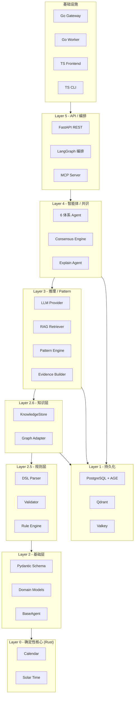
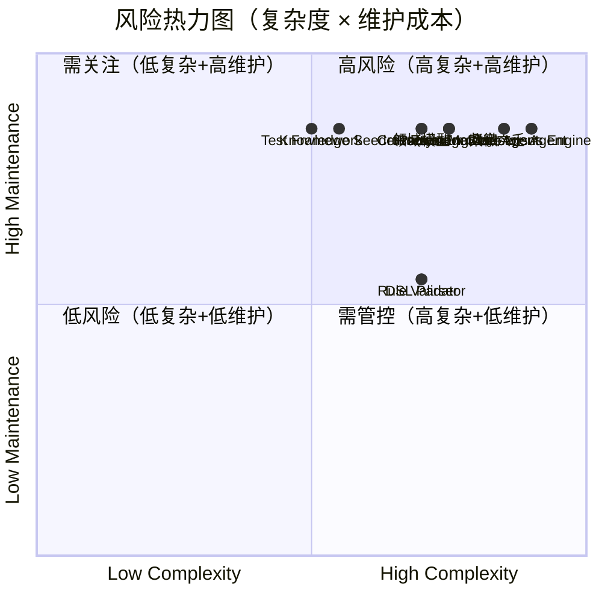

# Component Decision Matrix（组件决策矩阵）

> 状态：Engineering Freeze v1 (2026-07-12)
> 阶段：Phase 6.6 - Technology Selection & Open Source Evaluation
> 依赖：Phase 6 架构设计、Phase 6.5 Rule DSL、Phase 6.6 技术栈选型与开源评估
> 约束：不修改任何已有文档；不编写运行时代码；仅输出设计文档

---

## 1. 决策方法论

### 1.1 四种决策类型

| 决策 | 含义 | 适用场景 |
|------|------|----------|
| **Build** | 自研开发 | 核心竞争力模块，无开源替代或开源不满足需求 |
| **Reuse** | 采用开源 | 成熟开源项目可直接复用，不重复造轮子 |
| **Replace** | 替换现有实现 | 当前实现需被开源项目或新技术栈替换 |
| **Buy** | 购买商业服务 | 需专业服务支持且自研成本高于购买（本项目原则上不 Buy） |

### 1.2 评估字段说明

| 字段 | 说明 |
|------|------|
| 负责人 | 负责该组件的角色（非具体个人） |
| 语言 | 实现语言（Rust / Go / Python / TypeScript / SQL） |
| 是否自研 | ✅ 完全自研 / 🔶 部分自研（封装开源） / ❌ 不自研 |
| 是否采用开源 | ✅ 采用 / ❌ 不采用 |
| 预计 LOC | 预计代码行数（不含测试；标注「已有」表示已存在） |
| 预计复杂度 | Low / Medium / High / Very High |
| 未来维护成本 | Low / Medium / High |
| 风险 | 主要技术或交付风险 |
| 替代方案 | 若主方案失败的可选路径 |

### 1.3 组件分层总览

### 1.4 组件统计

| 类型 | 数量 |
|------|------|
| Build（自研） | 43 |
| Reuse（采用开源） | 14 |
| Replace（替换，子集） | 4 |
| Buy（购买） | 0 |
| **合计** | **57** |

---

## 2. Layer 0 - 确定性计算核心（Rust）

> 当前状态：Python 实现（`core/calendar.py`、`core/solar_time.py`）。
> 目标：迁移至 Rust，编译为 PyO3（Python 绑定）+ WASM（前端复用）+ C ABI（Go FFI）。

| ID | 组件 | 决策 | 负责人 | 语言 | 自研 | 开源 | LOC | 复杂度 | 维护 | 风险 | 替代方案 |
|----|------|------|--------|------|------|------|-----|--------|------|------|----------|
| C-01 | Calendar Engine | Build | Rust 工程师 | Rust | ✅ | sxtwl(数据) | ~800 | High | Medium | PyO3 Windows 编译；算法精度验证 | 纯 Python（已验证，无 WASM） |
| C-02 | Solar Time Engine | Build | Rust 工程师 | Rust | ✅ | - | ~400 | Medium | Low | 与 C-01 同库，风险关联 | 纯 Python（已验证） |
| C-03 | PyO3 Bindings | Build | Rust 工程师 | Rust | ✅ | pyo3/maturin | ~200 | Medium | Low | 版本兼容性（Python 3.11 ↔ PyO3） | CFFI（性能略低） |
| C-04 | WASM Build | Build | Rust 工程师 | Rust | ✅ | wasm-pack | ~100 | Low | Low | 包体积；浏览器 f64 一致性 | 前端 API 调用（延迟高） |

**关键说明**：

- **C-01 Calendar Engine**：迁移现有 `calendar.py` 的全部函数（`julian_day`、`solar_longitude`、`solar_term_time`、`solar_terms_for_year`、`lichun_time`、`sexagenary_day_index`、`month_boundary_before`、`bazi_year_index`、`solar_to_lunar`）。sxtwl 的 C 核心通过 FFI 封装提供农历数据，Meeus 算法自研。
- **C-02 Solar Time Engine**：迁移 `solar_time.py`（`equation_of_time`、`longitude_offset_minutes`、`true_solar_time`）。与 C-01 共享 Julian Day 计算，在同一 Rust crate 内。
- **C-04 WASM**：仅打包历法核心函数，不含 sxtwl FFI（sxtwl 为 C 库，WASM 编译复杂）。农历转换在 WASM 版本中回退到内置查找表。

---

## 3. Layer 1 - 持久化层

| ID | 组件 | 决策 | 负责人 | 语言 | 自研 | 开源 | LOC | 复杂度 | 维护 | 风险 | 替代方案 |
|----|------|------|--------|------|------|------|-----|--------|------|------|----------|
| C-05 | PostgreSQL Schema & Migrations | Build | Python 工程师 | SQL | ✅ | Alembic | ~500 | Medium | Low | 迁移脚本版本管理 | 手动 DDL |
| C-06 | Apache AGE Graph Schema | Reuse | Python 工程师 | Cypher | 🔶 | Apache AGE | ~200 | Medium | Low | AGE 版本与 PG 版本兼容性 | Neo4j（GPLv3 风险） |
| C-07 | Qdrant Vector Collections | Reuse | Python 工程师 | Python | 🔶 | qdrant-client | ~150 | Low | Low | 集合 schema 设计 | pgvector（性能较低） |
| C-08 | Valkey Cache & Queue Config | Reuse | DevOps | YAML | ❌ | Valkey | ~100 | Low | Low | 无 | Redis（RSALv2 风险） |
| C-09 | DB Connection Pool | Reuse | Python 工程师 | Python | ❌ | psycopg/SQLAlchemy | ~100 | Low | Low | 连接泄漏 | asyncpg |

**关键说明**：

- **C-05**：PostgreSQL 存储规则、知识节点、证据、共识报告、审计日志。`conditions`/`results`/`attributes` 使用 JSONB。Alembic 管理 schema 迁移。
- **C-06**：Apache AGE 作为 PostgreSQL 扩展提供图查询。`CREATE EXTENSION age` 启用。知识关系（生克冲刑合害）存为图边，Cypher 查询。**Replace** Neo4j（Phase 9 原计划），因 GPLv3 许可证风险。
- **C-07**：Qdrant 存储经典文献向量、知识节点向量、规则语义向量。三个 Collection：`classics`、`knowledge_nodes`、`rules`。
- **C-08**：Valkey 替代 Redis，配置缓存策略（TTL）、任务队列（asynq 后端）、限流计数器。

---

## 4. Layer 2 - 基础层（Python）

| ID | 组件 | 决策 | 负责人 | 语言 | 自研 | 开源 | LOC | 复杂度 | 维护 | 风险 | 替代方案 |
|----|------|------|--------|------|------|------|-----|--------|------|------|----------|
| C-10 | Pydantic Schema 模型 | Build | Python 工程师 | Python | ✅ | Pydantic | ~1500 | Medium | Medium | Phase 6 Schema 变更影响全局 | dataclass（无验证） |
| C-11 | 领域模型 (Charts) | Build | 命理+Python | Python | ✅ | Pydantic | ~1200 | High | High | 命理规则变更需同步 | TypedDict（无验证） |
| C-12 | DeterministicEngine + TraceRecorder | Build | Python 工程师 | Python | ✅(已有) | - | ~300 | Medium | Low | 纯函数契约不可破坏 | - |
| C-13 | BaseAgent 模板 | Build | Python 工程师 | Python | ✅(已有) | - | ~200 | Medium | Low | 模板方法稳定性 | - |
| C-14 | 确定性 RNG | Build | Python 工程师 | Python | ✅(已有) | - | ~50 | Low | Low | - | - |
| C-15 | Config & Settings | Build | Python 工程师 | Python | ✅(已有) | pydantic-settings | ~200 | Low | Low | 环境变量管理 | python-dotenv |

**关键说明**：

- **C-10 Pydantic Schema**：Phase 6 定义的全部模型（`Rule`、`RuleCondition`、`RuleResult`、`RuleScope`、`SourceRef`、`KnowledgeNode`、`SchoolView`、`Relation`、`Evidence`、`Pattern`、`EvidenceConsensusReport`）。通过 `model_json_schema()` 导出 JSON Schema。这些模型是全部业务逻辑的权威定义。
- **C-11 领域模型**：排盘结构（`BaziChart`、`ZiweiChart`、`QimenBoard`、`LiuyaoChart`）及其子结构（四柱、宫位、星曜等）。命理知识密集，需命理领域专家参与设计。
- **C-12 / C-13**：已存在于 `core/engines.py`，是「Rule First. LLM Last.」原则的代码体现。`DeterministicEngine.calculate()` 为纯函数契约，`BaseAgent` 管理确定性 `compute()` + 可选 `explain()` 生命周期。**禁止被外部框架替代**。

---

## 5. Layer 2.5 - 规则层（Python）

| ID | 组件 | 决策 | 负责人 | 语言 | 自研 | 开源 | LOC | 复杂度 | 维护 | 风险 | 替代方案 |
|----|------|------|--------|------|------|------|-----|--------|------|------|----------|
| C-16 | Rule Schema (Pydantic) | Build | 命理+Python | Python | ✅ | Pydantic | ~400 | Medium | Medium | Schema 与 DSL 同步 | - |
| C-17 | Rule DSL Parser | Build | Python 工程师 | Python | ✅ | PyYAML | ~600 | High | Medium | DNF 展开正确性；any/not 嵌套 | Lark（过度工程） |
| C-18 | Rule Validator | Build | Python 工程师 | Python | ✅ | Pydantic | ~800 | High | Medium | 6 阶段校验完整性 | 仅 Pydantic 验证（不足） |
| C-19 | Rule Engine | Build | 命理+Python | Python | ✅ | - | ~500 | High | High | 11 操作符实现；路径寻址 | python-rule-engine（不适配） |
| C-20 | Rule Registry | Build | Python 工程师 | Python | ✅(已有) | - | ~200 | Low | Low | 规则版本并存管理 | - |
| C-21 | Conflict Resolver | Build | 命理+Python | Python | ✅ | - | ~300 | Medium | Medium | retain_all 策略正确性 | - |

**关键说明**：

- **C-17 Rule DSL Parser**：Phase 6.5 定义完整 Grammar。核心职责：YAML->dict（PyYAML）-> `Rule` 模型（Pydantic 验证）-> DNF 条件展开（`any` 拆分为多条 Rule，派生 ID `#1`/`#2`）。`not` 映射为 `negate: true`。**禁止使用 Lark/tree-sitter**（DSL 以 YAML 为载体，无需通用解析器）。
- **C-18 Rule Validator**：6 阶段流水线（Parse->Grammar->Field->Scope->Schema->Version）。校验规则 ID 格式（`^rule:[a-z]+:[a-z_]+:v[0-9]+$`）、操作符合法性、Scope 系统匹配、Schema 字段完整性、版本语义化。
- **C-19 Rule Engine**：核心评估逻辑。遍历 Rule 的 conditions，对排盘结构化数据执行操作符匹配（`equals`/`contains`/`in`/`matches` 等 11 种）。field 路径指向 `BaziChart.pillars[0].ten_gods_stem` 等结构化路径。输出 `RuleEvaluation`。
- **C-21 Conflict Resolver**：实现三种策略（`retain_all`/`highest_priority_wins`/`merge`）。默认 `retain_all`（ADR-006），保留全部证据交由 Consensus Agent 处理。

---

## 6. Layer 2.6 - 知识层（Python）

| ID | 组件 | 决策 | 负责人 | 语言 | 自研 | 开源 | LOC | 复杂度 | 维护 | 风险 | 替代方案 |
|----|------|------|--------|------|------|------|-----|--------|------|------|----------|
| C-22 | Knowledge Node Schema | Build | 命理+Python | Python | ✅ | Pydantic | ~300 | Medium | Medium | 20 种 NodeType 属性键集合维护 | - |
| C-23 | Relation Schema | Build | 命理+Python | Python | ✅ | Pydantic | ~150 | Low | Low | 关系类型枚举完整性 | - |
| C-24 | KnowledgeStore 查询逻辑 | Build | 命理+Python | Python | ✅ | - | ~600 | High | High | 多流派解析；多态节点查询 | networkx（无持久化） |
| C-25 | Knowledge Graph Adapter | Reuse | Python 工程师 | Python | 🔶 | Apache AGE | ~400 | Medium | Medium | Cypher 查询性能；AGE Python 驱动成熟度 | neo4j-driver（GPLv3 风险） |
| C-26 | Knowledge Data Seeder | Build | 命理专家 | YAML/Python | ✅ | - | ~2000 | Medium | High | 知识准确性；多流派一致性 | - |

**关键说明**：

- **C-22 Knowledge Node Schema**：Phase 6 定义的多态节点模型。20 种 `node_type`，每种有预定义 `attributes` 键集合。`schools` 字段支持多流派（`SchoolView`）。知识层为**只读参考层**（ADR-002），不参与计算。
- **C-24 KnowledgeStore**：实现 Phase 6 定义的 Protocol（`get_node`/`query_nodes`/`get_relations`/`find_path`/`resolve_school`）。查询逻辑为项目特有，必须自研。底层图遍历委托给 C-25 的 AGE Cypher 引擎。
- **C-25 Knowledge Graph Adapter**：封装 Apache AGE 的 Cypher 查询，将 `find_path` 等高层接口翻译为 Cypher 语句。Python 端通过 psycopg 执行 Cypher（AGE 支持 SQL 接口调用 Cypher）。
- **C-26 Knowledge Data Seeder**：命理知识数据的 YAML/JSON 种子文件（五行、十神、主星、神煞、格局等知识节点 + 关系）。这是**内容资产**而非代码，需命理领域专家编写和审核。预计 2000+ 行知识定义。

---

## 7. Layer 3 / 3.5 - 推理与 Pattern（Python）

| ID | 组件 | 决策 | 负责人 | 语言 | 自研 | 开源 | LOC | 复杂度 | 维护 | 风险 | 替代方案 |
|----|------|------|--------|------|------|------|-----|--------|------|------|----------|
| C-27 | Evidence Schema & Builder | Build | 命理+Python | Python | ✅ | Pydantic | ~500 | High | Medium | 证据追溯链完整性 | - |
| C-28 | Pattern Schema | Build | 命理+Python | Python | ✅ | Pydantic | ~200 | Medium | Low | 格局定义标准化 | - |
| C-29 | Pattern Matcher | Build | 命理+Python | Python | ✅(部分) | - | ~500 | High | High | 格局识别规则正确性 | - |
| C-30 | Cross-system Pattern Detector | Build | 命理+Python | Python | ✅ | - | ~400 | High | High | 跨体系 Pattern 对齐语义 | - |
| C-31 | LLM Provider Abstraction | Reuse | Python 工程师 | Python | 🔶(已有) | httpx | ~300 | Low | Low | Ollama API 版本变更 | - |
| C-32 | Explainer (LLM 解释) | Build | 命理+Python | Python | ✅(已有) | - | ~400 | Medium | Medium | Prompt 质量；幻觉控制 | 确定性模板解释（fallback） |
| C-33 | RAG Retriever + Embedding | Reuse | Python 工程师 | Python | 🔶 | LangChain+Qdrant | ~300 | Medium | Medium | 检索相关性；嵌入模型选择 | 自研 qdrant-client 封装 |

**关键说明**：

- **C-27 Evidence Schema & Builder**：Phase 6 定义 `Evidence` 模型（规则 ID、格局 ID、知识节点 ID、来源、权重）。`EvidenceBuilder` 在规则评估和格局匹配后组装证据对象，确保每个结论可追溯到具体规则和经典出处。
- **C-29 Pattern Matcher**：已有部分实现（`agents/ziwei/pattern_matcher.py`，~5.2KB）。需扩展为通用 Pattern 匹配引擎，支持跨体系格局识别（如八字「伤官佩印」与紫微「文曲化科」的语义对齐）。
- **C-30 Cross-system Pattern Detector**：Phase 6 ADR-004 核心创新。不同体系的输出结构差异大，通过 Pattern 作为跨体系比较单元。多 Agent 识别同一 Pattern 时置信度增强。
- **C-31 LLM Provider**：已有 `inference/providers.py`（~3.9KB），抽象 Ollama/云端 LLM 调用。本地优先使用 Ollama，严格隔离于 `explain()` 方法，不可触及 `calculate()`。
- **C-32 Explainer**：已有 `bazi_explainer.py`（~8.9KB）和 `ziwei_explainer.py`（~9.6KB）。LLM 解释渲染 + 确定性模板 fallback。解释为非关键路径，LLM 不可用时回退到模板。
- **C-33 RAG Retriever**：已有骨架 `rag/retriever.py`（~2.9KB）。使用 LangChain Retriever + Qdrant 集成。检索逻辑按体系/流派过滤，自研；底层检索委托 LangChain。

---

## 8. Layer 4 / 4.5 - 智能体与共识（Python）

| ID | 组件 | 决策 | 负责人 | 语言 | 自研 | 开源 | LOC | 复杂度 | 维护 | 风险 | 替代方案 |
|----|------|------|--------|------|------|------|-----|--------|------|------|----------|
| C-34 | 八字 Agent + Engine | Build | 命理+Python | Python | ✅(已有) | - | ~1500 | Very High | High | 命理规则正确性；黄金向量维护 | - |
| C-35 | 紫微 Agent + Engine | Build | 命理+Python | Python | ✅(已有) | - | ~1500 | Very High | High | 三派排盘差异；星曜定位 | - |
| C-36 | 奇门 Agent + Engine | Build | 命理+Python | Python | ✅(已有) | - | ~1000 | High | High | 超神接气；置闰法 | - |
| C-37 | 六爻 Agent + Engine | Build | 命理+Python | Python | ✅(已有) | - | ~1500 | High | High | 纳甲/六亲逻辑 | - |
| C-38 | 梅花 Agent + Engine | Build | 命理+Python | Python | ✅ | - | ~800 | High | High | Phase 9 新增 | - |
| C-39 | 六壬 Agent + Engine | Build | 命理+Python | Python | ✅ | - | ~1200 | Very High | High | 四课三传复杂度 | - |
| C-40 | Agent Registry | Build | Python 工程师 | Python | ✅(已有) | - | ~150 | Low | Low | - | - |
| C-41 | Evidence Consensus Engine | Build | 命理+Python | Python | ✅ | - | ~800 | Very High | High | 多结论并存逻辑；证据聚合正确性 | Weighted Average（已废弃） |
| C-42 | Consensus Report Builder | Build | Python 工程师 | Python | ✅ | Pydantic | ~400 | Medium | Medium | 报告结构完整性 | - |
| C-43 | Explain Agent | Build | 命理+Python | Python | ✅ | LangGraph | ~600 | Medium | Medium | LLM 幻觉；引用准确性 | 确定性模板（已实现） |

**关键说明**：

- **C-34 ~ C-37**：已有实现并通过黄金向量测试。八字（`bazi.py` ~10.5KB）、紫微（`ziwei.py` ~11.4KB）、奇门（`qimen.py` ~8.4KB）、六爻（`liuyao.py` ~12.9KB）。这些是项目核心 IP，每个引擎的 `calculate()` 为纯函数，不修改。
- **C-38 / C-39**：Phase 9 新增。梅花易数（时间/数字起卦、体用分析）和大六壬（四课三传、天地盘）。依赖自研历法模块和知识层。
- **C-41 Evidence Consensus Engine**：Phase 6 ADR-001 核心创新。从 Weighted Average 升级为 Evidence-Based Consensus。多结论并存（按 Domain 分组，置信度降序），保留全部证据（ADR-006 `retain_all`）。现有 `consensus.py`（~8KB）需重构。
- **C-43 Explain Agent**：编排 LLM 生成自然语言解释，注入 Evidence + 知识节点引用 + 经典出处。使用 LangGraph 管理解释流程（检索->组装 prompt->调用 LLM->后处理引用）。LLM 不可用时回退到确定性模板（已实现于 `_explain_fallback`）。

---

## 9. Layer 5 - API 与编排（Python）

| ID | 组件 | 决策 | 负责人 | 语言 | 自研 | 开源 | LOC | 复杂度 | 维护 | 风险 | 替代方案 |
|----|------|------|--------|------|------|------|-----|--------|------|------|----------|
| C-44 | FastAPI REST App | Reuse | Python 工程师 | Python | 🔶(已有) | FastAPI/Uvicorn | ~500 | Medium | Low | 端点设计一致性 | Flask（生态弱） |
| C-45 | Orchestration Graph | Build | Python 工程师 | Python | ✅(已有) | LangGraph | ~500 | High | Medium | 状态图流程正确性；降级策略 | 自研编排（不推荐） |
| C-46 | OpenAPI Spec | Reuse | Python 工程师 | YAML | ❌ | FastAPI 自动生成 | ~0 | Low | Low | - | 手动编写（不推荐） |
| C-47 | MCP Server | Reuse | Python 工程师 | Python | 🔶(已有) | MCP Python SDK | ~400 | Medium | Low | MCP 协议版本演进 | 自研协议（禁止） |

**关键说明**：

- **C-44 FastAPI REST**：已有 `api/app.py`（~3.2KB）。暴露 `/orchestrate`、`/bazi/calculate`、`/ziwei/calculate` 等端点。FastAPI 自动生成 OpenAPI 3.1 spec。**Replace** 未来 Go Gateway 接管路由/鉴权/限流后，FastAPI 退为内部 gRPC 服务的 REST 适配层。
- **C-45 Orchestration Graph**：已有 `orchestration/graph.py`（~4.7KB）。LangGraph StateGraph 编排：排盘->规则评估->格局匹配->共识聚合->解释生成。支持条件分支（某体系失败则跳过）和降级（LLM 不可用时模板解释）。
- **C-47 MCP Server**：已有骨架 `mcp/server.py`（~1.7KB）。将排盘、规则查询、知识查询暴露为 MCP Tools，供本地 LLM Agent 调用。使用官方 MCP Python SDK（MIT），**禁止自研 MCP 协议**。

---

## 10. 基础设施 - Go

| ID | 组件 | 决策 | 负责人 | 语言 | 自研 | 开源 | LOC | 复杂度 | 维护 | 风险 | 替代方案 |
|----|------|------|--------|------|------|------|-----|--------|------|------|----------|
| C-48 | API Gateway | Build | Go 工程师 | Go | ✅ | grpc-go/Gin | ~1500 | Medium | Medium | 与 Python 服务 gRPC 契约同步 | Python FastAPI 代理（性能差） |
| C-49 | Worker | Build | Go 工程师 | Go | ✅ | asynq | ~800 | Medium | Low | 任务幂等性；失败重试 | Celery（Python，跨语言开销） |
| C-50 | Scheduler | Build | Go 工程师 | Go | ✅ | robfig/cron | ~300 | Low | Low | 时区处理 | 系统 crontab（不可观测） |

**关键说明**：

- **C-48 API Gateway**：系统入口，负责 REST 路由、JWT 鉴权、限流（Valkey 计数器）、请求日志。通过 gRPC 转发至 Python 服务。**Replace** 当前 FastAPI 直接对外暴露的模式。渐进迁移：Phase 9 引入 Go Gateway，FastAPI 退为内部服务。
- **C-49 Worker**：后台任务执行（规则批量校验、知识库导入、RAG 索引重建、向量重计算）。asynq 基于 Valkey，支持重试/超时/优先级/死信队列。通过 gRPC 调用 Python 服务执行业务逻辑。
- **C-50 Scheduler**：定时任务（每日节气预计算缓存、定期知识库同步、向量索引重建）。`robfig/cron` 解析 cron 表达式，触发 asynq 任务。

---

## 11. 基础设施 - TypeScript

| ID | 组件 | 决策 | 负责人 | 语言 | 自研 | 开源 | LOC | 复杂度 | 维护 | 风险 | 替代方案 |
|----|------|------|--------|------|------|------|-----|--------|------|------|----------|
| C-51 | Frontend | Build | 前端工程师 | TypeScript | ✅ | React/Vite/TanStack | ~5000 | High | High | 命盘可视化复杂度；WASM 集成 | - |
| C-52 | CLI | Build | 前端工程师 | TypeScript | ✅ | Commander.js | ~800 | Medium | Low | npm 分发；跨平台 | Python CLI（不推荐） |

**关键说明**：

- **C-51 Frontend**：Web UI 展示排盘结果（八字四柱表、紫微星盘 Canvas/SVG、奇门九宫格）、规则管理界面、知识图谱浏览。通过 OpenAPI Codegen 从后端 spec 生成 TypeScript 类型。历法预览使用 Rust WASM（C-04）在浏览器本地计算，零 API 延迟。
- **C-52 CLI**：`npm install -g openmetaphysics` 分发。命令行排盘、规则校验、知识查询。与 Frontend 共享 API 类型定义和 OpenAPI 客户端。

---

## 12. 跨切面组件

| ID | 组件 | 决策 | 负责人 | 语言 | 自研 | 开源 | LOC | 复杂度 | 维护 | 风险 | 替代方案 |
|----|------|------|--------|------|------|------|-----|--------|------|------|----------|
| C-53 | Protobuf IDL & gRPC | Reuse | Go+Python 工程师 | Proto | 🔶 | grpc-go/grpcio | ~500 | Medium | Medium | .proto 与 Pydantic 适配层维护 | REST only（性能差） |
| C-54 | Docker Compose | Reuse | DevOps | YAML | ❌ | Docker | ~200 | Low | Low | 多服务编排复杂度 | k8s（过重） |
| C-55 | CI/CD Pipeline | Reuse | DevOps | YAML | ❌ | GitHub Actions | ~300 | Low | Low | 多语言构建矩阵 | - |
| C-56 | Test Framework & Golden Vectors | Build | 全员 | Python | ✅ | pytest | ~3000 | Medium | High | 黄金向量维护；命理正确性验证 | - |
| C-57 | Logging & Tracing | Reuse | DevOps | Python/Go | 🔶 | OpenTelemetry | ~400 | Medium | Medium | 跨语言 trace 关联 | 结构化日志（无 trace） |

**关键说明**：

- **C-53 Protobuf IDL**：`.proto` 文件作为内部 gRPC 服务的唯一真相源。codegen 生成 Go 和 Python 代码。Pydantic 模型仍为业务权威，Protobuf 消息为传输契约，通过显式适配层映射。**禁止自动绑定**（如 protobuf-to-pydantic），保持解耦。
- **C-54 Docker Compose**：`docker-compose.yml` 编排全部服务（PostgreSQL+AGE、Qdrant、Valkey、Ollama、Python API、Go Gateway、Go Worker）。本地一键启动。
- **C-56 Test Framework**：pytest 单元测试 + 集成测试 + 回归测试。黄金向量（Golden Vectors）是命理正确性的核心保障--每个体系的排盘结果与人工验证的基准比对。测试代码量预计最大（~3000 LOC）。
- **C-57 Logging & Tracing**：OpenTelemetry 贯穿 Go Gateway -> gRPC -> Python 服务，统一 trace ID。结构化日志（JSON）便于聚合分析。

---

## 13. 完整组件矩阵

### 13.1 决策与语言总表

| ID | 组件 | 决策 | 负责人 | 语言 | 自研 | 开源依赖 | LOC |
|----|------|------|--------|------|------|----------|-----|
| C-01 | Calendar Engine | Build | Rust 工程师 | Rust | ✅ | sxtwl | ~800 |
| C-02 | Solar Time Engine | Build | Rust 工程师 | Rust | ✅ | - | ~400 |
| C-03 | PyO3 Bindings | Build | Rust 工程师 | Rust | ✅ | pyo3/maturin | ~200 |
| C-04 | WASM Build | Build | Rust 工程师 | Rust | ✅ | wasm-pack | ~100 |
| C-05 | PostgreSQL Schema | Build | Python 工程师 | SQL | ✅ | Alembic | ~500 |
| C-06 | AGE Graph Schema | Reuse | Python 工程师 | Cypher | 🔶 | Apache AGE | ~200 |
| C-07 | Qdrant Collections | Reuse | Python 工程师 | Python | 🔶 | qdrant-client | ~150 |
| C-08 | Valkey Config | Reuse | DevOps | YAML | ❌ | Valkey | ~100 |
| C-09 | DB Connection Pool | Reuse | Python 工程师 | Python | ❌ | psycopg/SQLAlchemy | ~100 |
| C-10 | Pydantic Schema 模型 | Build | Python 工程师 | Python | ✅ | Pydantic | ~1500 |
| C-11 | 领域模型 (Charts) | Build | 命理+Python | Python | ✅ | Pydantic | ~1200 |
| C-12 | DeterministicEngine | Build | Python 工程师 | Python | ✅(已有) | - | ~300 |
| C-13 | BaseAgent 模板 | Build | Python 工程师 | Python | ✅(已有) | - | ~200 |
| C-14 | 确定性 RNG | Build | Python 工程师 | Python | ✅(已有) | - | ~50 |
| C-15 | Config & Settings | Build | Python 工程师 | Python | ✅(已有) | pydantic-settings | ~200 |
| C-16 | Rule Schema | Build | 命理+Python | Python | ✅ | Pydantic | ~400 |
| C-17 | Rule DSL Parser | Build | Python 工程师 | Python | ✅ | PyYAML | ~600 |
| C-18 | Rule Validator | Build | Python 工程师 | Python | ✅ | Pydantic | ~800 |
| C-19 | Rule Engine | Build | 命理+Python | Python | ✅ | - | ~500 |
| C-20 | Rule Registry | Build | Python 工程师 | Python | ✅(已有) | - | ~200 |
| C-21 | Conflict Resolver | Build | 命理+Python | Python | ✅ | - | ~300 |
| C-22 | Knowledge Node Schema | Build | 命理+Python | Python | ✅ | Pydantic | ~300 |
| C-23 | Relation Schema | Build | 命理+Python | Python | ✅ | Pydantic | ~150 |
| C-24 | KnowledgeStore | Build | 命理+Python | Python | ✅ | - | ~600 |
| C-25 | Graph Adapter | Reuse | Python 工程师 | Python | 🔶 | Apache AGE | ~400 |
| C-26 | Knowledge Data Seeder | Build | 命理专家 | YAML | ✅ | - | ~2000 |
| C-27 | Evidence Schema & Builder | Build | 命理+Python | Python | ✅ | Pydantic | ~500 |
| C-28 | Pattern Schema | Build | 命理+Python | Python | ✅ | Pydantic | ~200 |
| C-29 | Pattern Matcher | Build | 命理+Python | Python | ✅(部分) | - | ~500 |
| C-30 | Cross-system Detector | Build | 命理+Python | Python | ✅ | - | ~400 |
| C-31 | LLM Provider | Reuse | Python 工程师 | Python | 🔶(已有) | httpx | ~300 |
| C-32 | Explainer | Build | 命理+Python | Python | ✅(已有) | - | ~400 |
| C-33 | RAG Retriever | Reuse | Python 工程师 | Python | 🔶 | LangChain+Qdrant | ~300 |
| C-34 | 八字 Agent | Build | 命理+Python | Python | ✅(已有) | - | ~1500 |
| C-35 | 紫微 Agent | Build | 命理+Python | Python | ✅(已有) | - | ~1500 |
| C-36 | 奇门 Agent | Build | 命理+Python | Python | ✅(已有) | - | ~1000 |
| C-37 | 六爻 Agent | Build | 命理+Python | Python | ✅(已有) | - | ~1500 |
| C-38 | 梅花 Agent | Build | 命理+Python | Python | ✅ | - | ~800 |
| C-39 | 六壬 Agent | Build | 命理+Python | Python | ✅ | - | ~1200 |
| C-40 | Agent Registry | Build | Python 工程师 | Python | ✅(已有) | - | ~150 |
| C-41 | Consensus Engine | Build | 命理+Python | Python | ✅ | - | ~800 |
| C-42 | Consensus Report Builder | Build | Python 工程师 | Python | ✅ | Pydantic | ~400 |
| C-43 | Explain Agent | Build | 命理+Python | Python | ✅ | LangGraph | ~600 |
| C-44 | FastAPI REST | Reuse | Python 工程师 | Python | 🔶(已有) | FastAPI | ~500 |
| C-45 | Orchestration Graph | Build | Python 工程师 | Python | ✅(已有) | LangGraph | ~500 |
| C-46 | OpenAPI Spec | Reuse | Python 工程师 | YAML | ❌ | FastAPI 自动生成 | ~0 |
| C-47 | MCP Server | Reuse | Python 工程师 | Python | 🔶(已有) | MCP SDK | ~400 |
| C-48 | API Gateway | Build | Go 工程师 | Go | ✅ | grpc-go/Gin | ~1500 |
| C-49 | Worker | Build | Go 工程师 | Go | ✅ | asynq | ~800 |
| C-50 | Scheduler | Build | Go 工程师 | Go | ✅ | robfig/cron | ~300 |
| C-51 | Frontend | Build | 前端工程师 | TypeScript | ✅ | React/Vite | ~5000 |
| C-52 | CLI | Build | 前端工程师 | TypeScript | ✅ | Commander.js | ~800 |
| C-53 | Protobuf IDL & gRPC | Reuse | Go+Python 工程师 | Proto | 🔶 | grpc-go/grpcio | ~500 |
| C-54 | Docker Compose | Reuse | DevOps | YAML | ❌ | Docker | ~200 |
| C-55 | CI/CD Pipeline | Reuse | DevOps | YAML | ❌ | GitHub Actions | ~300 |
| C-56 | Test Framework | Build | 全员 | Python | ✅ | pytest | ~3000 |
| C-57 | Logging & Tracing | Reuse | DevOps | Python/Go | 🔶 | OpenTelemetry | ~400 |

### 13.2 复杂度、维护成本与风险

| ID | 组件 | 复杂度 | 维护 | 风险摘要 | 替代方案 |
|----|------|--------|------|----------|----------|
| C-01 | Calendar Engine | High | Medium | PyO3 Windows 编译；算法精度 | 纯 Python |
| C-02 | Solar Time Engine | Medium | Low | 与 C-01 同库风险关联 | 纯 Python |
| C-03 | PyO3 Bindings | Medium | Low | Python/Rust 版本兼容 | CFFI |
| C-04 | WASM Build | Low | Low | 包体积；f64 一致性 | API 调用 |
| C-05 | PostgreSQL Schema | Medium | Low | 迁移版本管理 | 手动 DDL |
| C-06 | AGE Graph Schema | Medium | Low | AGE/PG 版本兼容 | Neo4j（GPLv3） |
| C-07 | Qdrant Collections | Low | Low | 集合 schema 设计 | pgvector |
| C-08 | Valkey Config | Low | Low | 无 | Redis（RSALv2） |
| C-09 | DB Connection Pool | Low | Low | 连接泄漏 | asyncpg |
| C-10 | Pydantic Schema | Medium | Medium | Schema 变更影响全局 | dataclass |
| C-11 | 领域模型 | High | High | 命理规则变更同步 | TypedDict |
| C-12 | DeterministicEngine | Medium | Low | 纯函数契约不可破坏 | - |
| C-13 | BaseAgent | Medium | Low | 模板稳定性 | - |
| C-14 | 确定性 RNG | Low | Low | - | - |
| C-15 | Config | Low | Low | 环境变量管理 | python-dotenv |
| C-16 | Rule Schema | Medium | Medium | Schema 与 DSL 同步 | - |
| C-17 | DSL Parser | High | Medium | DNF 展开正确性 | Lark（过度工程） |
| C-18 | Rule Validator | High | Medium | 6 阶段校验完整性 | 仅 Pydantic |
| C-19 | Rule Engine | High | High | 11 操作符；路径寻址 | python-rule-engine |
| C-20 | Rule Registry | Low | Low | 版本并存管理 | - |
| C-21 | Conflict Resolver | Medium | Medium | retain_all 正确性 | - |
| C-22 | Knowledge Node Schema | Medium | Medium | 20 种属性键维护 | - |
| C-23 | Relation Schema | Low | Low | 关系枚举完整性 | - |
| C-24 | KnowledgeStore | High | High | 多流派解析；多态查询 | networkx |
| C-25 | Graph Adapter | Medium | Medium | Cypher 性能；驱动成熟度 | neo4j-driver |
| C-26 | Knowledge Seeder | Medium | High | 知识准确性；流派一致性 | - |
| C-27 | Evidence Builder | High | Medium | 证据追溯链完整性 | - |
| C-28 | Pattern Schema | Medium | Low | 格局标准化 | - |
| C-29 | Pattern Matcher | High | High | 格局识别正确性 | - |
| C-30 | Cross-system Detector | High | High | 跨体系语义对齐 | - |
| C-31 | LLM Provider | Low | Low | Ollama API 变更 | - |
| C-32 | Explainer | Medium | Medium | Prompt 质量；幻觉 | 模板 fallback |
| C-33 | RAG Retriever | Medium | Medium | 检索相关性 | 自研封装 |
| C-34 | 八字 Agent | Very High | High | 命理正确性；黄金向量 | - |
| C-35 | 紫微 Agent | Very High | High | 三派差异；星曜定位 | - |
| C-36 | 奇门 Agent | High | High | 超神接气；置闰 | - |
| C-37 | 六爻 Agent | High | High | 纳甲/六亲逻辑 | - |
| C-38 | 梅花 Agent | High | High | Phase 9 新增 | - |
| C-39 | 六壬 Agent | Very High | High | 四课三传复杂度 | - |
| C-40 | Agent Registry | Low | Low | - | - |
| C-41 | Consensus Engine | Very High | High | 多结论并存；证据聚合 | Weighted Avg（已废弃） |
| C-42 | Consensus Report | Medium | Medium | 报告结构完整性 | - |
| C-43 | Explain Agent | Medium | Medium | LLM 幻觉；引用准确 | 模板 fallback |
| C-44 | FastAPI REST | Medium | Low | 端点一致性 | Flask |
| C-45 | Orchestration Graph | High | Medium | 流程正确性；降级策略 | 自研编排 |
| C-46 | OpenAPI Spec | Low | Low | - | 手动编写 |
| C-47 | MCP Server | Medium | Low | MCP 协议演进 | 自研（禁止） |
| C-48 | API Gateway | Medium | Medium | gRPC 契约同步 | Python 代理 |
| C-49 | Worker | Medium | Low | 任务幂等性；重试 | Celery |
| C-50 | Scheduler | Low | Low | 时区处理 | 系统 crontab |
| C-51 | Frontend | High | High | 命盘可视化；WASM 集成 | - |
| C-52 | CLI | Medium | Low | npm 分发；跨平台 | Python CLI |
| C-53 | Protobuf IDL | Medium | Medium | 适配层维护 | REST only |
| C-54 | Docker Compose | Low | Low | 多服务编排 | k8s（过重） |
| C-55 | CI/CD | Low | Low | 多语言构建矩阵 | - |
| C-56 | Test Framework | Medium | High | 黄金向量维护 | - |
| C-57 | Logging & Tracing | Medium | Medium | 跨语言 trace 关联 | 结构化日志 |

---

## 14. 风险热力图

按「复杂度 × 维护成本」定位风险等级：

**高风险组件**（复杂度 Very High/High + 维护 High）需优先投入资源和测试覆盖：

| 优先级 | 组件 | 原因 |
|--------|------|------|
| P0 | C-41 Consensus Engine | 核心创新，多结论并存逻辑复杂 |
| P0 | C-34/C-35 八字/紫微 Agent | 核心体系，命理正确性要求极高 |
| P0 | C-39 六壬 Agent | 最复杂排盘，Phase 9 新增 |
| P1 | C-24 KnowledgeStore | 多流派解析 + 多态查询 |
| P1 | C-29/C-30 Pattern Matcher/Detector | 跨体系格局对齐 |
| P1 | C-19 Rule Engine | 11 操作符 + 路径寻址 |
| P1 | C-11 领域模型 | 命理规则变更需同步 |
| P2 | C-17/C-18 DSL Parser/Validator | DNF 展开 + 6 阶段校验 |
| P2 | C-51 Frontend | 命盘可视化 + WASM 集成 |
| P2 | C-26 Knowledge Seeder | 知识准确性，内容资产 |
| P2 | C-56 Test Framework | 黄金向量维护 |

---

## 15. 统计汇总

### 15.1 决策分布

| 决策 | 数量 | 占比 | 说明 |
|------|------|------|------|
| Build | 43 | 75% | 核心 IP 自研 |
| Reuse | 14 | 25% | 采用开源 |
| Replace（子集） | 4 | 7% | 替换现有实现（含于上） |
| Buy | 0 | 0% | 不购买商业服务 |

**Replace 组件明细**：

| ID | 组件 | 替换内容 | 替换为 |
|----|------|----------|--------|
| C-01 | Calendar Engine | Python 实现 | Rust 实现（PyO3+WASM） |
| C-02 | Solar Time Engine | Python 实现 | Rust 实现 |
| C-06 | AGE Graph Schema | 原 Neo4j 计划 | Apache AGE（GPLv3 规避） |
| C-08 | Valkey Config | 原 Redis 计划 | Valkey（RSALv2 规避） |

### 15.2 语言分布

| 语言 | 组件数 | 预计 LOC | 占比 |
|------|--------|----------|------|
| Python | 39 | ~24,400 | 63% |
| Rust | 4 | ~1,500 | 4% |
| Go | 3 | ~2,600 | 7% |
| TypeScript | 2 | ~5,800 | 15% |
| SQL/Cypher | 2 | ~700 | 2% |
| YAML | 5 | ~2,600 | 7% |
| Proto | 1 | ~500 | 1% |
| Python/Go | 1 | ~400 | 1% |
| **合计** | **57** | **~38,500** | **100%** |

### 15.3 已有 vs 新建

| 状态 | 组件数 | 说明 |
|------|--------|------|
| 已有实现 | 16 | 当前代码库已存在（含 1 个部分实现） |
| 新建 | 41 | 需开发 |

已有实现组件：C-12~C-15、C-20、C-29(部分)、C-31、C-32、C-34~C-37、C-40、C-44、C-45、C-47

### 15.4 维护成本分布

| 维护成本 | 组件数 | 典型组件 |
|----------|--------|----------|
| High | 15 | 命理引擎、Consensus、KnowledgeStore、Pattern、Frontend、Test |
| Medium | 17 | DSL Parser、Validator、Graph Adapter、Gateway、Protobuf |
| Low | 25 | 基础设施、Schema、Config、开源封装 |

### 15.5 负责人分布

| 角色 | 负责组件数 | 关键职责 |
|------|-----------|----------|
| 命理+Python 工程师 | 20 | 排盘引擎、规则、知识、Pattern、共识、解释 |
| Python 工程师 | 21 | Schema、API、编排、基础设施封装、DB |
| Rust 工程师 | 4 | 历法核心、绑定、WASM |
| Go 工程师 | 3 | Gateway、Worker、Scheduler |
| 前端工程师 | 2 | Frontend、CLI |
| DevOps | 4 | Docker、CI/CD、Logging、Valkey |
| Go+Python 工程师 | 1 | Protobuf IDL & gRPC |
| 命理专家 | 1 | Knowledge Data Seeder（内容资产） |
| 全员 | 1 | Test Framework & Golden Vectors |

---

## 16. 阶段映射

| 阶段 | 组件 ID | 交付目标 |
|------|---------|----------|
| Phase 7 | C-10,C-11,C-16~C-21,C-22~C-26 | Rule+Knowledge 模型与内存存储 |
| Phase 7 | C-27,C-28,C-29 | Evidence+Pattern 实现 |
| Phase 7 | C-34,C-35 接入规则 | 八字+紫微后处理 |
| Phase 8 | C-41,C-42,C-43 | Consensus 升级 + Explain 集成 |
| Phase 8 | C-30,C-33 | 跨体系 Pattern + RAG |
| Phase 9 | C-01~C-04 | Rust 核心（Calendar/SolarTime） |
| Phase 9 | C-05~C-09 | 持久化（PostgreSQL+AGE+Qdrant+Valkey） |
| Phase 9 | C-38,C-39 | 梅花+六壬 |
| Phase 9 | C-48~C-50 | Go 基础设施 |
| Phase 10 | C-51,C-52 | TypeScript Frontend+CLI |
| Phase 10 | C-53~C-57 | gRPC、Docker、CI/CD、测试、可观测性 |

---

> **本文档为 Phase 6.6 组件决策矩阵，不包含任何实现代码。所有组件决策需在 Phase 7 实现前经架构评审确认。**
> **LOC 为粗略估计，仅供资源规划参考，不代表最终代码量。**
