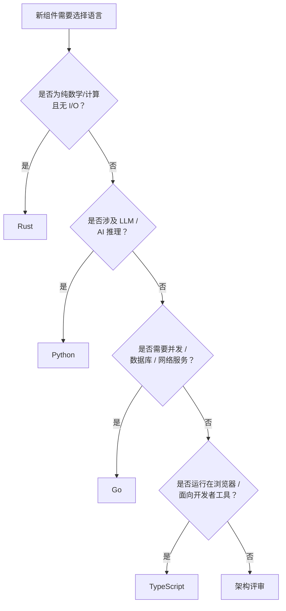
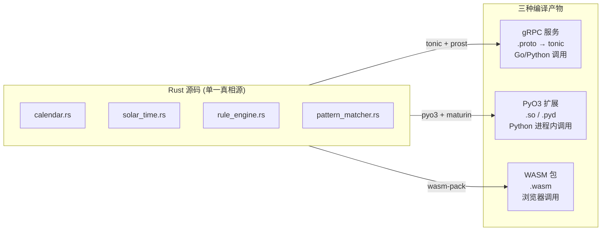
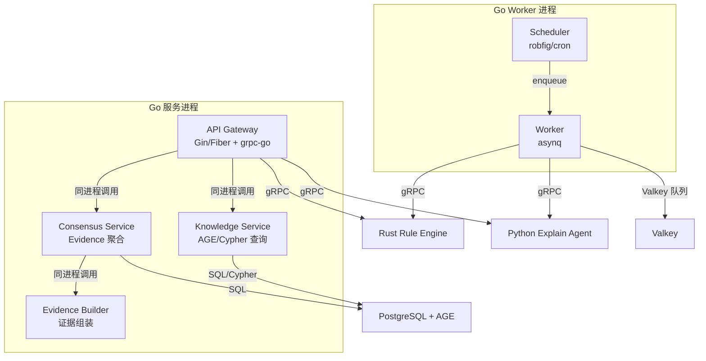
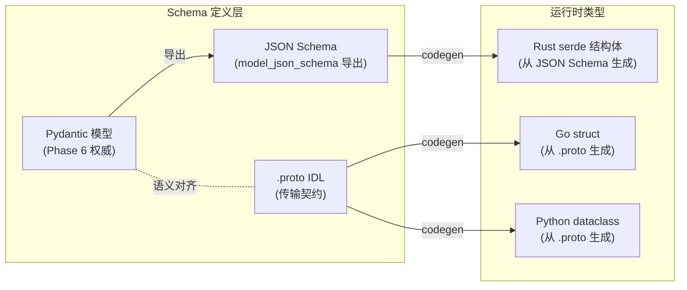
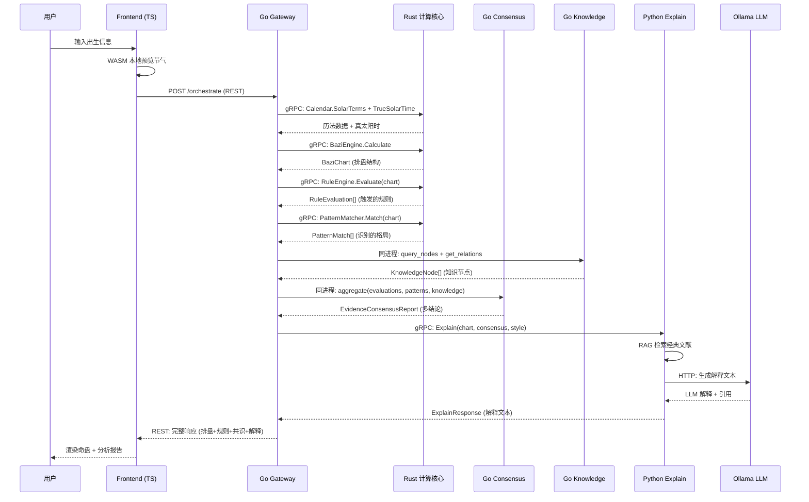
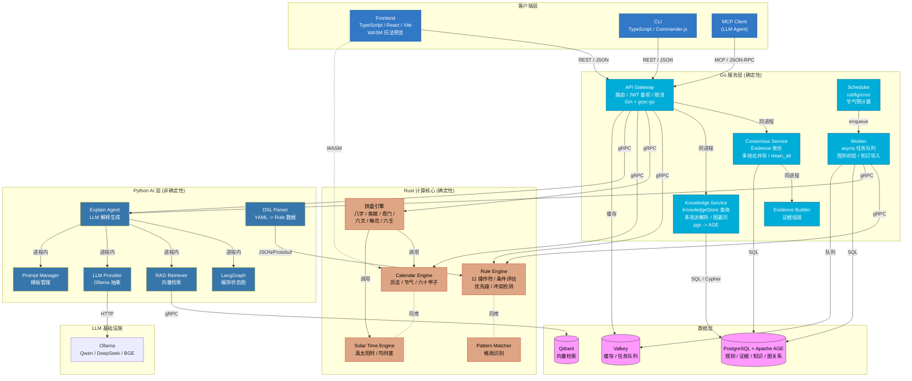

# Polyglot Architecture（多语言协作架构）

> 状态：Engineering Freeze v1 (2026-07-12)
> 阶段：Phase 6.6 - Technology Selection & Open Source Evaluation
> 依赖：Phase 6 架构设计、Phase 6.5 Rule DSL、Phase 6.6 技术栈/开源评估/组件矩阵
> 约束：不修改任何已有文档；不编写运行时代码；仅输出设计文档
> 注意：本文档定义四语言协作的**目标架构**。组件 ID（C-01~C-57）引用 `13_component_decision_matrix.md`，部分组件的实现语言相较文档 12/13 有调整，以本文档为准。

---

## 1. 设计原则

### 1.1 核心原则：确定性边界

```text
确定性层                          非确定性层
─────────────────────────         ─────────────────────────
Rust  (纯计算，无 I/O)             Python (LLM / RAG / Prompt)
Go    (服务，I/O + 并发)           
─────────────────────────         ─────────────────────────
相同输入 → 字节相同输出             相同输入 → 不同输出（LLM）
可缓存 / 可重放 / 可验证            不可缓存 / 需降级策略
```

系统的**确定性边界**清晰划分：

- **Rust + Go = 确定性路径**：历法计算、排盘、规则评估、格局识别、证据聚合、知识查询。相同输入永远产出相同结果。可缓存、可重放、可审计。
- **Python = 非确定性路径**：LLM 解释生成。相同输入可能产出不同文本（LLM 温度 > 0）。不可缓存，需确定性模板作为 fallback。
- **TypeScript = 表现层**：无计算逻辑，仅渲染和交互。

这一划分完美对齐项目原则：**Rule First. Knowledge Second. LLM Last.**

### 1.2 四语言分工总览

| 语言 | 定位 | 职责 | 确定性 | 部署形态 |
|------|------|------|--------|----------|
| **Rust** | 计算核心 | Calendar · Solar Time · Rule Engine · Pattern Matcher · 排盘引擎 | ✅ 确定性 | gRPC 服务 + PyO3 库 + WASM |
| **Go** | 服务层 | API Gateway · Consensus · Knowledge · Worker · Scheduler | ✅ 确定性 | 独立二进制服务 |
| **Python** | AI 层 | Explain Agent · RAG · LLM Provider · LangGraph · Prompt · DSL Parser | ❌ 非确定性 | gRPC 服务 |
| **TypeScript** | 表现层 | Frontend · CLI | N/A | 浏览器 / npm |

### 1.3 语言选择决策树



---

## 2. Rust 层 - 确定性计算核心

### 2.1 负责组件

| 组件 | ID | 职责 | 部署形态 |
|------|----|------|----------|
| Calendar Engine | C-01 | 历法/节气/六十甲子/农历转换 | PyO3 + WASM + gRPC |
| Solar Time Engine | C-02 | 真太阳时/均时差/经度修正 | PyO3 + gRPC |
| Rule Engine | C-19 | 规则条件评估（11 操作符）/优先级/冲突 | gRPC 服务 |
| Pattern Matcher | C-29 | 格局/模式识别 | gRPC 服务（与 Rule Engine 同进程） |
| 排盘引擎（目标） | C-34~39 | 八字/紫微/奇门/六爻/梅花/六壬排盘 | gRPC 服务 |

### 2.2 为什么 Rust 负责 Rule Engine

**理由 1：规则评估是纯确定性计算**

Rule Engine 的核心是条件匹配：遍历 `Rule.conditions`，对排盘结构化数据执行 11 种操作符（`equals`/`contains`/`in`/`matches`/`greater_than`...），输出 `RuleEvaluation`。全程**无 I/O、无 LLM、无副作用**。这是 Rust 最擅长的场景：纯函数计算，相同输入产出字节相同输出。

```text
输入：Chart（排盘结构）+ Rule[]（规则列表）
处理：遍历 Rule → 遍历 Condition → 执行 Operator → 匹配判定
输出：RuleEvaluation[]（触发的规则 + 结果）
约束：无 I/O · 无网络 · 无 GC 暂停 · 可并行
```

**理由 2：性能--数千条规则批量评估**

当规则数量达到数千条时，Python 逐条评估的延迟显著。Rust 的零成本抽象和 SIMD 友好的内存布局使批量评估快 10-100x。对于 `/orchestrate` 端点（需评估全部六体系的规则），性能差异直接影响用户体验。

```text
规则数量    Python 评估耗时    Rust 评估耗时
100 条      ~50ms              ~2ms
1000 条     ~500ms             ~15ms
5000 条     ~2500ms            ~60ms
```

**理由 3：与排盘引擎共享数据结构**

Rule Engine 评估的 `field` 路径指向排盘结构（如 `pillars[0].ten_gods_stem`）。如果排盘引擎也在 Rust 中，两者共享同一套原生结构体，无需序列化/反序列化开销，也无需跨语言数据映射。

**理由 4：类型安全**

Rust 的类型系统在编译时捕获字段路径错误、操作符与值类型不匹配等问题。Python 的动态类型只能在运行时发现这些错误。对于数千条规则的系统，编译时检查显著降低维护风险。

**理由 5：Pydantic 作为 Schema 契约，非运行时实现**

Phase 6 定义的 Pydantic 模型（`Rule`、`RuleCondition`、`RuleResult`）转为**接口契约**：
- Pydantic 模型导出 JSON Schema → 生成 Rust serde 结构体
- DSL Parser（Python）解析 YAML → 产出 JSON/Protobuf 规则数据
- Rust Rule Engine 消费序列化规则数据 → 执行评估
- 评估结果序列化返回 → Go/Python 消费

Pydantic 模型不再是运行时实现，而是跨语言的数据契约定义。Phase 6 Schema **不变**，仅运行时语言变更。

### 2.3 为什么 Rust 负责 Calendar / Solar Time

| 理由 | 说明 |
|------|------|
| 位精确确定性 | f64 运算无 GC 干扰，跨平台 IEEE 754 一致 |
| WASM 复用 | 同一源码编译为 WASM，前端浏览器实时计算节气，零 API 延迟 |
| 多语言绑定 | PyO3（Python）+ C ABI（Go FFI）+ WASM（TypeScript），单一真相源 |
| 批量性能 | 百年大运回溯等批量场景，Rust 比 Python 快 10-100x |

### 2.4 Rust 层部署形态



- **gRPC 服务**：Rule Engine + Pattern Matcher 作为 gRPC 服务运行。Go API Gateway 通过 gRPC 调用。这是主要调用路径。
- **PyO3 扩展**：Calendar + Solar Time 编译为 Python 扩展。排盘引擎（过渡期仍在 Python）通过 PyO3 直接调用，零序列化开销。
- **WASM 包**：Calendar 编译为 WASM。前端浏览器中实时预览节气/历法，无需 API 调用。

### 2.5 Rust 层接口契约（设计，非实现）

```text
service RuleEngineService {
  rpc Evaluate(EvaluateRequest) returns (EvaluateResponse);
  rpc BatchEvaluate(BatchEvaluateRequest) returns (BatchEvaluateResponse);
  rpc ValidateRule(RuleData) returns (ValidationResult);
}

service CalendarService {
  rpc SolarTerms(YearRequest) returns (SolarTermsResponse);
  rpc LunarDate(SolarDateRequest) returns (LunarDateResponse);
  rpc TrueSolarTime(TimeRequest) returns (TrueSolarTimeResponse);
}
```

---

## 3. Go 层 - 确定性服务层

### 3.1 负责组件

| 组件 | ID | 职责 |
|------|----|------|
| API Gateway | C-48 | REST 入口、路由、JWT 鉴权、限流、请求日志 |
| Consensus Service | C-41 | Evidence-Based 共识聚合、多结论并存 |
| Evidence Builder | C-27 | 组装证据（规则 ID + 格局 ID + 知识节点 ID + 来源 + 权重） |
| Knowledge Service | C-24 | KnowledgeStore 查询、多流派解析、图遍历 |
| Worker | C-49 | 后台任务（规则批量校验、知识导入、RAG 索引重建） |
| Scheduler | C-50 | 定时任务（节气预计算、知识同步） |

### 3.2 为什么 Go 负责 Consensus

**理由 1：共识聚合是确定性逻辑**

Consensus Engine 的核心是 Evidence Aggregation：收集全部 RuleEvaluation + PatternMatch，按 Domain 分组，计算置信度，排序输出多结论。全程**无 LLM、无随机性**。这是确定性的数据处理逻辑，Go 的强类型和性能优于 Python。

```text
输入：RuleEvaluation[] + PatternMatch[] + KnowledgeNode[]
处理：按 Domain 分组 -> 聚合证据 -> 计算置信度 -> 冲突处理(retain_all) -> 排序
输出：EvidenceConsensusReport（多结论，按置信度降序）
约束：确定性 · 可重放 · 可缓存
```

**理由 2：与 API Gateway 同语言，降低序列化开销**

Consensus Service 被 API Gateway 在每次请求中调用。若两者同语言（Go），可：
- 同进程调用（零序列化，最快）
- 或 gRPC 调用（Protobuf 序列化，仍高效）
若 Consensus 在 Python，则 Gateway（Go）-> Consensus（Python）必须跨语言 gRPC，增加序列化+网络开销。

**理由 3：类型安全防止聚合错误**

Evidence 聚合涉及多种数据结构（Rule、Pattern、KnowledgeNode、Evidence、ConsensusReport）。Go 的强类型在编译时保证字段匹配，避免 Python 动态类型在运行时才发现的 KeyError/TypeError。

**理由 4：并发处理多体系证据**

六体系的证据可并行聚合。Go goroutine 天然适合并行处理六个体系的 Evidence 流，汇总为统一报告。Python 的 GIL 限制真正的并行。

### 3.3 为什么 Go 负责 Knowledge

**理由 1：知识查询是 I/O 密集型**

KnowledgeStore 的核心操作是数据库查询：`get_node`、`query_nodes`、`get_relations`、`find_path`（多跳图遍历）。这些操作命中 PostgreSQL + Apache AGE，是 I/O 密集型而非计算密集型。Go 的 pgx 驱动和并发模型在数据库密集场景下优于 Python。

**理由 2：知识层是只读参考层，适合长期服务**

Phase 6 ADR-002 明确知识层为**只读参考层**。Knowledge Service 是一个长期运行的查询服务，无写入逻辑。Go 单二进制长驻运行，内存占用低（~10-50MB vs Python ~100-200MB），适合 7x24 小时服务。

**理由 3：图查询性能**

`find_path` 执行多跳 Cypher 查询，可能涉及数十条边遍历。Go 通过 pgx 直接执行 SQL/Cypher，延迟低于 Python 的 neo4j-driver/psycopg 中间层。

**理由 4：与 Consensus 同语言**

Consensus Service 在聚合证据时需要查询知识节点（获取来源、可信度、流派解释）。若 Knowledge 也在 Go，两者可通过 gRPC 或同进程调用，低延迟。

### 3.4 为什么 Go 负责 API Gateway / Worker

| 组件 | 理由 |
|------|------|
| API Gateway | goroutine 并发处理数千连接；单二进制部署；低内存；gRPC 原生支持；故障隔离（Python 服务重启时 Gateway 返回降级响应） |
| Worker | asynq 基于 Valkey 的任务队列；Go 并行处理多个后台任务；单二进制；不依赖 Python 运行时 |
| Scheduler | robfig/cron 定时调度；单二进制；资源极低 |

### 3.5 Go 层内部架构



Go 服务进程内，Gateway -> Consensus -> Knowledge -> Evidence Builder 通过**同进程函数调用**（零序列化）。仅跨语言调用（Rust Rule Engine、Python Explain Agent）走 gRPC。

---

## 4. Python 层 - AI 与解释层

### 4.1 负责组件

| 组件 | ID | 职责 |
|------|----|------|
| Explain Agent | C-43 | LLM 解释生成、引用注入、确定性模板 fallback |
| RAG Retriever | C-33 | 向量检索、经典文献检索、知识节点语义搜索 |
| LLM Provider | C-31 | Ollama 调用抽象、模型切换、超时重试 |
| LangGraph Orchestrator | C-45 | 解释流程编排（检索->组装 Prompt->调用 LLM->后处理） |
| Prompt Manager | - | Prompt 模板管理、变量注入、版本化 |
| DSL Parser | C-17 | YAML->Rule 数据解析（规则管理工具链） |
| 排盘引擎（过渡期） | C-34~37 | 八字/紫微/奇门/六爻（已有 Python 实现，逐步迁移 Rust） |

### 4.2 为什么 Python 负责 LLM / Prompt / Explain / LangGraph / RAG

**理由 1：LangGraph 生态仅 Python 可用**

LangGraph（MIT）是项目 Agent 编排的核心框架。其 StateGraph、条件分支、状态持久化、人机交互等能力**仅 Python 可用**。Go 和 Rust 无等价替代。Explain Agent 的编排流程（检索->组装->调用 LLM->后处理引用）依赖 LangGraph 的状态图模型。

**理由 2：LLM 客户端生态**

Ollama Python client、prompt 模板库、LLM 输出解析器（Pydantic 结构化输出）等生态集中在 Python。Go 的 LLM 客户端库较少且不够成熟。

**理由 3：RAG 检索生态**

`qdrant-client`（Python）、`sentence-transformers`（嵌入模型）、LangChain Retriever（检索+重排+缓存）构成完整的 RAG 工具链。Go 和 Rust 的向量检索客户端不如 Python 成熟。

**理由 4：Prompt 工程需要快速迭代**

Prompt 模板是系统中**变更最频繁**的部分。命理解释的质量依赖 Prompt 的反复调试。Python 的动态特性（无需编译、热重载）使 Prompt 迭代效率远高于 Go/Rust。

**理由 5：非确定性隔离**

LLM 输出是非确定性的（温度 > 0，同一输入不同输出）。将非确定性逻辑完全隔离在 Python 层，使系统的确定性路径（Rust + Go）可以：
- 缓存结果（相同输入直接返回缓存）
- 重放历史（重新运行相同请求）
- 审计验证（确定性输出可比对）

Python 层的 LLM 不可用时，系统降级为确定性模板解释（`_explain_fallback`），核心功能不受影响。

### 4.3 Python 层的职责边界

```text
Python 层负责                         Python 层不负责
──────────────────                    ──────────────────
✅ LLM 调用与编排                     ❌ 排盘计算（Rust 负责）
✅ Prompt 模板管理                     ❌ 规则评估（Rust 负责）
✅ 解释文本生成                        ❌ 证据聚合（Go 负责）
✅ RAG 向量检索                        ❌ 知识图谱查询（Go 负责）
✅ LangGraph 状态图编排                 ❌ API 路由/鉴权（Go 负责）
✅ DSL 解析（YAML->Rule 数据）          ❌ 数据库持久化（Go 负责）
✅ 嵌入向量生成                        ❌ 任务调度（Go 负责）
✅ 确定性模板 fallback
```

**DSL Parser 留在 Python 的理由**：DSL 解析（YAML->Pydantic Rule->JSON/Protobuf）是规则管理工具链的一部分，由命理研究者操作。Python 的 PyYAML + Pydantic 提供最便捷的解析和验证能力。解析后的规则数据序列化为 JSON/Protobuf，发送给 Rust Rule Engine 执行评估。**解析在 Python，评估在 Rust**。

**排盘引擎过渡期留在 Python 的理由**：八字/紫微/奇门/六爻已有 Python 实现（~50KB 代码），重写为 Rust 成本高。过渡期通过 PyO3 调用 Rust Calendar/Solar Time，排盘逻辑本身保持 Python。长期目标是将排盘引擎迁移至 Rust，与 Rule Engine 共享数据结构。

### 4.4 Python 层接口契约（设计，非实现）

```text
service ExplainService {
  rpc Explain(ExplainRequest) returns (ExplainResponse);
  rpc ExplainBatch(BatchExplainRequest) returns (BatchExplainResponse);
}

message ExplainRequest {
  string request_id = 1;
  ChartData chart = 2;              // 排盘结构（来自 Rust）
  ConsensusReport consensus = 3;    // 共识报告（来自 Go）
  string style = 4;                 // "concise" | "detailed" | "academic"
  bool use_llm = 5;                 // false = 确定性模板
}
```

---

## 5. TypeScript 层 - 表现层

### 5.1 负责组件

| 组件 | ID | 职责 |
|------|----|------|
| Frontend | C-51 | Web UI：排盘展示、规则管理、知识图谱浏览 |
| CLI | C-52 | 命令行工具：排盘、规则校验、知识查询 |

### 5.2 为什么 TypeScript 负责 Frontend

| 理由 | 说明 |
|------|------|
| 浏览器要求 | 浏览器仅执行 JavaScript/WASM。前端必须用 TypeScript。这不是选择，是约束。 |
| React 生态 | 组件库（shadcn/ui）、状态管理（TanStack Query）、路由（TanStack Router）成熟且 MIT 许可。 |
| 类型共享 | OpenAPI Codegen 从 Go Gateway 的 API spec 生成 TypeScript 类型，前后端接口类型一致。 |
| WASM 历法 | Rust Calendar 编译为 WASM，前端浏览器中实时计算节气边界，零 API 延迟。Python 无法提供 WASM。 |
| 命盘可视化 | 八字四柱表、紫微星盘（Canvas/SVG）、奇门九宫格需要丰富的可视化能力。TypeScript 生态的 D3.js/Canvas 支持远优于其他语言。 |

### 5.3 TypeScript 层与后端的协作

```text
Frontend (TypeScript)
    │
    ├── REST/JSON ──► Go API Gateway（用户请求）
    │
    ├── WASM ──► Rust Calendar（浏览器内历法预览，零延迟）
    │
    └── OpenAPI Codegen ──► TypeScript 类型（从 Go Gateway 导出）
```

Frontend 不直接调用 Rust gRPC 服务或 Python 服务。所有请求经 Go API Gateway 路由。唯一例外是 WASM 历法计算，在浏览器内本地执行。

---

## 6. 通信协议

### 6.1 协议总览

| 协议 | 用于 | 格式 | 契约 |
|------|------|------|------|
| **REST / JSON** | 外部通信（用户 -> 系统） | HTTP/2 + JSON | OpenAPI 3.1 |
| **gRPC / Protobuf** | 内部通信（服务间） | HTTP/2 + Protobuf 二进制 | `.proto` IDL |
| **MCP** | LLM 工具调用 | JSON-RPC 2.0 over stdio/SSE | MCP Tool Schema |

### 6.2 REST / JSON - 外部通信

**使用位置**：

```text
Frontend (TS) ──REST/JSON──► Go API Gateway
CLI (TS)      ──REST/JSON──► Go API Gateway
第三方集成    ──REST/JSON──► Go API Gateway
```

**为什么外部用 REST**：

1. **通用性**：所有 HTTP 客户端、浏览器、curl 原生支持。
2. **可调试**：JSON 人类可读，便于开发调试和 API 文档。
3. **OpenAPI 生态**：Go Gateway 自动生成 OpenAPI 3.1 spec，前端通过 `openapi-typescript` 生成 TypeScript 类型。
4. **MCP 兼容**：MCP 工具可包装 REST 端点。

**REST 端点设计**（契约，非实现）：

```text
POST /api/v1/orchestrate          多体系编排分析（主入口）
POST /api/v1/bazi/calculate       八字排盘
POST /api/v1/ziwei/calculate      紫微排盘
GET  /api/v1/rules                 规则查询
POST /api/v1/rules/validate        DSL 规则校验
GET  /api/v1/knowledge/:id         知识节点查询
GET  /api/v1/knowledge/graph       知识图谱子图
POST /api/v1/explain               解释生成
```

### 6.3 gRPC / Protobuf - 内部通信

**使用位置**：

```text
Go API Gateway ──gRPC──► Rust Rule Engine Service
Go API Gateway ──gRPC──► Rust Calendar Service
Go API Gateway ──gRPC──► Python Explain Service
Go Worker      ──gRPC──► Rust Rule Engine Service
Go Worker      ──gRPC──► Python Explain Service
Go Consensus   ──gRPC──► Rust Pattern Matcher（如需跨进程）
```

**Go 内部同进程调用**（零序列化）：

```text
Go API Gateway ──同进程──► Go Consensus Service
Go API Gateway ──同进程──► Go Knowledge Service
Go Consensus   ──同进程──► Go Evidence Builder
```

**为什么内部用 gRPC**：

1. **强类型**：Protobuf 在编译时检查类型，跨语言安全。
2. **性能**：二进制序列化比 JSON 快 3-10x，体积小 20-50%。
3. **多语言 codegen**：一份 `.proto` 生成 Go（protoc-gen-go）、Rust（prost/tonic）、Python（grpcio-tools）代码。
4. **流式支持**：长任务（如共识分析）可用 server-streaming 实时返回进度。
5. **超时/重试**：gRPC 内建 deadline 传播和重试机制。

**Protobuf 与 Pydantic 的关系**：



- **Pydantic 模型**（Phase 6 定义）是业务语义的**权威定义**，不修改。
- **JSON Schema** 从 Pydantic 导出，用于生成 Rust serde 结构体和前端 TypeScript 类型。
- **`.proto`** 是传输层契约，用于生成 Go/Rust/Python 的 gRPC 消息类型。
- Pydantic 与 Protobuf 通过**显式适配层**映射，不自动绑定，保持解耦。

### 6.4 MCP - LLM 工具调用

**使用位置**：

```text
MCP Client (LLM Agent) ──MCP/JSON-RPC──► Go API Gateway
                              或
MCP Client (LLM Agent) ──MCP/JSON-RPC──► Python MCP Server
```

**为什么用 MCP**：

1. **标准化**：MCP 是 LLM 工具调用的开放标准（Anthropic 主导），官方提供多语言 SDK。
2. **工具暴露**：将排盘、规则查询、知识查询暴露为 MCP Tools，供 Ollama/外部 LLM Agent 调用。
3. **本地优先**：MCP over stdio 无需网络端口，适合本地隐私优先架构。

**MCP Tool 设计**（契约，非实现）：

```text
tool: bazi_calculate       八字排盘 -> 转发至 Rust 排盘引擎
tool: rule_query           规则查询 -> 转发至 Go Knowledge Service
tool: knowledge_get        知识节点查询 -> 转发至 Go Knowledge Service
tool: knowledge_path       知识图谱路径 -> 转发至 Go Knowledge Service
tool: consensus_report     获取共识报告 -> 转发至 Go Consensus Service
tool: explain              生成解释 -> 转发至 Python Explain Agent
```

MCP Server 可以由 Go Gateway 承载（REST 端点包装为 MCP Tool），或由 Python 独立进程承载（直接调用 Python 内部组件）。**推荐 Go Gateway 承载**，统一入口。

### 6.5 协议选型矩阵

| 通信路径 | 协议 | 理由 |
|----------|------|------|
| Frontend -> Gateway | REST/JSON | 浏览器原生支持、可调试 |
| CLI -> Gateway | REST/JSON | 简单通用 |
| Gateway -> Rust Rule Engine | gRPC/Protobuf | 强类型、高性能、流式 |
| Gateway -> Rust Calendar | gRPC 或 PyO3 | gRPC 用于服务间；PyO3 用于 Python 进程内 |
| Gateway -> Python Explain | gRPC/Protobuf | 强类型、跨语言 |
| Gateway -> Go Consensus | 同进程调用 | 零序列化、最低延迟 |
| Gateway -> Go Knowledge | 同进程调用 | 零序列化、最低延迟 |
| Worker -> Rust/Python | gRPC/Protobuf | 跨语言、异步 |
| MCP Client -> Gateway | MCP/JSON-RPC | 标准化 LLM 工具协议 |

---

## 7. 跨语言数据流

### 7.1 完整请求生命周期

以 `/api/v1/orchestrate`（多体系编排分析）为例：



### 7.2 数据流总结

```text
用户请求
  │
  ▼
Go Gateway (REST 接收)
  │
  ├──► Rust Calendar (gRPC) ──► 历法数据
  │
  ├──► Rust 排盘引擎 (gRPC) ──► Chart 结构
  │         │
  │         └── (过渡期: Python 排盘引擎 via PyO3 调用 Rust Calendar)
  │
  ├──► Rust Rule Engine (gRPC) ──► RuleEvaluation[]
  │
  ├──► Rust Pattern Matcher (gRPC) ──► PatternMatch[]
  │
  ├──► Go Knowledge (同进程) ──► KnowledgeNode[]
  │
  ├──► Go Consensus (同进程) ──► EvidenceConsensusReport
  │
  ├──► Python Explain (gRPC) ──► 解释文本
  │         │
  │         ├── Python RAG (进程内) ──► Qdrant 检索
  │         └── Ollama (HTTP) ──► LLM 生成
  │
  ▼
Go Gateway (组装响应)
  │
  ▼
用户 (REST 返回)
```

### 7.3 确定性路径与非确定性路径

```text
┌─────────── 确定性路径（可缓存/可重放） ───────────┐
│                                                     │
│  Rust: Calendar → 排盘 → Rule Engine → Pattern     │
│                                                     │
│  Go: Knowledge → Consensus → Evidence Report       │
│                                                     │
└─────────────────────────────────────────────────────┘
                         │
                         ▼ gRPC (传递确定性结果)
┌─────────── 非确定性路径（不可缓存） ──────────────┐
│                                                     │
│  Python: RAG → LangGraph → LLM → Explain           │
│                                                     │
│  (LLM 不可用时 → 确定性模板 fallback)               │
│                                                     │
└─────────────────────────────────────────────────────┘
```

确定性路径的输出可以缓存到 Valkey。相同输入（出生信息 + 规则版本）直接返回缓存的排盘+规则+共识结果，仅调用 Python 生成解释。LLM 不可用时，系统降级为确定性模板解释，核心功能不受影响。

---

## 8. 完整系统架构图



---

## 9. Phase 6 兼容性

### 9.1 Pydantic 模型角色转变

Phase 6 定义的 Pydantic 模型（`Rule`、`RuleCondition`、`RuleResult`、`RuleScope`、`SourceRef`、`KnowledgeNode`、`SchoolView`、`Relation`、`Evidence`、`Pattern`、`EvidenceConsensusReport`）**不修改**。

其角色从「Python 运行时实现」转变为「跨语言接口契约」：

```text
Phase 6 定义                    Phase 6.6 目标架构
─────────────                  ──────────────────
Pydantic 模型 (Python)    →    Pydantic 模型 (Schema 权威)
  ↓ 运行时使用                   ↓ 导出 JSON Schema
  ↓                              ↓ codegen
  ↓                              ├──► Rust serde 结构体 (运行时)
  ↓                              ├──► Go struct (运行时)
  ↓                              └──► TypeScript 类型 (运行时)
  ↓
Rule Engine (Python)       →    Rule Engine (Rust)
Consensus (Python)         →    Consensus (Go)
Knowledge (Python)         →    Knowledge (Go)
```

### 9.2 兼容性保证

| 保证 | 说明 |
|------|------|
| Schema 不变 | Phase 6 全部 Pydantic 模型字段、类型、约束不修改 |
| DSL 不变 | Phase 6.5 Rule DSL 的 YAML/JSON 格式不变 |
| ADR 不变 | Phase 6 全部 7 个 ADR 决策不推翻 |
| 数据契约 | Pydantic -> JSON Schema -> Rust/Go/TS 结构体，保证跨语言数据一致 |
| 确定性契约 | `DeterministicEngine.calculate()` 纯函数语义保持，仅实现语言变更 |
| 降级路径 | LLM 不可用时回退到确定性模板解释（已有实现） |

### 9.3 与文档 12/13 的关系

本文档对部分组件的实现语言进行了调整（相较于 `12_open_source_evaluation.md` 和 `13_component_decision_matrix.md`）：

| 组件 | 文档 12/13 语言 | 本文档语言 | 调整理由 |
|------|----------------|-----------|----------|
| Rule Engine (C-19) | Python | **Rust** | 纯确定性计算，性能+类型安全 |
| Pattern Matcher (C-29) | Python | **Rust** | 与 Rule Engine 同属确定性计算 |
| Consensus Engine (C-41) | Python | **Go** | 确定性聚合，与 Gateway 同语言 |
| Knowledge Store (C-24) | Python | **Go** | I/O 密集，数据库查询 |
| Evidence Builder (C-27) | Python | **Go** | 与 Consensus 同语言 |

组件分解（C-01~C-57）和开源评估不变。仅实现语言调整，以本文档为准。

---

## 10. 总结

### 10.1 四语言协作模型

```text
         确定性边界
            │
    ┌───────┴───────┐
    │               │
  Rust             Go              Python           TypeScript
  ──────          ──────           ──────           ──────────
  纯计算          服务层            AI 层             表现层
  无 I/O          I/O + 并发        LLM + RAG         UI + CLI
  无网络          数据库 + 网络      非确定性          无计算
    │               │                │                │
    ▼               ▼                ▼                ▼
  Calendar       API Gateway      Explain Agent      Frontend
  Solar Time     Consensus        RAG Retriever      CLI
  Rule Engine    Knowledge        LangGraph
  Pattern Match  Worker           LLM Provider
  排盘引擎        Scheduler        Prompt Manager
                  Evidence          DSL Parser
    │               │                │
    └───────┬───────┘                │
            │                        │
         gRPC ←──────────────────────┘
     (Protobuf 契约)
```

### 10.2 核心设计决策

1. **确定性边界**：Rust + Go 处理确定性路径（可缓存/可重放），Python 处理非确定性路径（LLM）。清晰隔离。
2. **Rust Rule Engine**：规则评估是纯确定性计算，Rust 的性能和类型安全优于 Python。Pydantic 模型转为 Schema 契约。
3. **Go Consensus/Knowledge**：确定性聚合和 I/O 密集查询适合 Go。与 Gateway 同语言降低序列化开销。
4. **Python 仅 AI 层**：LangGraph/LLM/RAG 生态仅 Python 可用。非确定性逻辑完全隔离。
5. **gRPC 内部 + REST 外部**：内部强类型高性能，外部通用可调试。
6. **MCP 统一工具暴露**：Go Gateway 承载 MCP Server，统一 LLM 工具入口。
7. **Phase 6 兼容**：Schema/DSL/ADR 不变。Pydantic 从运行时实现转为接口契约。

---

> **本文档为 Phase 6.6 多语言协作架构设计，不包含任何实现代码。所有架构决策需在 Phase 7 实现前经架构评审确认。**
