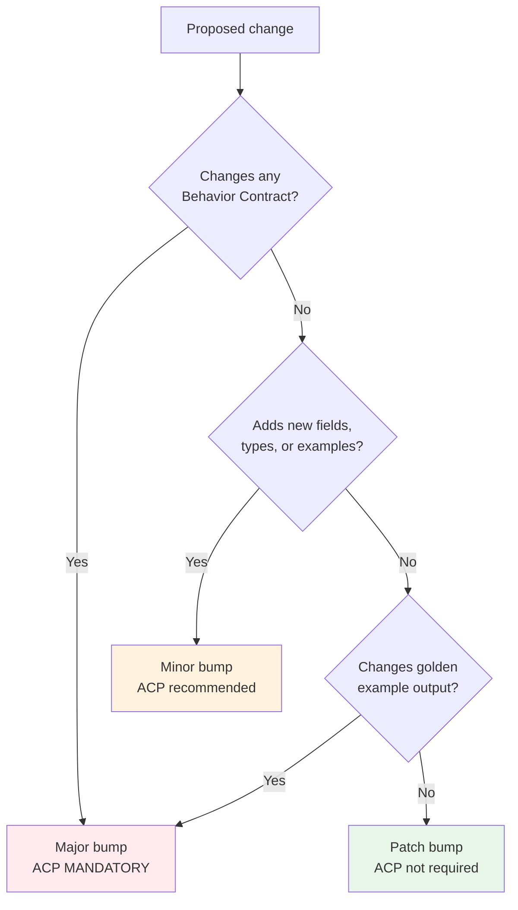

# Contract Versioning Specification (Normative)

> **Status**: Normative - Binding on all implementations.
> **Authority**: Defines the version scheme and change governance
> for Architecture Contracts.
> **Keywords**: RFC 2119 (**MUST**, **MUST NOT**, **SHALL**,
> **SHALL NOT**, **SHOULD**, **SHOULD NOT**, **MAY**).
> **Companion**: `RUNTIME_CONTRACT.md`, `REFERENCE_RUNTIME_SPEC.md`

---

## 1. Purpose

This document defines the versioning scheme for Architecture
Contracts. It specifies when versions are bumped, what each bump
level means, and when an Architecture Change Proposal (ACP) is
required.

The goal is to ensure that every observable behavior change is
tracked, versioned, and communicated to all implementations.

---

## 2. Version Scheme

Architecture Contracts use **Semantic Versioning** (SemVer):
```
MAJOR.MINOR.PATCH
```

| Component | Current Value | Meaning |
|-----------|--------------|---------|
| MAJOR | 1 | Breaking behavior change |
| MINOR | 0 | Additive, non-breaking change |
| PATCH | 0 | Clarification, fix, no behavior change |

**Current Contract Version**: `1.0.0`

### 2.1 Version Location

The Contract version is declared in two places:

1. `contract_version` field in the Contract JSON file
   (`reference/contracts/evidence_contract.json`).
2. `CONTRACT_VERSION` class attribute in `EvidenceBuilder`
   (`reference/evidence_builder.py`).
3. `version` field in each `EvidenceItem` and `Evidence` model
   instance.

All three **MUST** be kept in sync.

### 2.2 Version Format Rules

- **MUST** match regex: `^[0-9]+\.[0-9]+\.[0-9]+$`
- **MUST** be a string, not a number.
- **MUST NOT** include pre-release suffixes (no `-alpha`, `-beta`).
- **MUST NOT** include build metadata (no `+build`).
- Each component **MUST** be a non-negative integer.

---

## 3. Major Version Bump

A **Major** version bump (e.g., `1.0.0` -> `2.0.0`) is required
when a change **breaks** existing behavior.

### 3.1 Breaking Changes

The following changes **MUST** trigger a Major bump:

| Change | Reason |
|--------|--------|
| Modify any of the 35 Behavior Contracts | Behavior is immutable |
| Change hash algorithm (SHA-256 -> other) | All IDs change |
| Change hash truncation length (12 -> other) | All IDs change |
| Change ID format (`ev:system:hash` -> other) | All IDs change |
| Remove a required field from a model | Existing consumers break |
| Change a field type (e.g., string -> number) | Consumers break |
| Change enum values (add/remove/rename) | Consumers break |
| Change DNF expansion algorithm | Rule IDs and structure change |
| Change operator semantics | Evaluation results change |
| Change PatternMatch return semantics (None vs False) | API contract changes |
| Change Evidence grouping logic | Output structure changes |
| Change JSON null handling (include -> omit) | Output format changes |
| Change sorting rules for output fields | Byte-level output changes |

### 3.2 Major Bump Process

```
1. File ACP (mandatory)
2. ACP approved
3. Modify Reference Runtime
4. Update Golden Tests
5. Regenerate Contract
6. Bump MAJOR version (reset MINOR and PATCH to 0)
7. All implementations MUST update within same dev cycle
8. All Golden Tests MUST pass
```

### 3.3 Major Bump ACP

A Major bump **MUST ALWAYS** be accompanied by an approved ACP.
No exceptions.

---

## 4. Minor Version Bump

A **Minor** version bump (e.g., `1.0.0` -> `1.1.0`) is used when
a change is **additive and non-breaking**.

### 4.1 Additive Changes

The following changes **MAY** trigger a Minor bump:

| Change | Reason |
|--------|--------|
| Add a new optional field to a model | Additive, non-breaking |
| Add a new EvidenceType value | Additive (existing types unchanged) |
| Add a new PatternCategory value | Additive |
| Add a new Domain value | Additive |
| Add a new operator (without changing existing) | Additive |
| Add new golden examples to Contract | Additive |
| Add a new Contract (e.g., rule_contract.json) | New contract, not breaking |

### 4.2 Minor Bump Rules

- **MUST NOT** change any existing Behavior Contract.
- **MUST NOT** change existing field types, names, or ordering.
- **MUST NOT** change existing golden example outputs.
- Existing implementations **SHOULD** continue to work without
  modification (they may ignore new optional fields).
- An ACP is **RECOMMENDED** but **MAY** be waived for trivial
  additions (e.g., adding a golden example) at the discretion of
  the reviewer.

### 4.3 Minor Bump Process

```
1. File ACP (recommended, may be waived for trivial additions)
2. Modify Reference Runtime (additive only)
3. Add/update Golden Tests
4. Regenerate Contract
5. Bump MINOR version (reset PATCH to 0)
6. All Golden Tests MUST pass
```

---

## 5. Patch Version Bump

A **Patch** version bump (e.g., `1.0.0` -> `1.0.1`) is used for
**non-behavioral** changes.

### 5.1 Patch Changes

| Change | Reason |
|--------|--------|
| Fix a docstring typo | No behavior change |
| Fix a Contract description string | No behavior change |
| Regenerate Contract (no behavior change, e.g., formatting fix) | No behavior change |
| Add a Golden Test for already-defined behavior | Coverage only |
| Internal refactor (no observable change) | No behavior change |

### 5.2 Patch Bump Rules

- **MUST NOT** change any Behavior Contract.
- **MUST NOT** change any golden example output.
- **MUST NOT** add or remove model fields.
- Contract Diff **MUST** show no change to `golden_examples`
  content (only metadata changes allowed).
- An ACP is **NOT required** for patch changes.

### 5.3 Patch Bump Process

```
1. Make the non-behavioral change
2. Regenerate Contract (if applicable)
3. Bump PATCH version
4. All Golden Tests MUST pass
5. Contract Diff MUST be empty (for golden_examples)
```

---

## 6. ACP Requirements Summary

### 6.1 ACP Decision Matrix



### 6.2 Quick Reference

| Change Type | Version Bump | ACP Required | Contract Diff | Golden Tests Updated |
|-------------|-------------|--------------|---------------|---------------------|
| Break behavior | Major | **YES** | Non-empty | **YES** |
| Add field/type | Minor | Recommended | Non-empty (new fields) | Maybe |
| Fix typo/docs | Patch | No | Empty or metadata-only | No |
| Add test (no new behavior) | Patch | No | Empty | New test added |
| Regenerate (no change) | None | No | Empty | No |

---

## 7. Compatibility Matrix

### 7.1 Implementation-Contract Compatibility

| Implementation Contract Version | Reference Runtime Version | Status |
|--------------------------------|--------------------------|--------|
| Same Major.Minor.Patch | Same | Fully compatible |
| Same Major.Minor, different Patch | Same Major.Minor | Compatible (patch-level metadata may differ) |
| Same Major, different Minor | Different Minor | Implementation SHOULD work (may miss new features) |
| Different Major | Different Major | **INCOMPATIBLE** - implementation MUST be updated |

### 7.2 Lag Policy

- Formal implementations **MUST NOT** lag behind the Reference
  Runtime by more than one Minor version within the same Major
  version.
- Lagging by a Major version is **FORBIDDEN**.
- The Merge Gate **MUST** reject implementations that are more
  than one Minor version behind.

### 7.3 Version Checking

Each formal implementation **SHOULD** include a Contract version
check that:
1. Reads the `contract_version` from the committed Contract file.
2. Compares it to the implementation's expected version.
3. Fails with a clear error message if incompatible.

---

## 8. Deprecation Policy

### 8.1 Deprecation Process

When a Contract field, type, or behavior is deprecated:

1. The deprecation **MUST** be announced in an ACP.
2. The deprecated item **MUST** remain functional for at least
   2 Minor versions or 1 Major version.
3. The deprecated item **MUST** be marked in the Contract
   description.
4. Golden Tests for the deprecated item **MUST** remain until
   removal.
5. Removal requires a Major version bump.

### 8.2 Deprecation Marking

Deprecated fields in the Contract **SHOULD** include a
`"deprecated": true` flag and a `"deprecated_since": "version"`
field in their `field_types` specification.

---

## 9. Version History

| Version | Date | Change | ACP |
|---------|------|--------|-----|
| 1.0.0 | 2026-07-12 | Initial Evidence Layer Contract - 35 Behavior Contracts, 5 golden examples | Sprint 3 creation |

### 9.1 Changelog Format

Future version entries **MUST** include:
- Version number
- Date
- Summary of changes
- ACP reference (if applicable)
- List of affected Behavior Contracts (if any)

---

## 10. Version Bump Checklist

Before bumping a Contract version, verify:

- [ ] Reference Runtime is modified (if behavior change)
- [ ] Golden Tests are updated and passing
- [ ] Contract is regenerated
- [ ] Contract Diff is reviewed
- [ ] Version is bumped in `EvidenceBuilder.CONTRACT_VERSION`
- [ ] Version is bumped in Contract JSON `contract_version`
- [ ] ACP is filed (if Major or Minor with behavior implications)
- [ ] All 106+ Golden Tests pass
- [ ] Contract file matches runtime (`test_contract_file_matches_runtime`)
- [ ] Version history table is updated

---

## 11. Revision History

| Date | Version | Change |
|------|---------|--------|
| 2026-07-12 | 1.0.0 | Initial creation - versioning scheme and ACP matrix defined |
