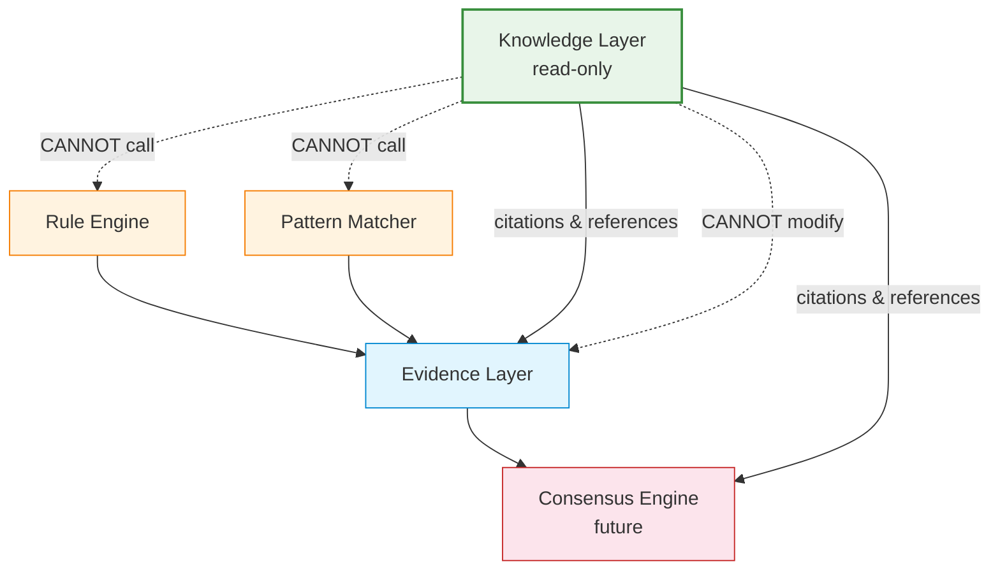

# Knowledge Behavior Specification (Normative)

> **Status**: Normative - Binding on all implementations.
> **Authority**: Defines immutable Knowledge Layer behavior contracts.
> **Keywords**: RFC 2119 (**MUST**, **MUST NOT**, **SHALL**,
> **SHALL NOT**, **SHOULD**, **SHOULD NOT**, **MAY**).
> **Companion**: `REFERENCE_RUNTIME_SPEC.md`, `BEHAVIOR_SPEC.md`,
> `RUNTIME_CONTRACT.md`

---

## 1. Purpose

This document defines the **Knowledge Layer Behavior Contracts**
(KB-001 through KB-020) for the open-metaphysics Reference Runtime.

The Knowledge Layer is a **read-only citation/reference provider**.
It provides structured knowledge nodes, relations, and references
for the Evidence Layer and Consensus Engine to cite. It does NOT
participate in reasoning, generate conclusions, modify Evidence,
increase Confidence, or call Rule.

These contracts are **immutable**. Any modification requires an
Architecture Change Proposal (ACP), as defined in
`REFERENCE_RUNTIME_SPEC.md` Section 8.

---

## 2. Architecture Boundary

### 2.1 What Knowledge IS

```
Evidence ──► Citation ──► Reference
                ▲
                │
          Knowledge Layer
     (KnowledgeNode, KnowledgeRelation,
      KnowledgeReference, KnowledgeStore)
```

Knowledge provides:
- Structured knowledge nodes (concepts, interpretations)
- Directed weighted relations between nodes
- Bibliographic references (classic text citations, school commentary)

### 2.2 What Knowledge IS NOT

| Forbidden Action | Reason |
|-----------------|--------|
| Participate in reasoning | Knowledge is read-only reference |
| Generate conclusions | Conclusions come from Rule/Pattern/Evidence |
| Modify Evidence | Evidence is immutable after creation |
| Increase Confidence | Confidence comes from Rule/Pattern evaluation |
| Call Rule | Knowledge has no access to RuleEngine |
| Call Pattern Matcher | Knowledge has no access to PatternMatcher |
| Perform calculation | Deterministic engines handle calculation |

### 2.3 Architecture Boundary Contracts

| Contract | Rule |
|----------|------|
| KnowledgeStore **MUST NOT** expose reasoning methods | No `reason()`, `conclude()`, `evaluate()`, `infer()` |
| KnowledgeNode **MUST NOT** have a `conclusion` field | Knowledge provides `interpretation`, not conclusions |
| KnowledgeNode **MUST NOT** have a `direction` field | Direction is an Evidence/Rules concept |
| Querying a node **MUST NOT** change its `confidence` | Read-only guarantee |
| KnowledgeStore **MUST NOT** call RuleEngine or PatternMatcher | Layer isolation |

---

## 3. Behavior Contract Inventory

### Node Validation Contracts

#### KB-001: Node ID Format

**Rule**: KnowledgeNode IDs **MUST** match the pattern
`^kn:[a-z_]+:[a-z_0-9]+$`.

**Normative**:
- Format: `kn:<type>:<slug>`
- `<type>` and `<slug>` **MUST** be lowercase letters, underscores,
  and digits (slug only).
- Invalid IDs **MUST** be rejected with `ValidationError`.

**Test**: `test_node_invalid_id_format`

#### KB-002: Node Type Validation

**Rule**: `node_type` **MUST** be one of 20 defined `NodeType` enum
values.

**Normative**:
- The 20 types: `wuxing`, `ten_god`, `heavenly_stem`,
  `earthly_branch`, `palace`, `main_star`, `auxiliary_star`,
  `shen_sha`, `pattern`, `career`, `personality`, `marriage`,
  `health`, `wealth`, `annual_fortune`, `major_luck`, `yong_shen`,
  `xi_shen`, `ji_shen`, `tiao_hou`.
- Invalid types **MUST** be rejected.

**Test**: `test_node_all_node_types_valid`

#### KB-003: Node Systems Non-Empty

**Rule**: `systems` **MUST** have at least one element (`min_length=1`).

**Normative**:
- Empty `systems` list **MUST** be rejected with `ValidationError`.
- Each system **MUST** be a valid `MetaphysicsSystem` enum value.

**Test**: `test_node_empty_systems_rejected`

#### KB-004: Node Confidence Bounds

**Rule**: `confidence` **MUST** be in `[0.0, 1.0]`.

**Normative**:
- Values outside `[0.0, 1.0]` **MUST** be rejected.
- `confidence` represents the knowledge node's inherent credibility,
  NOT a reasoning result confidence.

**Test**: `test_node_confidence_out_of_range`

#### KB-005: Node Extra Fields Rejected

**Rule**: KnowledgeNode **MUST** reject unknown fields (`extra="forbid"`).

**Normative**:
- Any field not in the model definition **MUST** cause
  `ValidationError`.
- This prevents silent schema drift.

**Test**: `test_node_extra_fields_rejected`

### Relation Validation Contracts

#### KB-006: Relation ID Format

**Rule**: KnowledgeRelation IDs **MUST** match the pattern
`^rel:.+$`.

**Normative**:
- Format: `rel:<any descriptive string>`
- Invalid IDs **MUST** be rejected.

**Test**: `test_relation_invalid_id_format`

#### KB-007: Relation Type Validation

**Rule**: `relation_type` **MUST** be one of 15 defined
`RelationType` enum values.

**Normative**:
- The 15 types: `sheng`, `ke`, `chong`, `xing`, `he`, `hai`,
  `fuzhu`, `zhiyue`, `duiying`, `yingxiang`, `zengqiang`,
  `xueroo`, `zhixiang`, `shuyu`, `yinyong`.
- Invalid types **MUST** be rejected.

**Test**: `test_relation_all_relation_types`

#### KB-008: Relation Direction Validation

**Rule**: `direction` **MUST** be `directed` or `undirected`.

**Normative**:
- Default: `directed`.
- Invalid values **MUST** be rejected.

**Test**: `test_relation_direction_values`

#### KB-009: Relation Weight Bounds

**Rule**: `weight` **MUST** be in `[0.0, 1.0]`.

**Normative**:
- Default: `1.0`.
- Out-of-range values **MUST** be rejected.

**Test**: `test_relation_weight_bounds`

### Reference Validation Contracts

#### KB-010: Reference ID Format

**Rule**: KnowledgeReference IDs **MUST** match the pattern
`^ref:[a-z_]+:[a-z_0-9]+$`.

**Normative**:
- Format: `ref:<type>:<slug>`
- Invalid IDs **MUST** be rejected.

**Test**: `test_reference_invalid_id_format`

#### KB-011: Reference Type Validation

**Rule**: `ref_type` **MUST** be one of 4 `ReferenceType` values:
`classic_text`, `school_commentary`, `modern_interpretation`,
`oral_tradition`.

**Normative**:
- `classic_text`: 经典出处 (e.g., 尚书·洪范, 滴天髓)
- `school_commentary`: 流派来源 (requires `school` field)
- `modern_interpretation`: 现代解释
- `oral_tradition`: 口传心授

**Test**: `test_reference_all_ref_types`

### Query Behavior Contracts

#### KB-012: Unknown Node Returns None (Null Behavior)

**Rule**: `find_by_id` for a non-existent node **MUST** return `None`,
not raise an exception.

**Normative**:
- `find_by_id("kn:nonexistent:x")` **MUST** return `None`.
- No exception **MUST** be raised for missing nodes.
- This is the "unknown node behavior" (未知节点行为).

**Test**: `test_find_by_id_not_found`, `test_verify_null_handling`

#### KB-013: find_by_type Returns Sorted List

**Rule**: `find_by_type` **MUST** return results sorted by node ID
(lexicographic ascending).

**Normative**:
- Same input **MUST** always produce the same sorted order.
- Empty result **MUST** be an empty list `[]`, not `None`.

**Test**: `test_find_by_type_sorted`

#### KB-014: find_by_system Returns Sorted List

**Rule**: `find_by_system` **MUST** return results sorted by node ID.

**Normative**:
- A node matches if ANY of its `systems` equals the query system.
- Results **MUST** be sorted by node ID.

**Test**: `test_find_by_system_sorted`

#### KB-015: find_by_tag Returns Sorted List

**Rule**: `find_by_tag` **MUST** return results sorted by node ID.

**Normative**:
- A node matches if the query tag is in its `tags` list.
- Results **MUST** be sorted by node ID.

**Test**: `test_find_by_tag_sorted`

#### KB-016: find_relation Returns Sorted List

**Rule**: `find_relation` **MUST** return results sorted by relation ID.

**Normative**:
- A relation matches if `node_id` is its `source_node_id` OR
  `target_node_id`.
- Optional `relation_type` and `direction` filters **MAY** be applied.
- Results **MUST** be sorted by relation ID.

**Test**: `test_find_relation_sorted`

#### KB-017: find_reference Returns Sorted List

**Rule**: `find_reference` **MUST** return results sorted by
`reference_id`.

**Normative**:
- A reference matches if its `target_id` equals the query `target_id`.
- Results **MUST** be sorted by `reference_id`.

**Test**: `test_find_reference_sorted`

### Duplicate Handling Contracts

#### KB-018: Duplicate Node ID Rejected (重复节点行为)

**Rule**: Adding a node with a duplicate ID **MUST** raise `ValueError`.

**Normative**:
- `store.add_node(node)` where `node.id` already exists **MUST**
  raise `ValueError` with message containing `"Duplicate node ID"`.
- The original node **MUST NOT** be overwritten.
- The store state **MUST NOT** change on a failed add.

**Test**: `test_duplicate_node_rejected`

#### KB-019: Duplicate Relation ID Rejected (重复关系行为)

**Rule**: Adding a relation with a duplicate ID **MUST** raise
`ValueError`.

**Normative**:
- `store.add_relation(rel)` where `rel.id` already exists **MUST**
  raise `ValueError` with message containing `"Duplicate relation ID"`.
- Duplicate reference IDs **MUST** also be rejected.

**Test**: `test_duplicate_relation_rejected`,
`test_duplicate_reference_rejected`

### Determinism Contracts

#### KB-020: Deterministic Output and Stable JSON

**Rule**: Same query **MUST** always produce byte-identical JSON output.

**Normative**:
- Running `store.execute(query)` twice **MUST** produce results whose
  `model_dump_json()` is identical.
- Running `store.find_by_id(id)` twice **MUST** return nodes whose
  `model_dump_json()` is identical.
- JSON serialization of the same result object **MUST** be stable
  (serializing twice produces identical strings).
- Contract re-generation **MUST** produce identical output if no
  behavior changed.

**Test**: `test_deterministic_find_by_id`,
`test_deterministic_find_by_type`, `test_deterministic_execute`,
`test_deterministic_json_stability`, `test_contract_determinism`

---

## 4. Behavior Contract Summary Table

| ID | Contract | Category | Test |
|----|----------|----------|------|
| KB-001 | Node ID format | Node Validation | `test_node_invalid_id_format` |
| KB-002 | Node type validation (20 types) | Node Validation | `test_node_all_node_types_valid` |
| KB-003 | Node systems non-empty | Node Validation | `test_node_empty_systems_rejected` |
| KB-004 | Node confidence bounds [0,1] | Node Validation | `test_node_confidence_out_of_range` |
| KB-005 | Node extra fields rejected | Node Validation | `test_node_extra_fields_rejected` |
| KB-006 | Relation ID format | Relation Validation | `test_relation_invalid_id_format` |
| KB-007 | Relation type validation (15 types) | Relation Validation | `test_relation_all_relation_types` |
| KB-008 | Relation direction validation | Relation Validation | `test_relation_direction_values` |
| KB-009 | Relation weight bounds [0,1] | Relation Validation | `test_relation_weight_bounds` |
| KB-010 | Reference ID format | Reference Validation | `test_reference_invalid_id_format` |
| KB-011 | Reference type validation (4 types) | Reference Validation | `test_reference_all_ref_types` |
| KB-012 | Unknown node returns None | Query / Null Behavior | `test_find_by_id_not_found` |
| KB-013 | find_by_type sorted | Query / Sorting | `test_find_by_type_sorted` |
| KB-014 | find_by_system sorted | Query / Sorting | `test_find_by_system_sorted` |
| KB-015 | find_by_tag sorted | Query / Sorting | `test_find_by_tag_sorted` |
| KB-016 | find_relation sorted | Query / Sorting | `test_find_relation_sorted` |
| KB-017 | find_reference sorted | Query / Sorting | `test_find_reference_sorted` |
| KB-018 | Duplicate node ID rejected | Duplicate Handling | `test_duplicate_node_rejected` |
| KB-019 | Duplicate relation ID rejected | Duplicate Handling | `test_duplicate_relation_rejected` |
| KB-020 | Deterministic output / stable JSON | Determinism | `test_deterministic_execute` |

**Total: 20 Knowledge Behavior Contracts**

---

## 5. Architecture Boundary Verification

The following architecture boundary checks are enforced by
`KnowledgeBehavior` and tested in `test_reference_knowledge.py`:

| Check | Method | Test |
|-------|--------|------|
| No reasoning methods on KnowledgeStore | `verify_no_reasoning_methods()` | `test_verify_no_reasoning_methods` |
| No conclusion field on KnowledgeNode | `verify_node_no_conclusion_field()` | `test_verify_node_no_conclusion_field` |
| Querying does not change confidence | `verify_knowledge_does_not_increase_confidence()` | `test_verify_confidence_unchanged` |
| Store is read-only after build | Direct test | `test_store_is_read_only_after_build` |
| Full audit passes all checks | `KnowledgeBehavior.audit()` | `test_full_audit` |

---

## 6. KnowledgeResult Contract

`KnowledgeResult` **MUST** always contain all four fields:

| Field | Type | When Empty |
|-------|------|-----------|
| `nodes` | `list[KnowledgeNode]` | `[]` (empty list) |
| `relations` | `list[KnowledgeRelation]` | `[]` |
| `references` | `list[KnowledgeReference]` | `[]` |
| `metadata` | `dict[str, Any]` | `{"query_type": ..., "total": 0}` |

**Normative**:
- Empty results **MUST** be empty lists, never `None`.
- `metadata` **MUST** always contain `query_type` and `total`.
- `found` **MUST** be `True` if any results were found, `False` otherwise.
- `version` **MUST** match the Contract version.

---

## 7. Contract Generation

The Knowledge Contract (`reference/contracts/knowledge_contract.json`)
**MUST** be auto-generated by `export_knowledge_contract()`.

**Normative**:
- **MUST NOT** be hand-written.
- **MUST** be regenerated whenever knowledge examples change.
- **MUST** contain 7 golden examples covering all 6 query types.
- **MUST** be deterministic (re-generation produces identical output).
- **MUST** match the committed file (`test_contract_file_matches_runtime`).

See `reference/contracts/README.md` for auto-generation rules.

---

## 8. Relationship to Other Layers



Knowledge provides citations and references TO the Evidence and
Consensus layers. It does NOT receive data from them, modify them,
or call their methods.

---

## 9. Immutability Statement

All 20 Knowledge Behavior Contracts (KB-001 through KB-020) are
**immutable** as of Contract Version 1.0.0. Any modification requires:

1. An Architecture Change Proposal (ACP).
2. A Contract Version bump (see `CONTRACT_VERSIONING.md`).
3. Updated Golden Tests.
4. Regenerated Knowledge Contract.
5. Sync of all formal implementations.

No exception is permitted.

---

## 10. Revision History

| Date | Version | Change |
|------|---------|--------|
| 2026-07-13 | 1.0.0 | Initial creation - 20 Knowledge Behavior Contracts defined |
