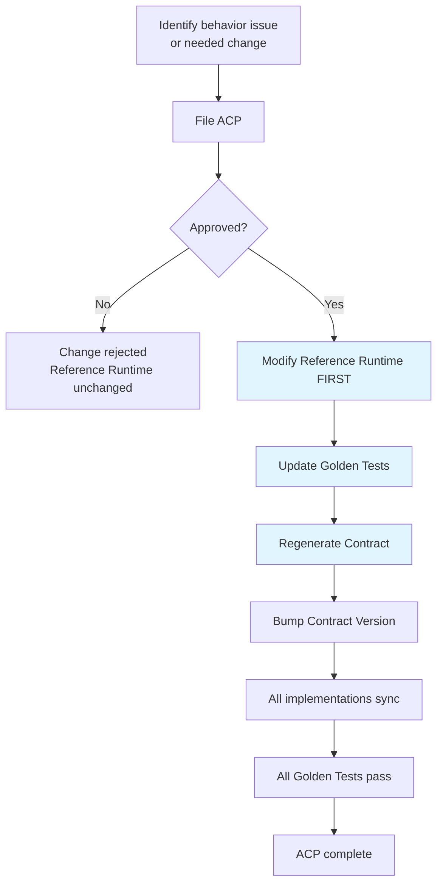

# Reference Runtime Specification (Normative)

> **Status**: Normative — Binding on all implementations.
> **Authority**: Highest priority in the open-metaphysics project.
> **Phase**: 6B Sprint 3.5 — Normative Reference Runtime Upgrade.
> **Keywords**: This document uses RFC 2119 keywords (**MUST**, **MUST NOT**,
> **SHALL**, **SHALL NOT**, **SHOULD**, **SHOULD NOT**, **MAY**).

---

## 1. Purpose

This document establishes the **Reference Runtime** as the
**Normative Reference Implementation** of the open-metaphysics
reasoning system. It defines its scope, authority, conformance
requirements, and the governance process that controls how the
Reference Runtime and all formal implementations evolve.

Every formal implementation — whether written in **Rust**, **Go**,
**Python**, or **WASM** — **MUST** conform to the behavior defined
by the Reference Runtime. The Reference Runtime is the single
source of truth for system behavior.

---

## 2. Definition: Normative Reference Implementation

The Reference Runtime is a **Normative Reference Implementation**.

| It IS | It IS NOT |
|-------|-----------|
| The behavior standard for all implementations | A demo |
| The source of truth for JSON output format | A sample |
| The source of truth for algorithm semantics | A prototype |
| The authority on field ordering, null handling, determinism | A throwaway experiment |
| The reference for contract generation | A production deployment target |
| The basis for Golden Tests and Contract validation | A performance benchmark |

### 2.1 Core Properties

The Reference Runtime **MUST** exhibit the following properties at
all times:

1. **Deterministic** — Identical inputs produce byte-identical
   outputs across runs, platforms, and time.
2. **Pure** — No I/O side effects during evaluation (contract
   export is the sole permitted I/O, and it is explicitly labeled).
3. **Single-threaded** — No concurrency, no race conditions, no
   non-determinism from scheduling.
4. **In-memory** — No database, no network, no external services.
5. **Self-contained** — All behavior is reproducible from the
   repository alone.
6. **Testable** — Every behavior is covered by Golden Tests.

### 2.2 Technology Constraints

The Reference Runtime is implemented entirely in **Python 3.11+**
using **Pydantic v2** for model validation. These are implementation
choices of the Reference Runtime, not requirements for formal
implementations. Formal implementations may use any language, but
**MUST** produce behaviorally identical results.

---

## 3. Scope

The Reference Runtime covers the following components:

```
reference/
├── models.py            Phase 6 Pydantic models (Rule layer)
├── parser.py            DSL Parser: YAML → Rule (with DNF expansion)
├── engine.py            RuleEngine: Rule × chart-data → RuleEvaluation
├── patterns.py          Pattern models + YAML parser
├── pattern_matcher.py   PatternMatcher: Pattern × RuleEvaluation[] → PatternMatch
├── evidence.py          Evidence domain models + Knowledge protocol
├── evidence_builder.py  EvidenceBuilder + Contract export
├── contracts/
│   └── evidence_contract.json   Auto-generated Architecture Contract
└── examples/            Golden example YAML files (rules + patterns)
```

### 3.1 Component Inventory

| Component | File | Sprint | Tests |
|-----------|------|--------|-------|
| DSL Parser | `reference/parser.py` | Sprint 1 | 29 |
| Rule Engine | `reference/engine.py` | Sprint 1 | 29 |
| Pattern Matcher | `reference/pattern_matcher.py` | Sprint 2 | 31 |
| Evidence Layer | `reference/evidence.py` + `reference/evidence_builder.py` | Sprint 3 | 46 |
| **Total** | | | **106** |

### 3.2 Out of Scope (Sprint 3.5)

The following are **NOT** part of the Reference Runtime and **MUST NOT**
be added without an Architecture Change Proposal (see Section 8):

- KnowledgeStore implementation
- Consensus Engine
- Explain Engine
- RAG / Vector search
- Graph database integration
- LLM integration
- Database persistence
- gRPC / REST API
- Concurrency / caching
- Performance optimization

---

## 4. Authority and Priority

### 4.1 Priority Hierarchy

The following priority hierarchy governs all development in the
open-metaphysics project:

```
1. Direct user/developer instructions (highest)
2. Reference Runtime behavior (this specification)
3. Phase 6 Architecture Freeze design docs
4. Phase 6.5+ Engineering docs
5. Formal implementations (Rust / Go / Python / WASM)
6. Documentation and comments (lowest)
```

### 4.2 Supremacy Clause

When any formal implementation conflicts with the Reference Runtime:

- The Reference Runtime behavior **SHALL** prevail.
- The formal implementation **MUST** be corrected to conform.
- The Reference Runtime **MUST NOT** be modified to match the
  implementation without an approved Architecture Change Proposal
  (ACP).

### 4.3 Phase 6 Compatibility

The Reference Runtime **MUST** remain compatible with the Phase 6
Architecture Freeze design documents (`docs/design/phase6/`). If a
conflict arises between the Reference Runtime and Phase 6 docs, the
conflict **MUST** be resolved via ACP before any code changes.

---

## 5. Conformance Requirements

### 5.1 Behavioral Conformance

A formal implementation is **behaviorally conformant** if and only
if all of the following hold:

1. **Golden Test Conformance** — The implementation produces output
   that is byte-identical to the Reference Runtime for every Golden
   Test case.
2. **Contract Conformance** — The implementation's output validates
   against the Architecture Contract (`reference/contracts/`).
3. **Determinism Conformance** — The implementation produces
   identical output across repeated runs with identical input.
4. **Edge Case Conformance** — The implementation handles null,
   missing, and empty inputs identically to the Reference Runtime.

### 5.2 Conformance Verification

Conformance **MUST** be verified before any merge via:

```
┌─────────────────────────────────────────┐
│           Merge Gate (CI)               │
│                                         │
│  1. Run Golden Tests (Reference Runtime)│
│  2. Run Contract Diff                   │
│  3. Run Behavior Validation             │
│  4. All three MUST pass → Merge allowed │
└─────────────────────────────────────────┘
```

See `RUNTIME_CONTRACT.md` Section 6 for the complete Contract
Governance process.

### 5.3 Non-Conformance Consequences

If a formal implementation fails conformance:

- The merge **MUST** be blocked.
- The implementation **MUST NOT** be deployed.
- The discrepancy **MUST** be documented as a bug or an ACP
  candidate.

---

## 6. Relationship to Formal Implementations

### 6.1 Implementation Map

| Layer | Reference Runtime (Python) | Formal Implementation |
|-------|---------------------------|----------------------|
| DSL Parser | `reference/parser.py` | Python (production) |
| Rule Engine | `reference/engine.py` | Rust |
| Pattern Matcher | `reference/pattern_matcher.py` | Rust |
| Evidence Builder | `reference/evidence_builder.py` | Rust |
| Consensus Engine | (not yet implemented) | Go |
| Knowledge Service | (not yet implemented) | Go |
| Explain / LLM | (not yet implemented) | Python |
| Frontend | (not yet implemented) | TypeScript |

### 6.2 Contract Boundary

Formal implementations **MUST NOT** consume Reference Runtime Python
objects directly. Instead, they **MUST** communicate via:

1. **Architecture Contracts** (JSON) — for output format.
2. **Golden Test vectors** — for behavioral verification.
3. **Behavior Specification** (`BEHAVIOR_SPEC.md`) — for algorithm
   semantics.

```
Reference Runtime ──generates──► Architecture Contract (JSON)
                                        │
                    ┌───────────────────┼───────────────────┐
                    ▼                   ▼                   ▼
              Rust impl           Go impl            Python impl
              (must conform)      (must conform)     (must conform)
```

### 6.3 Language Neutrality

The Reference Runtime is written in Python, but the behavior it
defines is **language-neutral**. The Behavior Specification
(`BEHAVIOR_SPEC.md`) describes behavior in terms of inputs, outputs,
and algorithms — not Python-specific constructs.

---

## 7. Relationship to Phase 6 Design

The Reference Runtime is a faithful, executable reimplementation of
the Phase 6 Architecture Freeze:

| Phase 6 Document | Reference Runtime Component |
|-----------------|---------------------------|
| `02_rule_layer_architecture.md` | `reference/engine.py`, `reference/models.py` |
| `03_json_schemas.md` | `reference/evidence.py` (Evidence schema), Contract |
| `04_pydantic_models.md` | `reference/models.py`, `reference/patterns.py`, `reference/evidence.py` |
| `06_flow_diagram.md` | `reference/pattern_matcher.py`, `reference/evidence_builder.py` |
| `09_test_plan.md` | `tests/test_reference_*.py` |
| `07_adr.md` (ADR-004) | `reference/pattern_matcher.py` |

The Reference Runtime **MUST NOT** contradict Phase 6 design docs.
If the Reference Runtime reveals a design ambiguity or error in
Phase 6, the resolution path is an ACP (Section 8).

---

## 8. Architecture Governance

### 8.1 Reference Runtime Supremacy

The Reference Runtime holds **supreme authority** over system
behavior. No formal implementation, developer preference, or
performance consideration may override the Reference Runtime's
defined behavior.

**Rules:**

- Formal implementations **MUST NOT** modify behavior defined by
  the Reference Runtime.
- If a formal implementation produces different output for the same
  input, the implementation is **buggy** and **MUST** be fixed.
- The Reference Runtime is never "wrong by default." If it appears
  wrong, an ACP is required to change it.

### 8.2 Architecture Change Proposal (ACP)

An **Architecture Change Proposal (ACP)** is the formal process for
modifying Reference Runtime behavior. ACPs are mandatory for any
change that affects observable behavior.

#### 8.2.1 When ACP Is Required

An ACP **MUST** be filed before making any of the following changes:

| Change | ACP Required? |
|--------|--------------|
| Modify DNF expansion algorithm | **YES** |
| Modify hash algorithm or ID format | **YES** |
| Modify operator semantics | **YES** |
| Modify JSON field ordering or null handling | **YES** |
| Modify Evidence grouping logic | **YES** |
| Modify Pattern matching return semantics (None vs False) | **YES** |
| Add a new operator | **YES** |
| Add a new EvidenceType | **YES** |
| Add a new PatternCategory | **YES** |
| Fix a typo in a docstring | No |
| Add a new Golden Test (no behavior change) | No |
| Regenerate Contract (no behavior change) | No |
| Refactor internal implementation (no behavior change) | No |

#### 8.2.2 ACP Process



#### 8.2.3 ACP Change Flow (Critical Rule)

**The Reference Runtime is always modified FIRST.**

```
Wrong:  Formal implementation changes behavior → Reference Runtime forced to match
Right:  ACP approved → Reference Runtime changes → All implementations sync
```

No implementation may change behavior ahead of the Reference Runtime.
If a bug is discovered in a formal implementation that reveals a
Reference Runtime issue, the process is:

1. File an ACP describing the issue.
2. ACP review and approval.
3. Reference Runtime is modified and Golden Tests updated.
4. Contract is regenerated and version-bumped.
5. All formal implementations are updated to match.
6. All Golden Tests pass across all implementations.

### 8.3 Implementation Sync Requirements

When the Reference Runtime changes (post-ACP):

- All formal implementations **MUST** be updated within the same
  development cycle.
- The Contract version **MUST** be bumped (see
  `CONTRACT_VERSIONING.md`).
- Golden Tests **MUST** be updated before the implementation sync.
- No implementation **MAY** lag behind the Reference Runtime by
  more than one Contract version.

### 8.4 Forbidden Actions

The following actions are **strictly forbidden** without an approved
ACP:

1. **MUST NOT** modify the Reference Runtime to match a formal
   implementation's divergent behavior.
2. **MUST NOT** skip Golden Tests to make a merge pass.
3. **MUST NOT** modify Golden Test expected values to match a
   buggy implementation.
4. **MUST NOT** modify the Architecture Contract by hand (see
   `reference/contracts/README.md`).
5. **MUST NOT** disable or weaken the Merge Gate.
6. **MUST NOT** introduce non-determinism into the Reference Runtime.

---

## 9. Document Cross-References

| Document | Purpose |
|----------|---------|
| `BEHAVIOR_SPEC.md` | Defines all Behavior Contracts (what must not change) |
| `RUNTIME_CONTRACT.md` | Defines Contract lifecycle, generation, validation, governance |
| `CONTRACT_VERSIONING.md` | Defines Contract version scheme and ACP triggers |
| `reference/contracts/README.md` | Contract auto-generation rules |
| `reference/golden/README.md` | Golden Test / Golden JSON / Golden Contract relationships |

---

## 10. Revision History

| Date | Version | Change |
|------|---------|--------|
| 2026-07-12 | 1.0.0 | Initial creation — Sprint 3.5 Normative Reference Runtime Upgrade |
