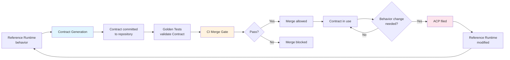
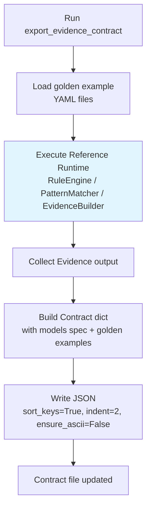
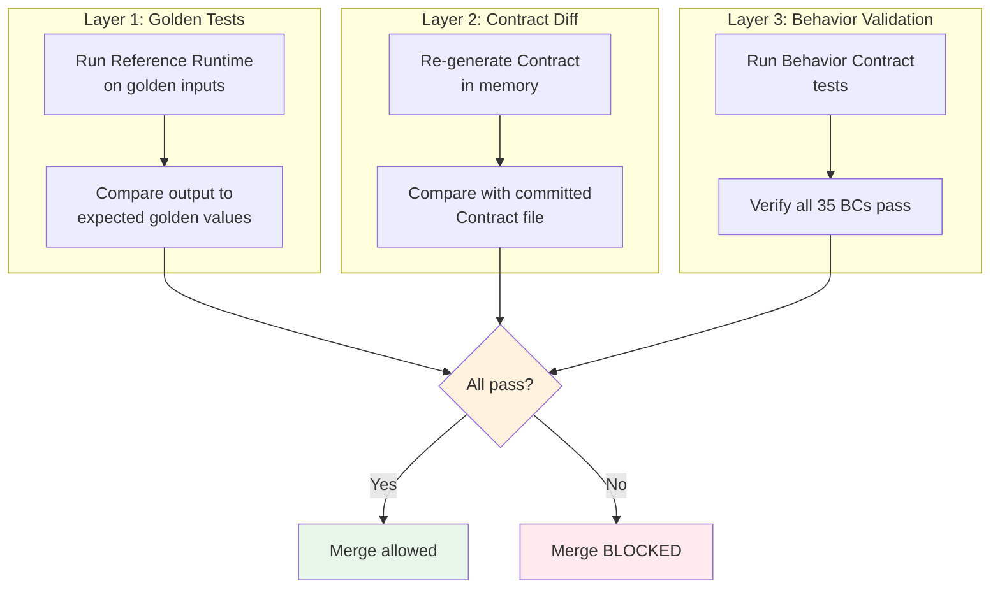
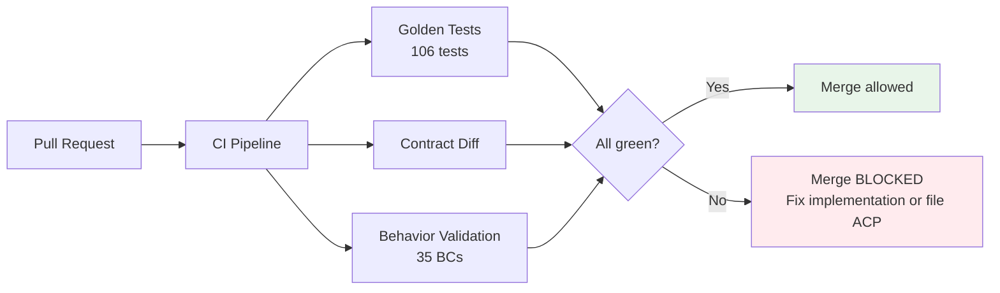
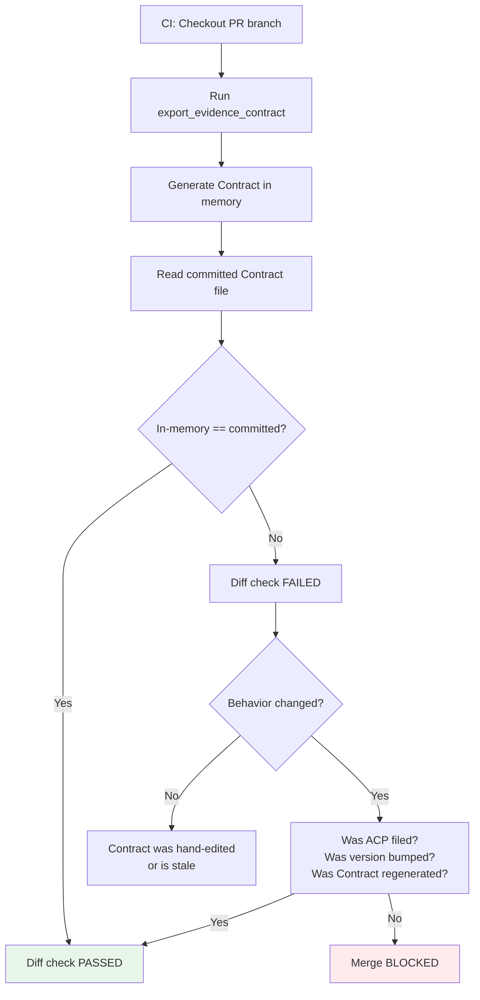
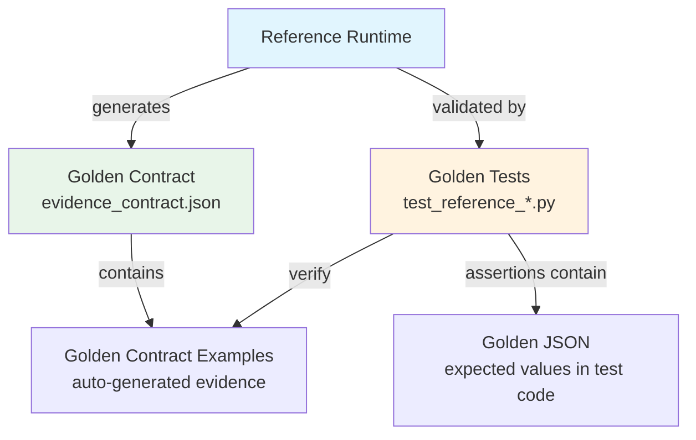

# Runtime Contract Specification (Normative)

> **Status**: Normative - Binding on all implementations.
> **Authority**: Defines the lifecycle, governance, and validation
> of Architecture Contracts.
> **Keywords**: RFC 2119 (**MUST**, **MUST NOT**, **SHALL**,
> **SHALL NOT**, **SHOULD**, **SHOULD NOT**, **MAY**).
> **Companion**: `REFERENCE_RUNTIME_SPEC.md`, `BEHAVIOR_SPEC.md`,
> `CONTRACT_VERSIONING.md`

---

## 1. Purpose

This document defines the **Architecture Contract** - the canonical
output specification that the Reference Runtime generates and all
formal implementations must conform to.

It covers:
- What a Contract is
- How Contracts are generated
- How Contracts are validated
- How Contracts are upgraded
- Contract Governance (merge gates)
- Relationship to JSON Schema and Golden Tests

---

## 2. Contract Definition

An **Architecture Contract** is a machine-readable JSON document
that captures the normative output of the Reference Runtime. It is
**not** test data. It is **not** a demo. It is a binding
specification.

### 2.1 Contract Properties

| Property | Requirement |
|----------|-------------|
| Auto-generated | **MUST** be produced by running the Reference Runtime |
| Deterministic | Re-generation with no behavior change **MUST** produce identical output |
| Versioned | Every Contract **MUST** declare a `contract_version` |
| Immutable | Once committed, a Contract **MUST NOT** be hand-edited |
| Authoritative | Violations of the Contract are bugs, not "differences of opinion" |

### 2.2 Contract File Location

```
reference/contracts/
└── evidence_contract.json    Evidence Layer Architecture Contract
```

Future contracts (rule, pattern, consensus) **MUST** follow the same
naming convention: `<layer>_contract.json`.

### 2.3 Contract Structure

```json
{
  "contract_name": "evidence",
  "contract_version": "1.0.0",
  "description": "...",
  "generated_by": "reference.evidence_builder.export_evidence_contract",
  "evidence_types": ["rule", "pattern", "knowledge_node", "relation"],
  "domains": ["career", "personality", "..."],
  "models": {
    "EvidenceItem": {
      "type": "object",
      "required": ["evidence_id", "source_type", "..."],
      "optional": ["direction", "weight", "timestamp"],
      "field_types": { ... }
    },
    "Evidence": {
      "type": "object",
      "required": ["evidence_id", "domain", "..."],
      "field_types": { ... }
    }
  },
  "golden_examples": [
    {
      "name": "single_rule_to_evidence",
      "description": "...",
      "input_type": "rule_evaluation",
      "evidence": [ ... ]
    }
  ]
}
```

---

## 3. Contract Lifecycle



### 3.1 Creation

A Contract is created when:
1. The Reference Runtime implements a new layer (e.g., Evidence Layer
   in Sprint 3).
2. The `export_*_contract()` function is invoked.
3. The output JSON is committed to `reference/contracts/`.

### 3.2 Validation

A Contract is validated by:
1. **Golden Tests** - Tests that verify the Reference Runtime
   produces output matching the Contract.
2. **Contract Diff** - CI checks that re-generating the Contract
   produces output identical to the committed file.
3. **Behavior Validation** - Tests that verify individual Behavior
   Contracts (see `BEHAVIOR_SPEC.md`).

### 3.3 Upgrade

A Contract is upgraded when:
1. An ACP is approved (see `REFERENCE_RUNTIME_SPEC.md` Section 8).
2. The Reference Runtime is modified.
3. The Contract is regenerated.
4. The Contract version is bumped (see `CONTRACT_VERSIONING.md`).
5. Golden Tests are updated.

### 3.4 Deprecation

A Contract (or a Contract version) is deprecated when:
1. A new Contract version supersedes it.
2. A deprecation notice is added to the Contract metadata.
3. A removal date is announced (at least 2 minor versions or 1
   major version of grace period).
4. Deprecated Contracts **MUST NOT** be deleted until the grace
   period expires.

---

## 4. Contract Generation

### 4.1 Generation Rule

**All Contracts **MUST** be auto-generated by running the Reference
Runtime.**

- **MUST NOT** hand-write Contract JSON.
- **MUST NOT** manually edit Contract files after generation.
- **MUST NOT** cherry-pick fields or modify golden examples.

### 4.2 Generation Process



### 4.3 Generation Command

```bash
# Regenerate the Evidence Contract
python -c "from reference.evidence_builder import export_evidence_contract, CONTRACT_PATH; export_evidence_contract(output_path=str(CONTRACT_PATH))"
```

### 4.4 Golden Examples in Contracts

Golden examples in the Contract are **real runtime outputs**, not
hand-crafted fixtures. Each golden example:

- **MUST** be produced by executing the Reference Runtime on a
  golden input.
- **MUST** include the full Evidence output (not truncated).
- **MUST** be deterministic (re-running produces identical output).
- **MUST** cover the key behavior categories (single rule, multi
  rule, pattern, cross-system, no-match).

---

## 5. Contract Validation

### 5.1 Three-Layer Validation



### 5.2 Golden Tests (Layer 1)

Golden Tests verify that the Reference Runtime produces correct
output for specific inputs. They are the primary behavioral
verification.

- **MUST** run on every CI build.
- **MUST** include determinism checks (run twice, compare).
- **MUST** include JSON serialization checks.
- **MUST** include traceability checks.

### 5.3 Contract Diff (Layer 2)

Contract Diff verifies that the committed Contract file matches
what the Reference Runtime would generate right now.

- **MUST** run on every CI build.
- If the diff is non-empty, the Contract is stale (either behavior
  changed without regeneration, or the file was hand-edited).
- A non-empty diff **MUST** block merge.

**Implementation**: `test_contract_file_matches_runtime` in
`test_reference_evidence.py`.

### 5.4 Behavior Validation (Layer 3)

Behavior Validation runs the 35 Behavior Contract tests defined in
`BEHAVIOR_SPEC.md`. These tests verify individual behavioral rules
(hash algorithm, DNF expansion, null handling, etc.).

- **MUST** run on every CI build.
- Any BC failure **MUST** block merge.

---

## 6. Contract Governance

### 6.1 Merge Gate

**No merge is permitted unless all three validation layers pass.**



### 6.2 Governance Rules

| Rule | Enforcement |
|------|-------------|
| Golden Tests **MUST** pass | CI gate |
| Contract Diff **MUST** be empty | CI gate |
| Behavior Validation **MUST** pass | CI gate |
| Contract **MUST** be auto-generated | Code review + CI |
| Contract **MUST NOT** be hand-edited | CI (diff check) |
| Behavior change **MUST** have ACP | Process enforcement |
| Contract version **MUST** bump on behavior change | CI (version check) |

### 6.3 Contract Diff Process



### 6.4 Multi-Language Contract Enforcement

Each formal implementation **MUST** include its own Contract
conformance tests:

| Implementation | Conformance Test |
|----------------|-----------------|
| Rust | `cargo test --test contract_conformance` |
| Go | `go test ./test/contract/...` |
| Python (production) | `pytest tests/test_contract_conformance.py` |
| WASM | WASM test harness comparing JSON output |

Each conformance test:
1. Loads the committed Contract from `reference/contracts/`.
2. Runs the implementation on the golden example inputs.
3. Compares output to the Contract's golden examples.
4. **MUST** produce byte-identical JSON (after canonical
   normalization with `sort_keys=True`).

---

## 7. Relationship to JSON Schema (Phase 6)

### 7.1 Phase 6 JSON Schemas

Phase 6 design documents (`docs/design/phase6/03_json_schemas.md`)
define JSON Schemas for Evidence, Rule, Pattern, Relation, and
Consensus. These are **design-time** schemas.

### 7.2 Architecture Contract vs JSON Schema

| Aspect | Phase 6 JSON Schema | Architecture Contract |
|--------|--------------------|-----------------------|
| Purpose | Design specification | Runtime conformance |
| Source | Hand-written (design) | Auto-generated (runtime) |
| Content | Field types, constraints | Field types + golden examples |
| Authority | Design reference | Behavioral authority |
| Binding on implementations | Indirectly | **Directly** (Merge Gate) |
| Change process | Doc update | ACP + version bump + regeneration |

### 7.3 Compatibility

The Architecture Contract **MUST** be compatible with the Phase 6
JSON Schema. If a conflict is found:

1. The Contract is authoritative for runtime behavior.
2. The Phase 6 JSON Schema should be updated via ACP to match.
3. The Contract **MUST NOT** be silently modified to match the
   schema.

---

## 8. Relationship to Golden Tests

### 8.1 Definitions

| Term | Definition |
|------|-----------|
| **Golden Test** | A test that verifies specific input produces specific expected output |
| **Golden JSON** | The expected JSON output for a golden test case (embedded in assertions) |
| **Golden Contract** | The Architecture Contract file containing auto-generated golden examples |

### 8.2 Relationship



### 8.3 Three-Way Consistency

Golden Tests, Golden JSON, and Golden Contract **MUST** be
mutually consistent:

1. Golden Tests verify that the Reference Runtime produces the
   Golden JSON.
2. The Golden Contract contains Golden Contract Examples that are
   also produced by the Reference Runtime.
3. If the Reference Runtime changes, ALL THREE must be updated
   together (via ACP).

### 8.4 Adding New Golden Tests

New Golden Tests **MAY** be added without an ACP if they:
- Do not change existing behavior.
- Only add coverage for already-defined behavior.
- Do not modify the Contract structure.

New Golden Tests **MUST** be accompanied by:
- Updated Golden JSON assertions.
- Updated Golden Contract (if new example categories are added to
  the Contract).

See `reference/golden/README.md` for details.

---

## 9. Contract File Format Specification

### 9.1 JSON Encoding

```
Encoding:       UTF-8 (no BOM)
Key order:      sorted (sort_keys=True)
Indentation:    2 spaces
Ensure ASCII:   False (Chinese chars as literals)
Trailing newline: Yes
```

### 9.2 Required Top-Level Fields

| Field | Type | Description |
|-------|------|-------------|
| `contract_name` | string | Layer name (e.g., `"evidence"`) |
| `contract_version` | string | SemVer (e.g., `"1.0.0"`) |
| `description` | string | Human-readable description |
| `generated_by` | string | Fully qualified function name |
| `models` | object | Model specifications |
| `golden_examples` | array | Auto-generated example outputs |

### 9.3 Model Specification

Each model in `models` **MUST** include:
- `type`: always `"object"`
- `required`: list of required field names
- `optional`: list of optional field names (if any)
- `field_types`: mapping of field name to type description

---

## 10. Contract Inventory

| Contract | File | Version | Status | Sprint |
|----------|------|---------|--------|--------|
| Evidence Layer | `reference/contracts/evidence_contract.json` | 1.0.0 | Active | Sprint 3 |
| Rule Layer | (future) | - | Planned | - |
| Pattern Layer | (future) | - | Planned | - |
| Consensus Layer | (future) | - | Planned | - |

Future contracts **MUST** follow the same format, governance, and
auto-generation rules defined in this document.

---

## 11. Revision History

| Date | Version | Change |
|------|---------|--------|
| 2026-07-12 | 1.0.0 | Initial creation - Contract lifecycle and governance defined |
