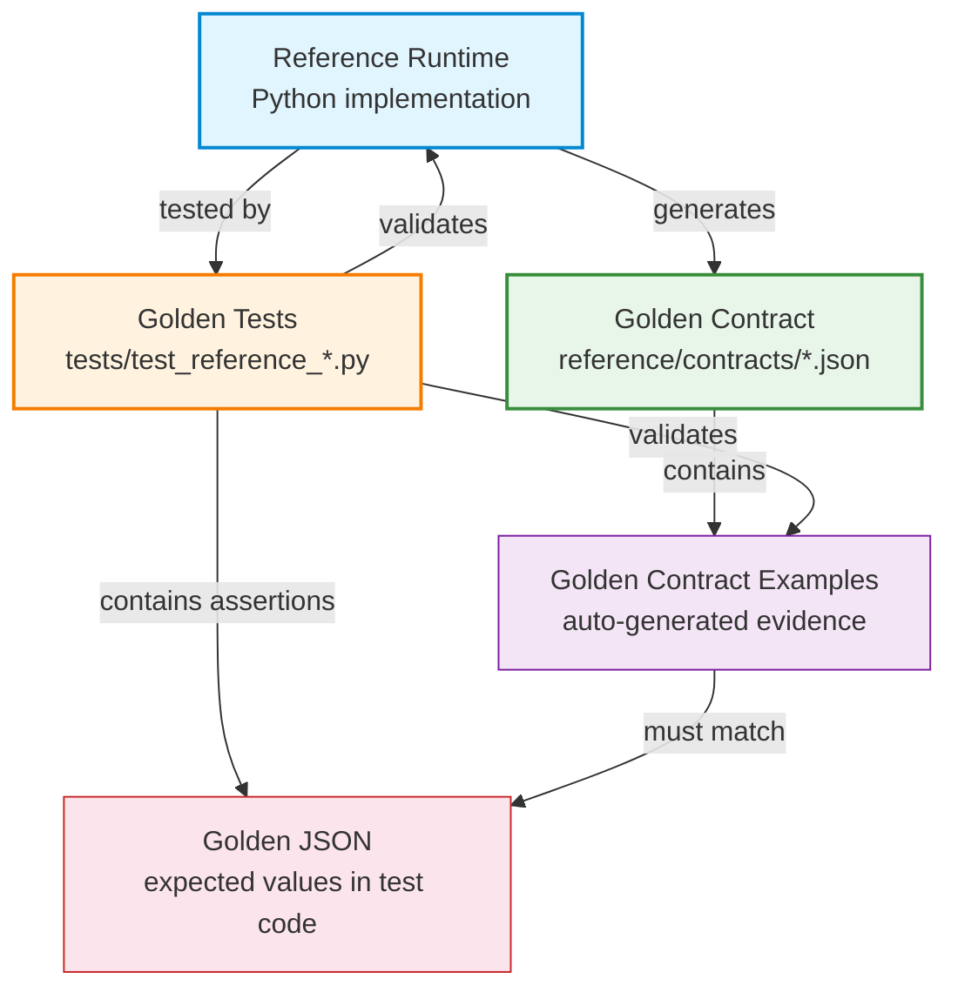

# Golden Tests Directory

> **Normative**: This directory documents the Golden Test framework
> for the open-metaphysics Reference Runtime.
> See: `docs/specification/RUNTIME_CONTRACT.md` Section 8

---

## Purpose

This directory documents the relationship between three concepts
that together form the **verification framework** for the Reference
Runtime:

1. **Golden Tests** - executable tests that verify behavior
2. **Golden JSON** - expected output values embedded in test code
3. **Golden Contract** - auto-generated Contract containing golden
   examples

---

## Definitions

### Golden Test

A **Golden Test** is a pytest test that:
- Provides a specific input to the Reference Runtime.
- Captures the output.
- Asserts the output matches a **Golden JSON** expected value.
- Verifies determinism (same input -> identical output across runs).

**Location**: `tests/test_reference_*.py`

| Test File | Sprint | Tests | Coverage |
|-----------|--------|-------|----------|
| `test_reference_rules.py` | Sprint 1 | 29 | DSL parsing, DNF expansion, operator semantics, RuleEngine |
| `test_reference_patterns.py` | Sprint 2 | 31 | Pattern parsing, single/multi/cross-system matching, ANY logic |
| `test_reference_evidence.py` | Sprint 3 | 46 | Evidence models, builder, traceability, contract, determinism |
| **Total** | | **106** | |

### Golden JSON

**Golden JSON** is the expected output value that a Golden Test
asserts against. It is embedded directly in the test code as
assertions or comparison values.

Golden JSON is **not** stored as separate files. It lives in the
test source code as:
- Field-level assertions (`assert item.conclusion == "性格刚毅果敢"`)
- Full JSON comparison (`assert j == expected_dict`)
- Determinism checks (`assert j1 == j2`)

### Golden Contract

The **Golden Contract** is the Architecture Contract file
(`reference/contracts/evidence_contract.json`) that contains
**Golden Contract Examples** - auto-generated Evidence outputs
from the Reference Runtime.

Golden Contract Examples are produced by running the Reference
Runtime on golden inputs and embedding the results in the Contract.

---

## Relationships



### Three-Way Consistency Rule

**Golden Tests, Golden JSON, and Golden Contract MUST be mutually
consistent at all times.**

1. Golden Tests verify the Reference Runtime produces Golden JSON.
2. The Golden Contract contains Golden Contract Examples that the
   Reference Runtime also produces.
3. Golden JSON assertions and Golden Contract Examples MUST agree
   on the same inputs.

If any one of the three changes, all three MUST be updated together
via the ACP process.

---

## How to Add New Golden Tests

### Step 1: Determine if an ACP is needed

| Situation | ACP Required? |
|-----------|--------------|
| Adding a test for already-defined behavior | No |
| Adding a test that reveals new behavior | Yes |
| Adding a test that reveals a bug | File ACP to fix the bug |

### Step 2: Write the test

Add a test method to the appropriate test class in
`tests/test_reference_*.py`:

```python
def test_new_golden_case(self):
    # 1. Prepare input
    ev = _make_rule_eval(
        rule_id="rule:bazi:new_case:v1",
        results=[_make_result(conclusion="新结论")],
    )
    # 2. Run Reference Runtime
    builder = EvidenceBuilder()
    items = builder.from_rule_evaluation(ev, "bazi")
    # 3. Assert Golden JSON
    assert len(items) == 1
    assert items[0].conclusion == "新结论"
    assert items[0].source_type == EvidenceType.RULE
    # 4. Assert determinism
    items2 = builder.from_rule_evaluation(ev, "bazi")
    assert items[0].model_dump_json() == items2[0].model_dump_json()
```

### Step 3: Update Contract (if needed)

If the new test covers a new example category:

```bash
# Add the example to _build_golden_examples() in evidence_builder.py
# Then regenerate:
python -c "from reference.evidence_builder import export_evidence_contract, CONTRACT_PATH; export_evidence_contract(output_path=str(CONTRACT_PATH))"
```

### Step 4: Run all tests

```bash
python -m pytest tests/test_reference_*.py -v
```

All 106+ tests MUST pass.

---

## Determinism Requirements

Every Golden Test MUST verify determinism:

| Check | Method |
|-------|--------|
| Same input -> same output | Run builder twice, compare `model_dump_json()` |
| Same input -> same evidence_id | Compare `evidence_id` across runs |
| Contract determinism | `export_evidence_contract()` called twice, compare dicts |
| Contract file matches runtime | Compare committed file with in-memory generation |
| Cross-run stability | Golden JSON values are hardcoded, not generated at runtime |

### Determinism Guarantees

The Reference Runtime provides the following determinism guarantees:

1. **Content-addressed IDs** - `evidence_id` is a SHA-256 hash of
   content. Same content -> same ID. Always.
2. **Sorted lists** - `matched_rule_ids`, `trace` (patterns),
   `item_ids` (grouping) are sorted before output.
3. **Canonical JSON** - Contract uses `sort_keys=True` for
   deterministic key ordering.
4. **No timestamps** - `timestamp` field is optional and defaults
   to `None`. No wall-clock time is used in IDs or output.
5. **No random** - No `random`, `uuid`, or non-deterministic
   operations anywhere in the Reference Runtime.

---

## Golden Test Categories

Each test file covers specific categories:

### test_reference_rules.py (Sprint 1)
- DSL parsing (single condition, AND, OR, NOT, scope)
- DNF expansion (any, all, not, De Morgan, double negation)
- Operator semantics (11 operators)
- Field path resolution (dot, index)
- Negate handling
- Determinism and JSON serialization

### test_reference_patterns.py (Sprint 2)
- Pattern parsing (single, multi, ANY, cross-system, no-match)
- Single rule matching
- Multi rule matching (ALL logic)
- ANY logic matching
- Cross-system matching
- None vs matched=False semantics
- Batch matching (match_all, match_all_with_misses)
- Determinism and JSON serialization

### test_reference_evidence.py (Sprint 3)
- Model creation and validation (EvidenceItem, Evidence, EvidenceSource)
- All 4 EvidenceType source types
- Rule -> Evidence conversion
- Pattern -> Evidence conversion
- Combined Evidence
- JSON serialization and roundtrip
- Deterministic output (IDs, repeated runs)
- Evidence traceability (trace chains)
- Contract export, determinism, file validation
- KnowledgeEvidenceProvider protocol
- Full-chain golden examples

---

## Cross-References

| Document | Purpose |
|----------|---------|
| `docs/specification/RUNTIME_CONTRACT.md` | Contract lifecycle and Golden Test relationship |
| `docs/specification/BEHAVIOR_SPEC.md` | 35 Behavior Contracts tested by Golden Tests |
| `docs/specification/CONTRACT_VERSIONING.md` | Version bump rules for Contract changes |
| `reference/contracts/README.md` | Contract auto-generation rules |
